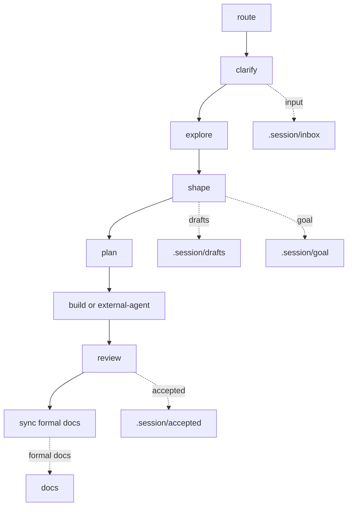

# Workflow Lite

> Lightweight by default. Session memory is separate from formal docs.

## Workflow



## Core Ideas

- `task`: lightweight action prompt in `.workflow/tasks/`.
- `role`: small perspective file in `.workflow/roles/`.
- `lens`: optional user-selected thinking method in `.workflow/lenses/`.
- `.session`: AI session working memory, not formal source of truth.
- `.session/goal`: evolving goal space and target docs map.
- `.session/inbox`: unprocessed or lightly structured inputs, background, exploration notes, and reference material.
- `.session/drafts`: work-in-progress shapes, options, plans, and reviews; not approved for execution by default.
- `.session/accepted`: accepted session-level conclusions such as decisions, approved plans, and accepted review verdicts.
- `docs`: formal project documentation maintained by the host project.
- `src/**/README.md`: optional code-adjacent reading entrypoint.

## Session Structure

```text
.session/
  goal/
    vision.md
    target_docs.md
    assumptions.md
    roadmap.md
  inbox/
  drafts/
  accepted/
  archive/
```

Use `.session/**` for work that may change during AI collaboration. Stable long-term knowledge, terms, architecture constraints, and design docs belong in `docs/**`.

## Session Naming

Session directories express state; file prefixes express artifact kind.

- `inbox`: `note_{topic}.md`, `brief_{topic}.md`
- `drafts`: `brief_`, `shape_`, `option_`, `plan_`, `review_`
- `accepted`: `brief_`, `decision_`, `plan_`, `review_`

Do not use task names as mandatory file prefixes. `docs/**` follows the host project's formal docs naming. `src/**/README.md` is fixed.

Drafts are not approved execution sources. `build` and external-agent implementation should prefer `.session/accepted/**`; using `.session/drafts/**` requires explicit user approval and should usually pass through `review`.

## Tasks

| Task | Role | Default Output | Purpose |
| :--- | :--- | :--- | :--- |
| `route` | `analyst` | chat | Recommend the smallest useful next path. |
| `clarify` | `analyst` | `.session/inbox/` | Capture staged requirements, background, scope, and acceptance notes. |
| `explore` | `designer` | `.session/inbox/` | Understand code, materials, behavior, feasibility, or reference structure. |
| `shape` | `designer` | `.session/drafts/`, `.session/accepted/`, or `.session/goal/` | Form a direction, concept, architecture, goal update, or session decision. |
| `plan` | `designer` | `.session/drafts/` or `.session/accepted/` | Turn a chosen direction into a repo-aware plan or external-agent handoff. |
| `build` | `builder` | repository changes | Apply an approved workflow-managed plan. |
| `review` | `reviewer` | `.session/drafts/` or `.session/accepted/` | Review behavior, evidence, plans, diffs, decisions, or docs alignment. |
| `sync` | `steward` | `docs/**` or `src/**/README.md` | Align formal docs and code-adjacent README files with confirmed decisions, code, or diffs. |

## Lenses

Lenses are user-selected. Copilot may suggest a lens, but must not apply it unless the user explicitly names it or adds its file as context.

| Lens | Use When |
| :--- | :--- |
| `iteration` | Multi-turn discussion needs session state, goal changes, decisions, and open questions. |
| `expand` | A decision or plan needs examples, pseudocode, smaller diagrams, or split parts. |
| `consistency` | Session decisions, formal docs, code, tests, or README files may conflict. |
| `distill` | A strong reference document should be studied for reusable structure and writing principles. |
| `language` | Full English, translation, terminology consistency, or formal glossary updates are needed. |
| `domain` | Terms, rules, ownership, boundaries, or conceptual model are unclear. |
| `strategy` | Technical routes or design options need comparison. |
| `redteam` | The current recommendation needs deliberate critique. |
| `test` | Behavior needs stronger verification. |
| `architecture` | Structure, interfaces, dependencies, constraints, or durable tradeoffs matter. |
| `debug` | A defect or uncertain behavior needs diagnosis. |

## Mode And Write Boundaries

- `Mode: discuss`: chat only; no templates and no writes.
- Ordinary `Mode: persist`: writes session artifacts to `.session/**`.
- `Task: sync` in `Mode: persist`: writes only `docs/**` or explicit `src/**/README.md`.
- `Mode: execute`: uses `Task: build` with an approved plan.
- External-agent path: native Plan -> Implement from Codex, Copilot, OpenCode, or similar agents, with plan audit before implementation and diff review afterward.

`Mode: execute` is workflow-managed execution only.

Native Plan/Implement is a separate external-agent write path.

## Task Boundary Router

Before acting, classify whether the request fits the selected task:

- `fits`: the task can handle it directly.
- `fits_with_preflight`: the task can handle it after a read-only preflight.
- `composite`: multiple tasks are needed.
- `wrong_task`: another task is the proper entrypoint.
- `missing_prerequisite`: required target, approved plan, source of truth, or formal docs safety is missing.

Composite requests should return segmented prompts with stop points. Do not silently switch tasks or automatically run later write/implementation segments.

## Implicit Preflight

Implicit preflight is a same-response, read-only check that can run automatically in `Mode: discuss`. It does not require the user to ask for preflight explicitly.

- Default implicit preflight: `shape`, `plan`, `sync`.
- Conditional implicit preflight: `review`, `build`, `explore`.
- No implicit preflight: `clarify`, `route`.

Implicit preflight must not load templates, write files, run implementation, run tests, perform sync, apply unselected lenses, or do a full repository scan. In `Mode: persist` and `Mode: execute`, do not run implicit preflight; block when prerequisites are missing.

## Prompt Discipline

These rules are core protocol, not optional lenses:

- `Success Criteria First`: before `plan`, `build`, or `sync` writes, name what must be true when the work is done.
- `Step -> Verify`: every major plan step needs a matching verification method.
- `Minimal Diff`: implementation changes only the approved scope; no drive-by refactors, formatting churn, or opportunistic cleanup.
- `Stop On Scope Expansion`: if execution reveals that scope must expand, stop and return to `plan` or `review`.
- `Readiness Before Write`: external-agent plans and diffs should be reviewed before further implementation or formal docs sync.

This project borrows prompt discipline from agent prompt repositories, but it does not copy role-command systems and does not add a root Claude-specific instruction file by default.

## Formal Docs Rules

Any write to `docs/**` must:

- Name source, target audience, and source of truth.
- Name reader-facing success criteria for the target document.
- Preserve stable, confirmed facts useful to formal readers.
- Preserve existing docs structure and tone when updating an existing file.
- Exclude AI discussion residue, unconfirmed tradeoffs, rejected options, internal redteam-only risks, temporary workarounds, sensitive implementation detail, and not-yet-announced plans.
- Output `docs blocked` and do not write `docs/**` when source, audience, source of truth, reader-facing success criteria, or safety is unclear.

## Common Paths

- Usage guidance: `route`.
- Stage requirements or background: `clarify -> .session/inbox/**`.
- Explore code or reference material: `explore -> .session/inbox/**`.
- Shape a direction or goal: `shape -> .session/drafts/**`, `.session/accepted/**`, or `.session/goal/**`.
- Plan work or handoff: `plan -> .session/drafts/**` or `.session/accepted/**`.
- Native implementation: external-agent native Plan -> `review` audit -> native Implement -> `review` diff.
- Workflow-managed implementation: `plan -> build`.
- Formal docs sync: `sync -> docs/**`.
- Code-adjacent README sync: `sync -> src/**/README.md`.

## Using With Copilot

- Add one task file from `.workflow/tasks/`.
- Add selected lenses only when explicitly named.
- Add templates only in `Mode: persist`.
- Add relevant `.session/goal/*`, `.session/inbox/**`, `.session/drafts/**`, `.session/accepted/**`, `docs/**`, and source files.
- Use `.workflow/copilot.md` as the Add Context menu.

## Using With OpenCode

- Use `.workflow/opencode.md` as the OpenCode adapter guide.
- Keep `.workflow/**` as the source of truth; do not create a separate OpenCode workflow.
- Use OpenCode first as a read-only context helper when its context management or model quality is uncertain.
- Treat OpenCode native Plan output as an external draft plan, not as approved work.
- Audit OpenCode plans with `review` before implementation and review diffs afterward.
- OpenCode bounded implementation should execute only approved narrow segments.
- Temporary `.opencode/plans/` files are scratch; persist draft handoffs to `.session/drafts/**` and accepted handoffs to `.session/accepted/**`.

## Using With Codex

- Task files keep `{{CONTENT: /.workflow/roles/...}}` for role injection.
- Template files are persist-only and are not injected by default.
- Lens files are not injected by default.
- Read a lens only when the user explicitly names it.
- Keep `.session/**` as working memory; use `sync` for formal docs.

## Default Language

Workflow artifacts default to Chinese explanations with English technical terms preserved. Preserve code identifiers, file paths, API names, package names, CLI commands, front matter keys, and schema keys in English. Use full English only when explicitly requested.

## Rules

- Keep the default path light.
- Default to `Mode: discuss`.
- Start non-trivial responses with an inline `Understanding Check`.
- Select lenses only when the user explicitly asks or adds them as context.
- Multiple lenses are allowed in `Mode: discuss` only when explicitly listed.
- Do not create formal docs from session material without source, audience, and source of truth.
- Use Mermaid diagrams only when they reduce understanding cost.
- Workflow Root is the repository root containing `.workflow/`.
