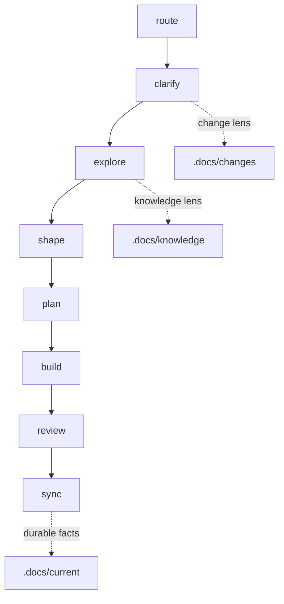

# Workflow Lite

> **Philosophy**: lightweight by default, heavier only when needed.
>
> Tasks define actions. Roles define perspective. Lenses add optional depth. Directories describe information state.

## Workflow



## Core Ideas

- `task`: a lightweight action prompt in `.workflow/tasks/`.
- `role`: a small perspective file in `.workflow/roles/`.
- `lens`: an optional escalation method in `.workflow/lenses/`.
- `.docs/work`: default place for everyday workflow artifacts.
- `.docs/changes`: optional tracked workspace for larger changes.
- `.docs/current`: durable facts synced from code, changes, or knowledge.
- `.docs/knowledge`: raw material and reusable wiki-style explanations.
- `.docs/shared`: project-wide terms, rules, and boundaries.

## Tasks

| Task | Role | Default Output | Purpose |
| :--- | :--- | :--- | :--- |
| `route` | `analyst` | chat | Recommend the smallest useful next path. |
| `clarify` | `analyst` | `.docs/work/briefs/` | Clarify goals, scope, assumptions, and acceptance. |
| `explore` | `designer` | `.docs/work/notes/` | Understand code, material, feasibility, or current behavior. |
| `shape` | `designer` | `.docs/work/shapes/` | Shape a solution, rule, contract, structure, or decision. |
| `plan` | `designer` | `.docs/work/plans/` | Turn a chosen direction or target design into repo-aware executable steps. |
| `build` | `builder` | repository changes | Apply an approved plan to code, docs, prompts, templates, or workflow artifacts. |
| `review` | `reviewer` | `.docs/work/reviews/` | Inspect behavior, risks, evidence, or refactor options. |
| `sync` | `steward` | updated docs | Update living docs, archive durable facts, or organize knowledge. |

## Lenses

Lenses are user-selected. Copilot may suggest a lens, but must not apply it unless the user explicitly names it or adds its file as context.

| Lens | Use When |
| :--- | :--- |
| `iteration` | Multi-turn discussion needs session state, background deltas, decisions, and open questions. |
| `expand` | A short shape or plan needs details, examples, pseudocode, smaller diagrams, or split part files. |
| `distill` | A strong reference document or knowledge system should be studied for reusable structure and writing principles. |
| `language` | Full English, translation, terminology consistency, or glossary maintenance is needed. |
| `domain` | Terms, rules, ownership, or boundaries are unclear. |
| `strategy` | Technical routes or design options need comparison. |
| `redteam` | The current recommendation needs deliberate critique. |
| `test` | Behavior needs stronger verification. |
| `architecture` | Structure, interfaces, dependencies, or durable tradeoffs matter. |
| `change` | Work should be tracked under `.docs/changes/{change_id}`. |
| `knowledge` | Raw material should become reusable long-term knowledge. |
| `debug` | A defect or uncertain behavior needs diagnosis. |

Architecture constraints are not global startup rules. Use `shape --lens architecture` to form architecture decisions, `review --lens architecture` to inspect structural risks, and `sync --lens architecture` to record confirmed constraints in `.docs/shared/boundaries.md`.

## Task Schema

Every task front matter uses this schema:

```yaml
id: <task_id>
role: <analyst|designer|builder|reviewer|steward>
purpose: <one sentence>
inputs:
  - <input>
outputs:
  - <output>
user_selectable_lenses:
  - <lens>
done_check:
  - <completion check>
```

Do not add legacy stage, artifact, skill, gate, or auto-applied lens fields.

## Using With Copilot

Use Copilot as a manual context composer:

- Add one task file from `.workflow/tasks/` as the main context.
- Add the matching template only when producing a file artifact.
- Add lens files only when the user explicitly selects them.
- If no lens is named, use `Lens: none`.
- Do not add all task, role, template, or lens files.

Suggested starting points:

- Add #.workflow/copilot.md as the context menu.
- Use `.github/copilot-instructions.md` for short repo-wide behavior.
- Use `.github/prompts/workflow-lite.prompt.md` as a manually invoked VS Code prompt file.

Example:

```text
Task: plan
Lens: none
Context:
- #.workflow/tasks/plan.md
- #.workflow/templates/plan.md
- #.docs/work/briefs/brief_example.md
Request:
Create a lightweight implementation plan.
```

## Getting Usage Guidance

If you are not sure which task or lens to use, start with `route`. It returns a chat-only guide with the recommended task order, lens suggestions, Add Context list, and next prompt.

Example:

```text
Task: route
Lens: none
Context:
- #.workflow/tasks/route.md
Request:
根据我的目标，推荐 task 顺序、lens、Add Context 和下一步提示词：我想先讨论目标架构，再根据当前 repo 拆计划。
```

## Using With Codex

Codex can continue to read task files directly:

- Task files keep `{{CONTENT: /.workflow/roles/...}}` and `{{CONTENT: /.workflow/templates/...}}` for role/template injection.
- Lens files are not injected by default.
- Read a lens only when the user explicitly names it or the task input says `Lens: <name>`.
- Keep ordinary outputs in `.docs/work/**`.

## Default Language

Workflow artifacts default to Chinese explanations with English technical terms preserved.

Preserve task/lens/template names, code identifiers, file paths, API names, package names, CLI commands, front matter keys, and schema keys in English. Use full English only when the user explicitly requests it or selects `language` with an English output request.

Use the `language` lens for full English output, translation, terminology normalization, readability review, or syncing stable terms to `.docs/shared/glossary.md`.

Do not create language-specific directories or filename variants by default.

## `.docs` Structure

```text
.docs/
  work/
    briefs/
    notes/
    shapes/
    plans/
    reviews/
    decisions/
  changes/
    {change_id}/
      brief.md
      plan.md
      evidence.md
      archive.md
  current/
    {topic}.md
  knowledge/
    raw/
    wiki/
      index.md
  shared/
    glossary.md
    rules.md
    boundaries.md
```

## Default Paths

- Small request: `clarify -> plan -> build`
- Need context first: `clarify -> explore -> plan -> build`
- Need solution shaping: `clarify -> explore -> shape -> plan -> build`
- Conversation-driven design: `shape --lens iteration --lens strategy -> review --lens redteam -> shape -> sync`
- Target design planning: `shape -> explore -> plan -> review -> plan`
- Expansion: `shape/plan --lens expand -> review --lens redteam -> plan/sync`
- Reference distillation for knowledge: `explore --lens distill --lens knowledge -> sync --lens knowledge`
- Reference distillation for workflow improvement: `explore --lens distill -> shape --lens distill --lens strategy -> plan -> build -> review`
- Bug or risk: `review --lens debug -> plan -> build`
- Larger tracked work: enable `change` lens and use `.docs/changes/{change_id}/`
- Knowledge capture: enable `knowledge` lens and use `.docs/knowledge/`
- Durable fact update: use `sync` and write `.docs/current/{topic}.md`

## Conversation-Driven Workflow

Use this path when the design emerges through multi-turn AI discussion rather than a one-shot spec.

1. Start a session with `shape --lens iteration` and capture the current goal, background added, candidate options, recommendation, rejected options, and open questions.
2. Explore options with `explore --lens strategy` or `shape --lens strategy`; compare 2-4 routes by fit, cost, risk, evidence, and what would change the decision.
3. Add DDD-lite discussion only when useful with `shape --lens domain`: align language, story flow, events, boundaries, rule ownership, and model changes.
4. Challenge the direction with `review --lens redteam`, optionally adding `domain` when critique should inspect terms, events, boundaries, or ownership.
5. Revise with `shape` until the recommendation is stable enough to plan.
6. Sync only stable conclusions with `sync`, writing durable facts to `.docs/current/**`, reusable knowledge to `.docs/knowledge/wiki/**`, and shared language or boundaries to `.docs/shared/**`.

DDD-lite is a discussion technique here, not a default development mode.

## Target Design To Repo Plan

Use this path when you first form a target architecture or conceptual design, then want to plan how the current repository should move toward it.

1. Use `shape` to define the target design. Add `architecture`, `domain`, `strategy`, or `iteration` only when the user selects them.
2. Use `explore` to map that target design onto the current repo: relevant modules, reusable parts, conflicts, impact surface, and unknowns.
3. Use `plan` to produce a repo-aware implementation sequence: target design, current repo fit, impact map, step options, recommended sequence, discussion points, verification, and handoff notes.
4. Use `review --lens redteam` to challenge the plan's step order, hidden costs, boundary conflicts, risk assumptions, and verification gaps.
5. Revise with `plan`, then continue to `build` or use `sync` to preserve only stable conclusions.

This is planning support, not a new architecture workflow. Do not add architecture, conceptual, DDD, TDD, or SDD detail unless the user selects the relevant lens.

## Expansion Outputs

Use `expand` when a compact shape, concept, decision, or plan needs more detail or should be split into smaller drafts.

- Do not create expansion-specific directories.
- Write expansion files next to the source artifact.
- Small expansion: `{base}.expanded.md`.
- Split expansion: `{base}.expanded.md` plus `{base}.part_{topic}.md`.
- The main expanded file must include an `Expansion Index`.
- Each part must declare `Source`, `Part Of`, `Part Topic`, `Depends On`, and `Status`.
- If there are more than 8 parts, keep the same naming scheme and maintain the index instead of creating a new directory.
- Keep expanded content as draft unless `sync` extracts stable conclusions.
- Do not write expanded drafts directly into `.docs/current/**`.

## Distillation

Use `distill` when you find an excellent business document, architecture directory, RFC, ADR, handbook, or knowledge base and want to understand why it works.

Distillation is not ordinary summarization. It should extract observed structure, reader journey, information types, why the document works, transferable structures, non-transferable context, and an adoption recommendation: `adopt`, `adapt`, `reject`, or `revisit`.

Default outputs:

- `explore --lens distill`: `.docs/work/notes/note_{source}_distillation.md`
- `shape --lens distill`: `.docs/work/shapes/shape_distill_{topic}.md`
- `sync --lens distill --lens knowledge`: `.docs/knowledge/wiki/**` or `.docs/shared/**`

Do not let `sync` directly modify `.workflow/**`. If distillation suggests changing `.workflow/templates/**`, `.workflow/lenses/**`, task prompts, or Copilot guidance, first use `shape` to choose the improvement, then `plan` to approve concrete repository changes, then `build` to apply them.

## Rules

- Keep the default path light.
- Select lenses only when the user explicitly asks or adds them as context.
- Copilot may suggest lenses, but must not auto-apply them.
- Explain why a selected lens is being used.
- Do not create change, current, or knowledge artifacts for ordinary small tasks.
- Use Mermaid diagrams only when they reduce understanding cost; do not add diagrams as decoration.
- Keep `src/**/MODULE.md` next to code.
- Code remains the source of truth for runtime behavior.
- Workflow Root is the repository root containing `.workflow/`.
