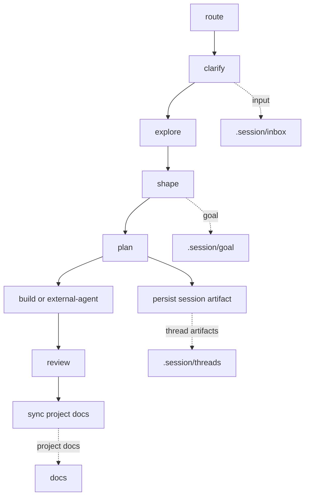

# Workflow Lite

> Lightweight by default. Session memory is separate from code-aligned project docs.

## Workflow



## Core Ideas

- `task`: lightweight action prompt in `.workflow/tasks/`.
- `role`: small perspective file in `.workflow/roles/`.
- `lens`: optional user-selected thinking method in `.workflow/lenses/`.
- `.session`: AI session working memory, not project source of truth.
- `.session/goal`: evolving goal space and target docs map.
- `.session/inbox`: unprocessed or lightly structured inputs, background, exploration notes, and reference material.
- `.session/threads`: related shape, option, plan, review, decision, and reference artifacts grouped by discussion/work thread.
- `persist`: the only task that writes session artifacts.
- `docs`: code-aligned project docs maintained by the host project.
- `notes`: optional disposable exploration notes for lightweight exploration repos when explicitly targeted.
- `src/**/README.md`: optional code-adjacent reading entrypoint.

## Session Structure

```text
.session/
  goal/
    vision.md
    target_docs.md
    assumptions.md
    roadmap.md
  inbox/
  threads/
    {thread}/
  archive/
```

Use `.session/**` for work that may change during AI collaboration. Stable long-term knowledge, terms, architecture constraints, and design docs belong in `docs/**`.

## Session Naming

Session directories express role; file prefixes express artifact kind.

- `inbox`: `note_{topic}.md`, `brief_{topic}.md`
- `threads/{thread}`: `brief_`, `note_`, `shape_`, `option_`, `plan_`, `review_`, `decision_`, `distillation_`, `expanded_`

Do not use task names as mandatory file prefixes. `docs/**` follows the host project's project docs naming. `src/**/README.md` is fixed.

`thread` is a kebab-case discussion or work topic. File `{topic}` remains snake_case. Path location does not authorize execution; user-invoked `build` with an explicit executable plan is the authorization boundary.

## Tasks

| Task | Role | Default Output | Purpose |
| :--- | :--- | :--- | :--- |
| `route` | `analyst` | chat | Recommend the smallest useful next path. |
| `clarify` | `analyst` | chat | Capture staged requirements, background, scope, and acceptance notes. |
| `explore` | `designer` | chat | Understand code, materials, behavior, feasibility, or reference structure. |
| `shape` | `designer` | chat | Form a direction, concept, architecture, goal update, or session decision. |
| `plan` | `designer` | chat | Turn a chosen direction into a repo-aware plan or external-agent handoff. |
| `persist` | `steward` | `.session/**` | Persist high-fidelity structured session artifacts from discussion, thread artifacts, Persist Packets, or user-provided sources. |
| `build` | `builder` | repository changes | Apply an explicit workflow-managed plan. |
| `review` | `reviewer` | chat | Review behavior, evidence, plans, diffs, decisions, or docs alignment. |
| `sync` | `steward` | `docs/**` or `src/**/README.md` | Project confirmed facts into code-aligned project docs and code-adjacent README files. |

## Task Boundary Shortcut

When unsure, start with `shape`. Use `explore` for evidence and `review` for verdict.

- `shape = synthesis`: default for ambiguous, what-if, strategy, conceptual, direction-setting, entrypoint-selection, or "how should I think about this" requests.
- `explore = evidence`: use only when the request primarily needs facts from code, docs, behavior, feasibility checks, references, entrypoints, or dependencies.
- `review = verdict`: use only when there is an existing target to judge, such as code, docs, plan, diff, decision, behavior claim, or thread artifact.
- `plan = executable sequence`: use when the direction is chosen and the user needs implementable steps.

`shape` may give provisional recommendations, but it must not provide approval or readiness verdicts. `explore` must not choose final direction. `review` must not invent replacement design.

For repository conflicts:

- Discovery question: conflict = reliability risk. Use `explore` for what exists, where it is, how it appears to work, and how reliable the evidence is.
- Judgment question: conflict = possible source-of-truth issue. Use `review --lens consistency` when the user asks what is correct, acceptable, ready, or worth changing.
- Do not infer repo ownership. Use the user's question type to choose `explore` vs `review`.

For project docs:

- `review` makes the judgment: source-of-truth, readiness, drift, and whether a fact should enter `docs/**`.
- `sync` performs the projection: rewrite confirmed facts into `docs/**` or `src/**/README.md` without reopening the design judgment.

## Lenses

Lenses are user-selected. Copilot may suggest a lens, but must not apply it unless the user explicitly names it or adds its file as context.

| Lens | Use When |
| :--- | :--- |
| `iteration` | Multi-turn discussion needs session state, goal changes, decisions, and open questions. |
| `expand` | A decision or plan needs examples, pseudocode, smaller diagrams, or split parts. |
| `consistency` | Session decisions, project docs, code, tests, or README files may conflict. |
| `distill` | A strong reference document should be studied for reusable structure and writing principles. |
| `language` | Full English, translation, terminology consistency, or project glossary updates are needed. |
| `domain` | Terms, rules, ownership, boundaries, or conceptual model are unclear. |
| `strategy` | Technical routes or design options need comparison. |
| `redteam` | The current recommendation needs deliberate critique. |
| `test` | Behavior needs stronger verification. |
| `architecture` | Structure, interfaces, dependencies, constraints, or durable tradeoffs matter. |
| `debug` | A defect or uncertain behavior needs diagnosis. |

## Mode And Write Boundaries

- `Mode: discuss`: chat only; no templates and no writes.
- `Task: persist` in `Mode: persist`: writes session artifacts to `.session/**`.
- `Task: sync` in `Mode: persist`: writes only `docs/**` or explicit `src/**/README.md`.
- `Mode: execute`: uses `Task: build` with an explicit executable plan.
- External-agent path: native Plan -> Implement from Codex, Copilot, OpenCode, or similar agents, with plan audit before implementation and diff review afterward.

`Mode: execute` is workflow-managed execution only.

Native Plan/Implement is a separate external-agent write path.

## Token-Aware Copilot Usage

Default to `Output: compact`.

Protocol: `Output: compact | normal | full`.

- `compact`: short answer plus optional `Persist Hint`.
- `normal`: add concise rationale or evidence when needed.
- `full`: use only for explicit persist requests, artifact previews, plan handoff, external-agent audit, diff review, or complex composite routing.

Daily Copilot path:

```text
discuss compact -> persist full artifact only when needed
```

Discussion tasks should not output full `Persist Packet` by default. Use `Persist Hint` unless the user asks to persist, asks for `Output: full`, or needs a handoff/audit.

## Task Boundary Router

Before acting, classify whether the request fits the selected task:

- `fits`: the task can handle it directly.
- `fits_with_preflight`: the task can handle it after a read-only preflight.
- `composite`: multiple tasks are needed.
- `wrong_task`: another task is the proper entrypoint.
- `missing_prerequisite`: required target, explicit plan, source of truth, or project docs safety is missing.

Composite requests should return segmented prompts with stop points. Do not silently switch tasks or automatically run later write/implementation segments.

## Persist-Centered Session Writes

Discussion tasks do not write files. They should end with short `Persist Hint` when the current output is worth preserving. Full `Persist Packet` is only for `Output: full`, explicit persist requests, or handoff/audit responses.

- `persist` writes `.session/**`.
- `persist` may also write explicit `notes/**` disposable exploration notes.
- `persist` consumes `Persist Hint`, `Persist Packet`, recent discussion, existing artifacts, or source files.
- `persist` can infer targets for `.session/inbox/**` and `.session/threads/{thread}/{artifact}_{topic}.md`.
- `Thread` or `Target Directory` may guide where related artifacts are grouped.
- Explicit `.session/**` targets are respected even when the file name does not follow the recommended prefix.
- `notes/**` must be explicit and is never inferred.
- Targets outside `.session/**` and `notes/**` are routed instead of rejected: `docs/**` and `src/**/README.md` go to `sync`; code, `.workflow/**`, and `.github/**` go to `build` or external-agent.

Persisted artifacts preserve decision-relevant reasoning, not full transcript. They should be more structured than chat without dropping useful context, evidence, tradeoffs, rejected options, examples, risks, open questions, or next use.

`persist` may apply explicit revisions, but it must not make new design, planning, or review judgments. If review feedback requires choosing a new direction, reordering a plan, or deciding whether a finding is correct, return to `shape`, `plan`, or `review` before persisting.

`shape` emits `Artifact ID: shape_<topic>` when it is worth persisting. Use `persist shape_<topic>` to anchor persistence to that shape. In multi-topic discussions, `persist` should preserve the original/main goal by default and treat later topics as supporting context unless explicitly targeted.

`persist` uses:

- `Intent`: `summary | exploration | decision | audit | handoff | constraint | reference`.
- `Depth`: `compact | standard | detailed`.

Default depth is `standard` for `brief` and `note`, and `detailed` for `shape`, `option`, `plan`, `review`, `decision`, `distillation`, and `expanded`.

## Exploration Notes

`notes/**` is a lightweight convention for exploration repos or one-off exploratory work.

- Use `Target: notes/{topic}.md` only when the user explicitly wants a disposable exploration note.
- `notes/**` is not project docs and does not use Project Docs Rules.
- `notes/**` is not an execution source for `build` or external-agent implementation.
- `persist` must not infer `notes/**`; default persist inference remains `.session/inbox/**` or `.session/threads/**`.
- Useful conclusions from `notes/**` should be promoted through normal workflow: persist to `.session/threads/**`, or sync confirmed project context to `docs/**`.
- `notes/INDEX.md` is optional. Consider it only when there are more than five active notes.
- Optional note metadata can track `status`, `source`, `updated`, and `promoted_to`.

## Implicit Preflight

Implicit preflight is a same-response, read-only check that can run automatically in `Mode: discuss`. It does not require the user to ask for preflight explicitly.

- Default implicit preflight: `shape`, `plan`, `sync`.
- Conditional implicit preflight: `review`, `build`, `explore`.
- No implicit preflight: `clarify`, `route`.

With shape-first routing:

- `shape` preflight is triage plus evidence check: decide whether to shape now, recommend `explore -> shape`, or route to `review`.
- `explore` preflight is source/scope/evidence-type check only.
- `review` preflight is target/question/evidence-readiness check only.

Implicit preflight must not load templates, write files, run implementation, run tests, perform sync, apply unselected lenses, or do a full repository scan. In `Mode: persist` and `Mode: execute`, do not run implicit preflight; block when prerequisites are missing.

## Built-in Safety Checks

Built-in safety checks are core protocol, not a lens. They do not load `.workflow/lenses/redteam.md` and do not use the full `critique.md` template.

- `shape`: name key unknowns, risky assumptions, and whether a separate `review --lens redteam` is recommended.
- `plan`: include `Step / Change / Verify / Risk / Stop Condition` for major steps.
- `build`: stop on unplanned scope expansion instead of editing beyond the explicit plan.
- `sync`: use Project Docs Rules and output `docs blocked` when project-doc safety is unclear.
- `review`: recommend `redteam` when the target is costly, ambiguous, or about to enter execution.

Safety checks should stay lightweight and should not block ordinary PoC discussion unless a write, execution, project docs update, source-of-truth decision, or irreversible change is at risk.

## Prompt Discipline

These rules are core protocol, not optional lenses:

- `Success Criteria First`: before `plan`, `build`, or `sync` writes, name what must be true when the work is done.
- `Step -> Verify`: every major plan step needs a matching verification method.
- `Minimal Diff`: implementation changes only the plan scope; no drive-by refactors, formatting churn, or opportunistic cleanup.
- `Stop On Scope Expansion`: if execution reveals that scope must expand, stop and return to `plan` or `review`.
- `Readiness Before Write`: external-agent plans and diffs should be reviewed before further implementation or project docs sync.

This project borrows prompt discipline from agent prompt repositories, but it does not copy role-command systems and does not add a root Claude-specific instruction file by default.

## Compatibility / Constraint Policy

Default policy is conservative:

- `Compatibility: preserve`
- `Constraint Mode: respect`

Policy fields: `Compatibility: preserve | breaking`; `Constraint Mode: respect | propose_override | prototype_exception`.

Only use `Compatibility: breaking` when the user or explicit source says `不背兼容`, `breaking`, `no migration`, `no alias`, or equivalent. Breaking means old paths, aliases, migrations, and fallbacks are not preserved unless the plan names them.

Only use `Constraint Mode: propose_override` or `prototype_exception` when explicitly requested. Prototype exceptions are temporary PoC scope and must not become durable project constraints unless confirmed and synced to `docs/**`.

Task behavior:

- `shape`: identify compatibility pressure and constraint tension, but do not switch policy automatically.
- `plan`: encode the selected policy into removed compatibility, migration/alias decisions, constraint exceptions, cleanup, and stop conditions.
- `build`: enforce the explicit plan policy only; stop on unplanned compatibility removal or constraint override.

## Project Docs Rules

Any write to `docs/**` must:

- Name source, future use, and source of truth.
- Name future-use success criteria for the target document.
- Preserve stable, confirmed facts useful for future human or agent execution.
- Preserve existing docs structure and tone when updating an existing file.
- Exclude AI discussion residue, unconfirmed tradeoffs, rejected options, temporary PoC detail, low-level implementation mirror content, and details that would mislead future execution.
- Output `docs blocked` and do not write `docs/**` when source, future use, source of truth, future-use success criteria, or safety is unclear.

`docs/**` is updated only when drift would cause future human/agent execution mistakes. Do not use it as a transcript, exploration log, temporary PoC journal, or low-level implementation mirror.

## Common Paths

- Usage guidance: `route`.
- Stage requirements or background: `clarify -> persist -> .session/inbox/**`.
- Explore code or reference material: `explore -> persist -> .session/inbox/**` or `.session/threads/{thread}/option_*.md`.
- Disposable exploration note: `persist -> notes/{topic}.md` only with explicit target.
- Shape a direction or goal: `shape -> persist -> .session/threads/{thread}/shape_*.md`.
- Ambiguous what-if or strategy: `shape`, then `explore -> shape` only if missing evidence could change the recommendation.
- Existing target reasonableness: `review`, then `shape` or `plan` only if revision is needed.
- Plan work or handoff: `plan -> persist -> .session/threads/{thread}/plan_*.md`.
- Multi-turn design: `shape/review/explore discuss loop -> persist into one thread`.
- Native implementation: external-agent native Plan -> `review` audit -> native Implement -> `review` diff.
- Workflow-managed implementation: `plan -> build`.
- Project docs sync: `sync -> docs/**`.
- Code-adjacent README sync: `sync -> src/**/README.md`.

## Using With Copilot

- Add one task file from `.workflow/tasks/`.
- Add selected lenses only when explicitly named.
- Add templates only for `persist` or `sync` in `Mode: persist`.
- Add relevant `.session/goal/*`, `.session/inbox/**`, `.session/threads/**`, `docs/**`, and source files.
- Use `.workflow/copilot.md` as the Add Context menu.

## Using With OpenCode

- Use `.workflow/opencode.md` as the OpenCode adapter guide.
- Keep `.workflow/**` as the source of truth; do not create a separate OpenCode workflow.
- Use OpenCode first as a read-only context helper when its context management or model quality is uncertain.
- Treat OpenCode native Plan output as an external plan draft until it is reviewed or explicitly chosen for implementation.
- Audit OpenCode plans with `review` before implementation and review diffs afterward.
- OpenCode bounded implementation should execute only explicit narrow segments.
- Temporary `.opencode/plans/` files are scratch; use `persist` to persist handoffs to `.session/threads/{thread}/plan_{topic}.md`.

## Using With Codex

- Codex support is manual. This project does not add `AGENTS.md` by default.
- Add or read `.workflow/codex.md` when you want Codex to follow Workflow Lite.
- Do not load all `.workflow/**`; use one task, explicitly selected lenses, and relevant context.
- Template files are persist-only and should be loaded only for `persist` or `sync` in `Mode: persist`.
- Codex native Plan -> Implement is `Write Path: external-agent`, not `Mode: execute`.
- If a future project needs automatic agent instructions, add a shared `AGENTS.md` separately; this repository does not require it.

## Default Language

Workflow artifacts default to Chinese explanations with English technical terms preserved. Preserve code identifiers, file paths, API names, package names, CLI commands, front matter keys, and schema keys in English. Use full English only when explicitly requested.

## Rules

- Keep the default path light.
- Default to `Mode: discuss`.
- Start non-trivial responses with an inline `Understanding Check`.
- Select lenses only when the user explicitly asks or adds them as context.
- Multiple lenses are allowed in `Mode: discuss` only when explicitly listed.
- Do not create project docs from session material without source, future use, and source of truth.
- Use Mermaid diagrams only when they reduce understanding cost.
- Workflow Root is the repository root containing `.workflow/`.
