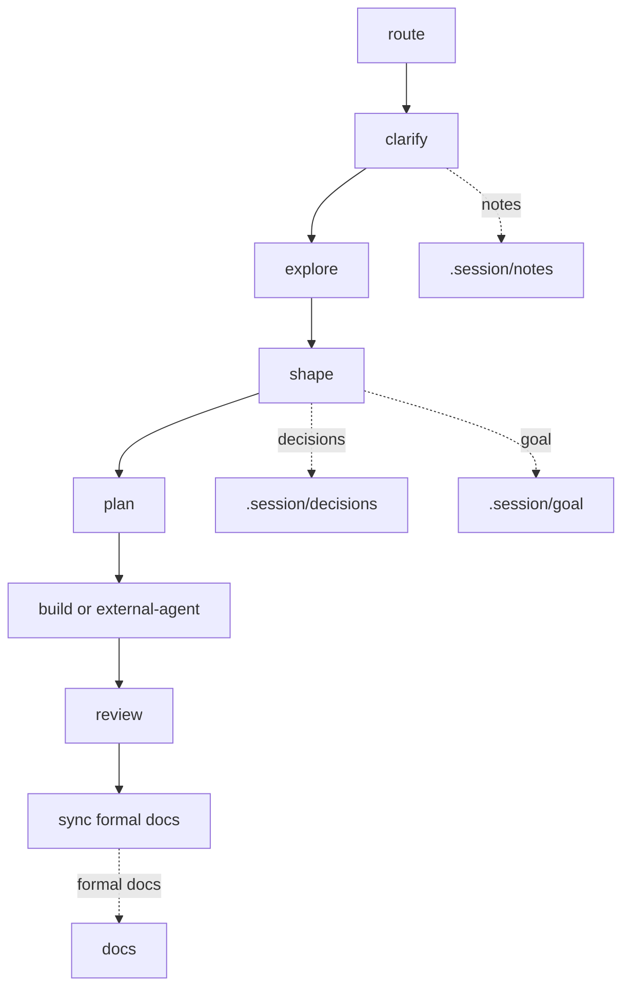

# Workflow Lite

> Lightweight by default. Session memory is separate from formal docs.

## Workflow



## Core Ideas

- `task`: lightweight action prompt in `.workflow/tasks/`.
- `role`: small perspective file in `.workflow/roles/`.
- `lens`: optional user-selected thinking method in `.workflow/lenses/`.
- `.session`: AI session working memory, not formal source of truth.
- `.session/goal`: evolving goal space and target docs map.
- `.session/notes`: staged inputs, background, exploration, and reference notes.
- `.session/decisions`: session decisions such as direction, scope, plan, constraint, handoff, or review.
- `docs`: formal project documentation maintained by the host project.
- `src/**/README.md`: optional code-adjacent reading entrypoint.

## Session Structure

```text
.session/
  goal/
    vision.md
    target_docs.md
    assumptions.md
    roadmap.md
  notes/
  decisions/
  archive/
```

Use `.session/**` for work that may change during AI collaboration. Stable long-term knowledge, terms, architecture constraints, and design docs belong in `docs/**`.

## Tasks

| Task | Role | Default Output | Purpose |
| :--- | :--- | :--- | :--- |
| `route` | `analyst` | chat | Recommend the smallest useful next path. |
| `clarify` | `analyst` | `.session/notes/` | Capture staged requirements, background, scope, and acceptance notes. |
| `explore` | `designer` | `.session/notes/` | Understand code, materials, behavior, feasibility, or reference structure. |
| `shape` | `designer` | `.session/decisions/` or `.session/goal/` | Form a direction, concept, architecture, goal update, or session decision. |
| `plan` | `designer` | `.session/decisions/` | Turn a chosen direction into a repo-aware plan or external-agent handoff. |
| `build` | `builder` | repository changes | Apply an approved workflow-managed plan. |
| `review` | `reviewer` | `.session/decisions/` | Review behavior, evidence, plans, diffs, decisions, or docs alignment. |
| `sync` | `steward` | `docs/**` or `src/**/README.md` | Align formal docs and code-adjacent README files with confirmed decisions, code, or diffs. |

## Lenses

Lenses are user-selected. Copilot may suggest a lens, but must not apply it unless the user explicitly names it or adds its file as context.

| Lens | Use When |
| :--- | :--- |
| `iteration` | Multi-turn discussion needs session state, goal changes, decisions, and open questions. |
| `expand` | A decision or plan needs examples, pseudocode, smaller diagrams, or split parts. |
| `consistency` | Session decisions, formal docs, code, tests, or README files may conflict. |
| `distill` | A strong reference document should be studied for reusable structure and writing principles. |
| `language` | Full English, translation, terminology consistency, or formal glossary updates are needed. |
| `domain` | Terms, rules, ownership, boundaries, or conceptual model are unclear. |
| `strategy` | Technical routes or design options need comparison. |
| `redteam` | The current recommendation needs deliberate critique. |
| `test` | Behavior needs stronger verification. |
| `architecture` | Structure, interfaces, dependencies, constraints, or durable tradeoffs matter. |
| `debug` | A defect or uncertain behavior needs diagnosis. |

## Mode And Write Boundaries

- `Mode: discuss`: chat only; no templates and no writes.
- Ordinary `Mode: persist`: writes session artifacts to `.session/**`.
- `Task: sync` in `Mode: persist`: writes only `docs/**` or explicit `src/**/README.md`.
- `Mode: execute`: uses `Task: build` with an approved plan.
- External-agent path: native Codex/Copilot Plan -> Implement, with plan audit before implementation and diff review afterward.

`Mode: execute` is workflow-managed execution only. Native Plan/Implement is a separate external-agent write path.

## Task Boundary Router

Before acting, classify whether the request fits the selected task:

- `fits`: the task can handle it directly.
- `fits_with_preflight`: the task can handle it after a read-only preflight.
- `composite`: multiple tasks are needed.
- `wrong_task`: another task is the proper entrypoint.
- `missing_prerequisite`: required target, approved plan, source of truth, or formal docs safety is missing.

Read-only preflight is allowed only in `Mode: discuss`. It may inspect code, docs, session files, or diffs, but it must not load templates, write files, run implementation, or apply unselected deep lenses.

Composite requests should return segmented prompts with stop points. Do not silently switch tasks or automatically run later write/implementation segments.

## Formal Docs Rules

Any write to `docs/**` must:

- Name source, target audience, and source of truth.
- Preserve stable, confirmed facts useful to formal readers.
- Preserve existing docs structure and tone when updating an existing file.
- Exclude AI discussion residue, unconfirmed tradeoffs, rejected options, internal redteam-only risks, temporary workarounds, sensitive implementation detail, and not-yet-announced plans.
- Output `docs blocked` and do not write `docs/**` when source, audience, source of truth, or safety is unclear.

## Common Paths

- Usage guidance: `route`.
- Stage requirements or background: `clarify -> .session/notes/**`.
- Explore code or reference material: `explore -> .session/notes/**`.
- Shape a direction or goal: `shape -> .session/decisions/**` or `.session/goal/**`.
- Plan work or handoff: `plan -> .session/decisions/**`.
- Native implementation: external-agent native Plan -> `review` audit -> native Implement -> `review` diff.
- Workflow-managed implementation: `plan -> build`.
- Formal docs sync: `sync -> docs/**`.
- Code-adjacent README sync: `sync -> src/**/README.md`.

## Using With Copilot

- Add one task file from `.workflow/tasks/`.
- Add selected lenses only when explicitly named.
- Add templates only in `Mode: persist`.
- Add relevant `.session/goal/*`, `.session/notes/**`, `.session/decisions/**`, `docs/**`, and source files.
- Use `.workflow/copilot.md` as the Add Context menu.

## Using With Codex

- Task files keep `{{CONTENT: /.workflow/roles/...}}` for role injection.
- Template files are persist-only and are not injected by default.
- Lens files are not injected by default.
- Read a lens only when the user explicitly names it.
- Keep `.session/**` as working memory; use `sync` for formal docs.

## Default Language

Workflow artifacts default to Chinese explanations with English technical terms preserved. Preserve code identifiers, file paths, API names, package names, CLI commands, front matter keys, and schema keys in English. Use full English only when explicitly requested.

## Rules

- Keep the default path light.
- Default to `Mode: discuss`.
- Start non-trivial responses with an inline `Understanding Check`.
- Select lenses only when the user explicitly asks or adds them as context.
- Multiple lenses are allowed in `Mode: discuss` only when explicitly listed.
- Do not create formal docs from session material without source, audience, and source of truth.
- Use Mermaid diagrams only when they reduce understanding cost.
- Workflow Root is the repository root containing `.workflow/`.
