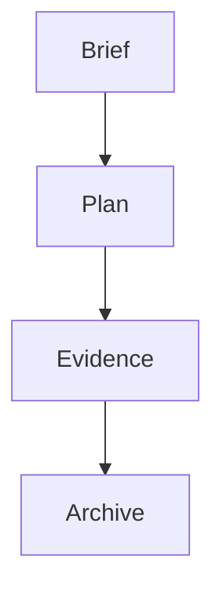

# Change

## Change ID

{{change_id}}

## Change Flow

> Optional. Add a Mermaid diagram only when it makes the change lifecycle easier to scan.

## Brief

{{goal, why, scope, and acceptance}}

## Plan

{{link to plan or embedded short plan}}

## Evidence

{{verification evidence}}

## Archive Notes

{{durable facts promoted to current docs}}
