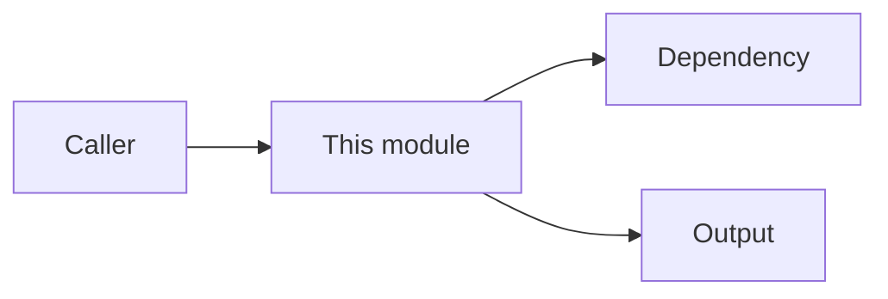

# Code-Adjacent README

## Note Type

{{module overview | surface | behavior | decision | mixed}}

## Scope

{{directory or code area covered, for example `src/auth/**`}}

## When To Read

- {{situation where this README helps}}

## Responsibilities

{{stable responsibilities of this code area, if useful}}

## Public Surface

{{important functions, classes, APIs, events, schemas, or commands}}

## Behavior Notes

{{runtime behavior confirmed from code or tests}}

## Local Decisions

- {{local decision, reason, and source}}

## Dependencies

{{important inbound and outbound dependencies}}

## Code Map

> Keep this diagram only if it improves readability.

## Verification

{{tests or checks that protect this code area}}

## Source Of Truth

- Runtime behavior: {{code or tests}}
- Product or system facts: {{.docs/current/** or none}}
- Shared boundaries: {{.docs/shared/boundaries.md or none}}

## Last Reviewed

{{yyyy-mm-dd and source}}
