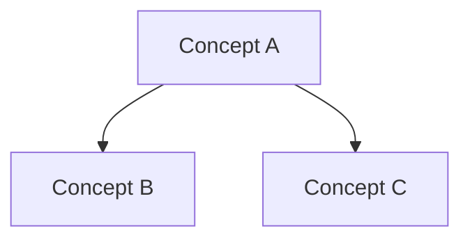
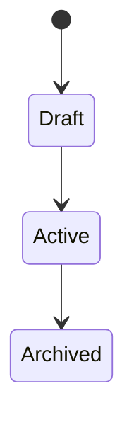

# Conceptual Design

## Purpose

{{what this conceptual model is trying to clarify}}

## User Mental Model

{{how users or stakeholders think about this capability}}

## Core Concepts

| Concept | Meaning | Responsibility | Notes |
| :--- | :--- | :--- | :--- |
| {{concept}} | {{definition}} | {{what it owns}} | {{notes}} |

## Concept Map

## Events

| Event | Trigger | Result | Owner |
| :--- | :--- | :--- | :--- |
| {{event}} | {{trigger}} | {{result}} | {{owner}} |

## Lifecycle / States

## Boundaries

### In This Concept

- {{what belongs here}}

### Not This Concept

- {{what should not be mixed in}}

## Rules Ownership

| Rule | Owner / Boundary | Source of Truth | Notes |
| :--- | :--- | :--- | :--- |
| {{rule}} | {{owner}} | {{source}} | {{notes}} |

## Open Conceptual Questions

- {{unresolved conceptual question}}

## Downstream Implications

- Shape: {{what solution design must consider}}
- Plan: {{what implementation planning must consider}}
- Knowledge: {{what should be synced if stable}}
