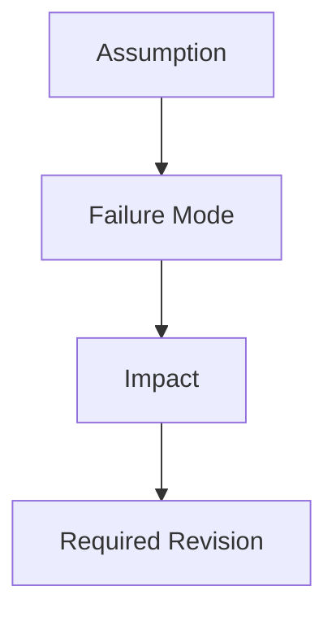

# Critique

## Target

{{option, model, plan, or recommendation being challenged}}

## Risk Path

> Optional. Add this only when the critique involves a chain of assumptions or failures.

## Assumptions Under Test

- {{assumption and why it matters}}

## Failure Modes

- {{how this could fail}}

## Hidden Costs

- {{cost that may be underestimated}}

## Boundary Conflicts

- {{unclear ownership, dependency, or responsibility conflict}}

## Rule Ownership Gaps

- {{rule with no clear owner or source of truth}}

## Long-Term Risks

- {{maintenance, migration, coupling, or operational risk}}

## What Would Break This Plan

- {{condition that invalidates the recommendation}}

## Required Revisions

- {{must-fix issue}}

## Acceptable Risks

- {{risk accepted for now and why}}
