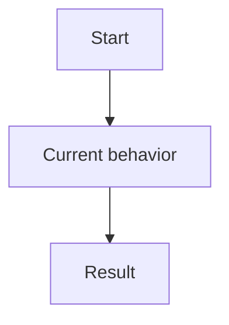

# Current

## Language / Style

{{default: Chinese explanations with English technical terms preserved; use full English only when requested}}

## Summary

{{durable current fact}}

## Behavior

{{current expected behavior or rule}}

## Behavior Map

> Optional. Add a Mermaid diagram only when it makes the durable behavior easier to understand at a glance.

## Interfaces

{{public interfaces or none}}

## Sources

- {{code path, change archive, review, or source doc}}

## Last Synced

{{date or change id}}
