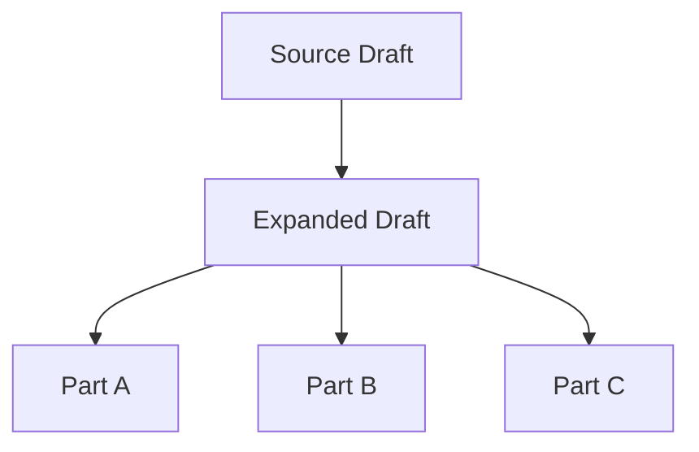

# Expanded Draft

## Language / Style

{{default: Chinese explanations with English technical terms preserved; use full English only when requested}}

## Source Summary

- Source: {{source file, message, shape, concept, or plan}}
- Source Type: {{shape | plan | concept | decision | note | other}}
- Original Summary: {{short summary of the original}}

## Expansion Index

- Source: {{source path or description}}
- Expanded: {{base.expanded.md}}
- Parts:
  - {{base.part_topic.md or none}}
- Status: {{draft | ready for review | accepted | superseded}}
- Last Updated: {{yyyy-mm-dd}}

## Part Metadata

Use this section only for part files.

- Source: {{source path or description}}
- Part Of: {{base.expanded.md}}
- Part Topic: {{topic}}
- Depends On: {{other parts or none}}
- Status: {{draft | ready for review | accepted | superseded}}

## Source Facts

- {{fact from user, code, docs, or source artifact}}

## Expanded Structure

{{expanded explanation, sections, subproposals, or detailed plan}}

## Parts

| Part | Purpose | Depends On | Status |
| :--- | :--- | :--- | :--- |
| {{base.part_topic.md}} | {{purpose}} | {{dependency or none}} | {{status}} |

## Examples

{{optional concrete examples; label as examples, not facts}}

## Pseudocode

```text
{{optional pseudocode that reduces ambiguity}}
```

## Draft Diagrams

> Keep diagrams only if they improve readability. Split diagrams instead of making one large graph.



## Assumptions Added

- {{assumption inferred during expansion and why it was added}}

## Open Questions

- {{question that should be resolved before build or sync}}

## Keep / Change / Drop

- Keep: {{parts that seem stable}}
- Change: {{parts likely to need revision}}
- Drop: {{parts that are optional or weak}}
