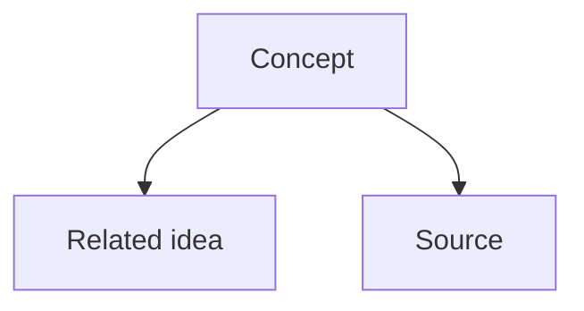

# Knowledge

## Language / Style

{{default: Chinese explanations with English technical terms preserved; use full English only when requested}}

## Summary

{{long-term explanation}}

## Concept Map

> Optional. Add a Mermaid diagram only when concepts or relationships are hard to read as prose.

## Sources

- {{raw source, code path, current doc, or decision}}

## Current Understanding

{{what is believed to be true}}

## Open Questions

- {{question or none}}

## Related

- {{related pages or docs}}
