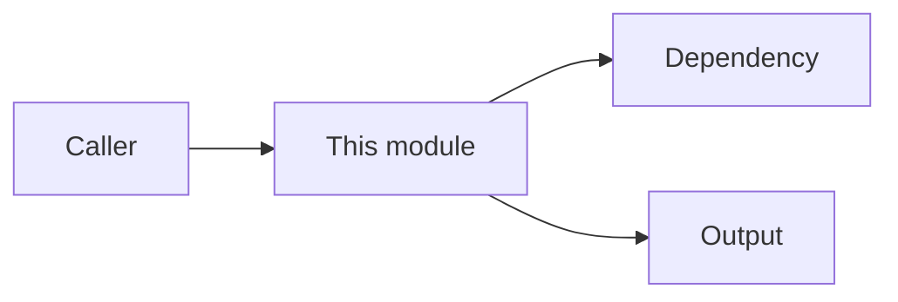

# Module Status

## Purpose

{{what this module is responsible for}}

## Public Surface

{{important functions, classes, APIs, events, or commands}}

## Dependencies

{{important inbound and outbound dependencies}}

## Module Map

> Keep this diagram only if it improves readability.

## Current Behavior

{{runtime behavior confirmed from code}}

## Recent Changes

- {{change summary, date, and source}}

## Verification

{{tests or checks that protect this module}}
