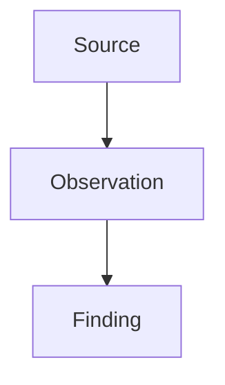

# Note

## Question

{{what was explored}}

## Sources

- {{code path, doc path, raw source, command, or observation}}

## Exploration Map

> Optional. Add a Mermaid diagram only when the explored path is easier to understand visually.

## Findings

- {{finding}}

## Unknowns

- {{unknown or none}}

## Next Step

{{recommended next task}}
