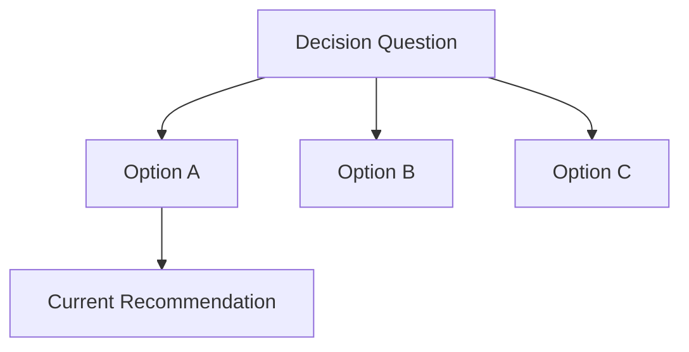

# Options

## Decision Question

{{what choice is being compared}}

## Option Map

> Optional. Add this only when option relationships are easier to scan visually.

## Options

| Option | Fit | Cost | Risk | Evidence | Status |
| :--- | :--- | :--- | :--- | :--- | :--- |
| {{option}} | {{where it fits}} | {{cost}} | {{risk}} | {{evidence}} | {{current | rejected | parked}} |

## Model Fit

| Option | Fits Concept Model | Boundary Impact | Tradeoff |
| :--- | :--- | :--- | :--- |
| {{option}} | {{yes/no/partial}} | {{impact}} | {{tradeoff}} |

## Current Recommendation

{{recommended option and why}}

## Why Not The Others

- {{option}}: {{reason}}

## What Would Change The Decision

- {{new fact, constraint, or risk that would change the recommendation}}
