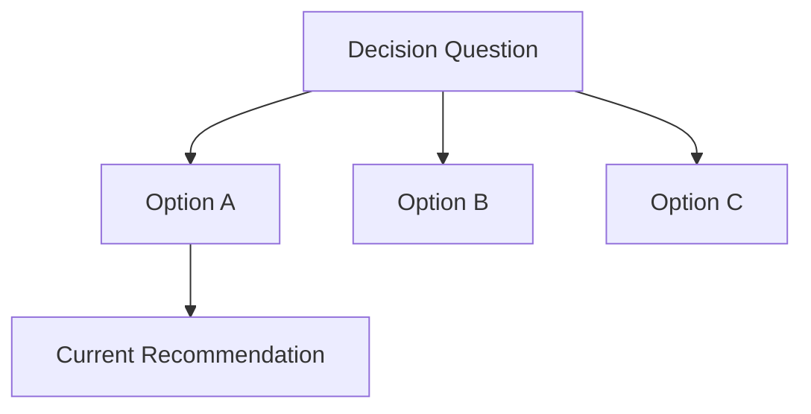

# Options

## Persist Metadata

- Artifact: option
- Status: {{working | stable | superseded}}
- Thread: {{thread-name}}
- Intent: {{exploration | decision | audit}}
- Depth: {{detailed}}
- Source: {{recent discussion | existing artifact | file path}}
- Target: {{.session/...}}
- Last Updated: {{date}}

## Source Context

- {{discussion, file, reference, or goal that triggered the comparison}}

## Important Context From Discussion

{{preserve discussion details that affect option fit, preference, exclusion, comparison criteria, examples, counterexamples, or what would change the recommendation. Do not preserve full transcript or conversational noise.}}

## Decision-Relevant Facts

- {{fact that changes option fit, cost, or risk}}

## Assumptions vs Facts

- Fact: {{confirmed input}}
- Assumption: {{inference that still needs validation}}

## Decision Question

{{what choice is being compared}}

## Discussion Trace

- Trigger: {{why these options were compared}}
- Context Added: {{background that changed the comparison}}
- Decision Trail: {{initial option set -> revision -> current recommendation}}
- Rejected Options: {{compressed list}}
- Open Questions: {{remaining uncertainty}}

## Option Map

> Optional. Add this only when option relationships are easier to scan visually.

## Options

| Option | Fit | Cost | Risk | Evidence | Status |
| :--- | :--- | :--- | :--- | :--- | :--- |
| {{option}} | {{where it fits}} | {{cost}} | {{risk}} | {{evidence}} | {{current / rejected / parked}} |

## Model Fit

| Option | Fits Concept Model | Boundary Impact | Tradeoff |
| :--- | :--- | :--- | :--- |
| {{option}} | {{yes/no/partial}} | {{impact}} | {{tradeoff}} |

## Current Recommendation

{{recommended option and why}}

## Reasoning Trail

{{how the option set and recommendation changed during discussion}}

## Why Not The Others

- {{option}}: {{reason}}

## What Would Change The Decision

- {{new fact, constraint, or risk that would change the recommendation}}

## Risks / Unknowns

- {{risk or missing evidence}}

## Open Questions

- {{question that could change option fit, cost, risk, or recommendation}}

## Examples / Pseudocode

{{example, pseudocode, or none}}

## Next Use

{{shape, plan, review, persist, sync, or none}}
