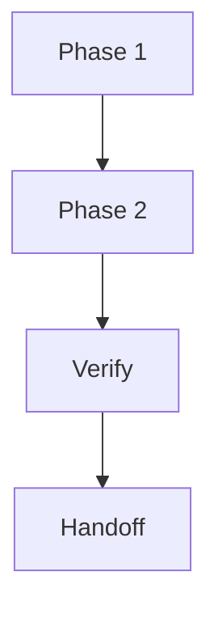

# Plan

## Persist Metadata

- Artifact: plan
- Topic: {{topic}}
- Artifact State: {{working | settled | superseded}}
- Thread: {{thread-name}}
- Intent: {{handoff | decision | audit}}
- Depth: {{detailed}}
- Source: {{recent discussion | existing artifact | file path}}
- Target: {{.session/...}}
- Last Updated: {{date}}

## Language / Style

{{default: Chinese explanations with English technical terms preserved; use full English only when requested}}

## Decision Link

- Thread plan: `.session/threads/<thread>/plan_<topic>.md`

## Plan Summary

- Target Outcome: {{what should be true after execution}}
- Recommended Path: {{short sequence or phase summary}}
- Abstraction Level: {{phase-plan | implementation-plan}}
- Readiness: {{ready for build | ready for external-agent | needs review | needs more detail | blocked}}
- Next Action: {{review | build | external-agent | sync | persist | shape | none}}
- Main Risk: {{main risk or none}}
- Source Basis: {{chat | shape artifact | inbox brief | decision | project docs}}

## Shape Summary

- Source: {{chat | shape artifact | inbox brief | decision | project docs}}
- Selected Direction: {{one-line chosen direction}}
- Key Decisions: {{decisions that affect execution order, scope, compatibility, or verification}}
- Assumptions: {{defaults or inferred decisions and risk if wrong}}

## Impact Surface

- Scope Size: {{small | medium | large}}
- Affected Surfaces: {{workflow core | task docs | templates | adapters | project docs | source code | tests | other}}
- Risk: {{low | medium | high}}
- Reversal Cost: {{low | medium | high}}
- Docs / Sync Impact: {{none | suggested | required}}
- Build / Handoff Readiness: {{ready | needs review | needs implementation-plan | blocked}}

## Plan Snapshot

- Abstraction Level: {{phase-plan | implementation-plan | none}}
- Target Outcome: {{what should be true after execution}}
- Execution Target: {{human | strong-agent | weak-agent | OpenCode | Codex | Copilot | none}}
- Phase Count: {{number of phases or none}}
- Readiness: {{ready for build | ready for external-agent | needs review | needs more detail}}
- Key Constraint: {{most important constraint or do-not-touch item}}
- Key Stop Condition: {{main reason to stop instead of expanding scope}}
- Next Use: {{review | persist | build | external-agent | sync | none}}

## Planning Basis

- Source Direction: {{shape artifact, decision, user request, project doc, or inferred target}}
- Requested Abstraction Level: {{phase-plan | implementation-plan | none}}
- Selected Abstraction Level: {{phase-plan | implementation-plan}}
- Selection Reason: {{shape recommendation | user request | inferred impact surface | readiness downgrade}}
- Locked Decisions: {{confirmed decisions and sources}}
- Assumed Decisions: {{recommended defaults and risk if wrong}}
- Rejected Options: {{options rejected because they affect sequence, scope, or constraints; none if not relevant}}
- Blocking Decisions: {{unresolved decisions blocking implementation-plan, or none}}
- Requires User Confirmation Before: {{none | implementation-plan | build}}

## What Would Make This Implementation-Ready

- {{missing target area, allowed change, verification, stop condition, or decision; none if already implementation-ready}}

## Discussion Notes To Preserve

{{preserve any discussion detail that would help future readers understand, revise, implement, or audit this plan. This may include user corrections, user preferences, examples, counterexamples, phase boundaries, phase constraints, why the sequence changed, accepted risks, or details a weaker model might otherwise miss. Do not preserve full transcript or conversational noise.}}

## Phase Plan

| Phase | Goal | Scope | Allowed Changes | Constraints | Verify | Exit Criteria | Stop Conditions |
| :--- | :--- | :--- | :--- | :--- | :--- | :--- | :--- |
| {{phase}} | {{phase goal}} | {{phase scope}} | {{allowed changes}} | {{phase constraints}} | {{verification}} | {{exit criteria}} | {{when to stop}} |

## Target Direction

{{source decision, goal, or target design}}

## Source Context

- {{thread decision, shape artifact, inbox brief, project doc, code path, or user correction}}

## Inputs

- {{input artifact, source file, target docs, constraint, or external plan source}}

## Decision-Relevant Facts

- {{fact that affects sequence, scope, verification, or target files}}

## Assumptions vs Facts

- Fact: {{confirmed input}}
- Assumption: {{inference that still needs validation}}

## Planning Rationale

- Why This Sequence: {{reason}}
- Rejected Sequencing: {{alternatives and why not}}
- Blocking Questions: {{none | questions that affect current readiness or next-step eligibility, with what each blocks}}
- Follow-up Questions: {{none | non-blocking future considerations}}

## Execution Strategy

{{why this implementation order is the safest or smallest useful path}}

## Execution Readiness

- Ready For Build: {{yes/no}}
- Ready For External Agent: {{yes/no}}
- Blocking Gaps: {{gap or none}}
- Execution Readiness: {{ready for build | needs review | needs more detail}}

> `phase-plan` is not direct build input. Convert it to `implementation-plan` before `build` or external-agent implementation.

## Success Criteria

- {{what must be true when this plan is done}}

## Allowed Changes

- {{files, docs, behavior, or interfaces allowed to change}}

## Do Not Touch

- {{path, behavior, interface, data, or docs area}}

## Compatibility / Constraint Plan

- Compatibility: {{preserve | breaking}}
- Constraint Mode: {{respect | propose_override | prototype_exception}}
- Removed Compatibility: {{old paths, aliases, behavior, schema, prompts, or none}}
- Migration / Alias: {{kept | removed | none | explicitly not provided}}
- Constraint Exceptions: {{constraint and reason, or none}}
- Do Not Preserve: {{legacy behavior intentionally dropped, or none}}
- Cleanup Required: {{old files, docs, prompts, tests, or none}}
- Stop Conditions: {{when breaking scope or exceptions exceed the explicit plan}}

> Default to `Compatibility: preserve` and `Constraint Mode: respect` unless the user or explicit source chooses otherwise.

## Current Repo Fit

- Relevant Files: {{files, packages, docs, or none}}
- Reusable Parts: {{what can be reused}}
- Conflicts: {{where current repo shape conflicts with target direction}}

## Dependencies Between Phases

- {{phase dependency, ordering constraint, or parallelizable part}}

## Impact Map

| Target | Files / Docs | Change | Risk |
| :--- | :--- | :--- | :--- |
| {{target}} | {{paths}} | {{add/change/remove}} | {{risk}} |

## Execution Flow

> Only keep this diagram if it improves readability.

## Detailed Step Sequence

| Phase | Step | Change | Verify | Risk | Stop Condition |
| :--- | :--- | :--- | :--- | :--- | :--- |
| {{phase}} | {{step}} | {{change}} | {{test, check, or manual verification}} | {{risk}} | {{when to stop and return to plan/review}} |

## Decision Trail

{{how the plan changed during discussion and why this sequence remains preferred}}

## Verification

- {{test, check, or manual verification}}

## Stop Conditions

- {{condition that requires stopping instead of expanding scope}}

## Blocking Questions

- {{none | question that blocks readiness, execution, implementation-plan, build, sync, or source-of-truth decision}}

> `implementation-plan` requires `Blocking Questions: none`. `phase-plan` may include blocking questions, but each question must say what it blocks.

## Follow-up Questions

- {{none | non-blocking future consideration}}

## Rollback / Recovery

- {{how to revert or recover if this plan fails}}

## Handoff Contract

{{success criteria, phase plan, allowed changes, do-not-touch areas, step verification, minimal diff constraints, and stop conditions for native Plan/Implement, if relevant}}

## Handoff Notes

- {{context an implementer or external agent needs to execute without making product decisions}}

## Target Docs

- {{docs path or none}}

## Stable Document Follow-up

{{include only when the plan clearly affects architecture, public behavior, module responsibility, execution constraints, agent/human onboarding context, or thread closure}}

- Impact: {{none | suggested | required}}
- Sync Domain: {{project-docs | session-archive | none}}
- Target: {{allowed docs/** path, src/**/README.md, .session/archive/<thread>/summary.md, or none}}
- Reason: {{what alignment or retrieval mistake could happen without sync}}
- Suggested Sync: {{sync prompt or none}}

## Project Docs Conditions

{{required only when the plan allows direct docs/** edits; otherwise use sync}}

- Source: {{source material}}
- Alignment Purpose: {{what code/docs alignment mistake this doc should prevent}}
- Source Of Truth: {{confirmed source}}
- Alignment Success Criteria: {{what must remain aligned after sync}}
- Existing Docs Structure: {{preserve or describe intended change}}
- Safety: {{session-only residue, temporary PoC detail, low-level mirror content, and misleading details removed}}

## Next Use

{{review, persist, build, external-agent, sync, or none}}
