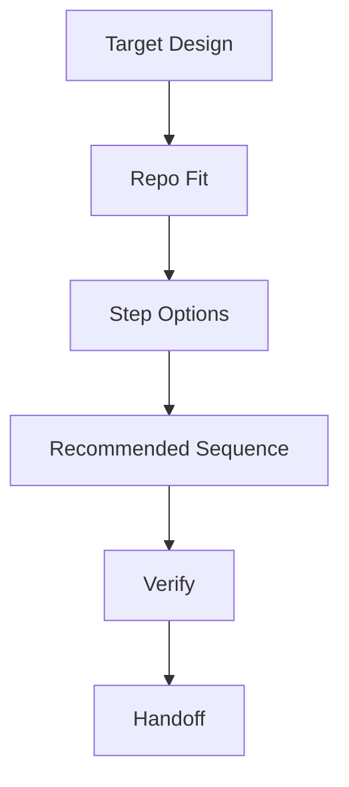

# Plan

## Language / Style

{{default: Chinese explanations with English technical terms preserved; use full English only when requested}}

## Goal

{{what will be delivered}}

## Target Design

- Source: {{shape, concept, architecture note, user proposal, or direct request}}
- Intent: {{target behavior, structure, or conceptual direction}}
- Non-Negotiables: {{boundaries, constraints, or decisions that must be preserved}}

## Current Repo Fit

- Relevant Modules: {{current files, packages, modules, or docs}}
- Reusable Parts: {{existing code or docs that can stay}}
- Conflicts: {{where current repo shape conflicts with target design}}
- Unknowns: {{repo facts that still need exploration}}

## Impact Map

| Target Area | Current Repo Surface | Change Needed | Risk |
| :--- | :--- | :--- | :--- |
| {{target concept or component}} | {{files, modules, docs, or boundary}} | {{add/change/remove}} | {{risk or none}} |

## Scope

- In: {{included work}}
- Out: {{excluded work}}

## Execution Flow

> Keep this diagram only if it improves readability. Use it to show the recommended sequence, not every detail.

## Step Options

| Option | When It Fits | Cost | Risk | Decision |
| :--- | :--- | :--- | :--- | :--- |
| {{option}} | {{fit condition}} | {{cost}} | {{risk}} | {{current/rejected/parked}} |

## Recommended Sequence

1. {{step one}}
2. {{step two}}
3. {{step three}}

## Discussion Points

- {{step ordering question, scope question, or unresolved tradeoff}}

## Verification

- {{test, check, or manual validation}}

## Risks

- {{risk or none}}

## Handoff Notes

{{anything build or review needs to know}}
