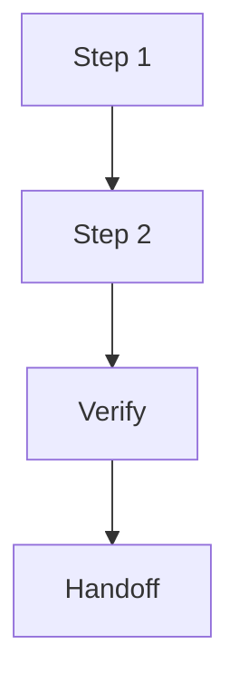

# Plan: {{topic}}

## Language / Style

{{default: Chinese explanations with English technical terms preserved; use full English only when requested}}

## Decision Link

{{.session/decisions/dec_{topic}_plan.md}}

## Target Direction

{{source decision, goal, or target design}}

## Current Repo Fit

- Relevant Files: {{files, packages, docs, or none}}
- Reusable Parts: {{what can be reused}}
- Conflicts: {{where current repo shape conflicts with target direction}}

## Impact Map

| Target | Files / Docs | Change | Risk |
| :--- | :--- | :--- | :--- |
| {{target}} | {{paths}} | {{add/change/remove}} | {{risk}} |

## Execution Flow

> Only keep this diagram if it improves readability.

## Recommended Sequence

1. {{step}}

## Do Not Touch

- {{path or behavior}}

## Verification

- {{test, check, or manual verification}}

## External-Agent Handoff

{{prompt or constraints for native Plan/Implement, if relevant}}

## Target Docs

- {{docs path or none}}
