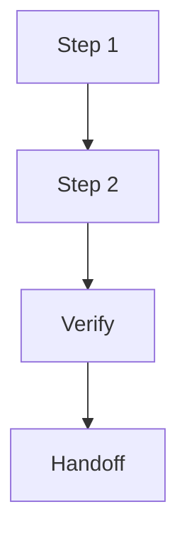

# Plan

## Persist Metadata

- Artifact: plan
- Topic: {{topic}}
- Status: {{draft | accepted}}
- Intent: {{handoff | decision | audit}}
- Depth: {{detailed}}
- Source: {{recent discussion | existing artifact | file path}}
- Target: {{.session/...}}
- Last Updated: {{date}}

## Language / Style

{{default: Chinese explanations with English technical terms preserved; use full English only when requested}}

## Decision Link

- Draft plan: `.session/drafts/plan_<topic>.md`
- Accepted plan: `.session/accepted/plan_<topic>.md`

## Target Direction

{{source decision, goal, or target design}}

## Source Context

- {{accepted decision, draft shape, goal file, project doc, code path, or user correction}}

## Inputs

- {{input artifact, source file, target docs, constraint, or external plan source}}

## Decision-Relevant Facts

- {{fact that affects sequence, scope, verification, or target files}}

## Assumptions vs Facts

- Fact: {{confirmed input}}
- Assumption: {{inference that still needs validation}}

## Planning Rationale

- Why This Sequence: {{reason}}
- Rejected Sequencing: {{alternatives and why not}}
- Open Questions: {{remaining uncertainty}}

## Execution Strategy

{{why this implementation order is the safest or smallest useful path}}

## Execution Readiness

- Approved For Build: {{yes/no}}
- Approved For External Agent: {{yes/no}}
- Blocking Gaps: {{gap or none}}
- Draft Warning: {{draft plans are not executable by default}}

## Success Criteria

- {{what must be true when this plan is done}}

## Allowed Changes

- {{files, docs, behavior, or interfaces allowed to change}}

## Do Not Touch

- {{path, behavior, interface, data, or docs area}}

## Compatibility / Constraint Plan

- Compatibility: {{preserve | breaking}}
- Constraint Mode: {{respect | propose_override | prototype_exception}}
- Removed Compatibility: {{old paths, aliases, behavior, schema, prompts, or none}}
- Migration / Alias: {{kept | removed | none | explicitly not provided}}
- Constraint Exceptions: {{constraint and reason, or none}}
- Do Not Preserve: {{legacy behavior intentionally dropped, or none}}
- Cleanup Required: {{old files, docs, prompts, tests, or none}}
- Stop Conditions: {{when breaking scope or exceptions exceed approval}}

> Default to `Compatibility: preserve` and `Constraint Mode: respect` unless the user or accepted source explicitly chooses otherwise.

## Current Repo Fit

- Relevant Files: {{files, packages, docs, or none}}
- Reusable Parts: {{what can be reused}}
- Conflicts: {{where current repo shape conflicts with target direction}}

## Dependencies Between Steps

- {{step dependency, ordering constraint, or parallelizable part}}

## Impact Map

| Target | Files / Docs | Change | Risk |
| :--- | :--- | :--- | :--- |
| {{target}} | {{paths}} | {{add/change/remove}} | {{risk}} |

## Execution Flow

> Only keep this diagram if it improves readability.

## Recommended Sequence

| Step | Change | Verify | Risk | Stop Condition |
| :--- | :--- | :--- | :--- | :--- |
| {{step}} | {{change}} | {{test, check, or manual verification}} | {{risk}} | {{when to stop and return to plan/review}} |

## Reasoning Trail

{{how the plan changed during discussion and why this sequence remains preferred}}

## Verification

- {{test, check, or manual verification}}

## Stop Conditions

- {{condition that requires stopping instead of expanding scope}}

## Open Questions

- {{question that blocks approval, execution, or docs sync}}

## Rollback / Recovery

- {{how to revert or recover if this plan fails}}

## External-Agent Handoff

{{success criteria, approved scope, allowed changes, do-not-touch areas, step verification, and minimal diff constraints for native Plan/Implement, if relevant}}

## Handoff Notes

- {{context an implementer or external agent needs to execute without making product decisions}}

## Target Docs

- {{docs path or none}}

## Docs Follow-up

{{include only when the plan clearly affects architecture, public behavior, module responsibility, execution constraints, or agent/human onboarding context}}

- Impact: {{none | suggested | required}}
- Target: {{docs/** path or none}}
- Reason: {{why future human/agent execution could be misled without docs update}}
- Suggested Sync: {{sync prompt or none}}

## Project Docs Conditions

{{required only when the approved plan allows direct docs/** edits; otherwise use sync}}

- Source: {{source material}}
- Future Use: {{how the doc guides future human/agent work}}
- Source Of Truth: {{confirmed source}}
- Future-Use Success Criteria: {{what future work should understand or avoid}}
- Existing Docs Structure: {{preserve or describe intended change}}
- Safety: {{session-only residue, temporary PoC detail, low-level mirror content, and misleading details removed}}

## Next Use

{{review, persist accepted, build, external-agent, sync, or none}}
