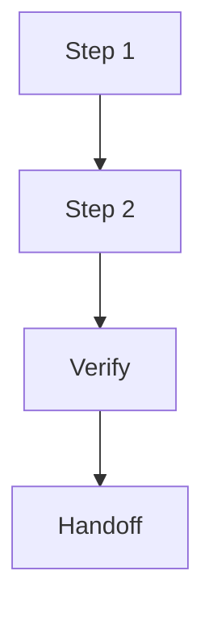

# Plan: {{topic}}

## Save Metadata

- Artifact: plan
- Status: {{draft | accepted}}
- Style: {{handoff | audit}}
- Source: {{recent discussion | existing artifact | file path}}
- Target: {{.session/...}}
- Last Updated: {{date}}

## Language / Style

{{default: Chinese explanations with English technical terms preserved; use full English only when requested}}

## Decision Link

{{.session/drafts/plan_{topic}.md or .session/accepted/plan_{topic}.md}}

## Target Direction

{{source decision, goal, or target design}}

## Planning Rationale

- Why This Sequence: {{reason}}
- Rejected Sequencing: {{alternatives and why not}}
- Open Questions: {{remaining uncertainty}}

## Execution Readiness

- Approved For Build: {{yes/no}}
- Approved For External Agent: {{yes/no}}
- Blocking Gaps: {{gap or none}}
- Draft Warning: {{draft plans are not executable by default}}

## Success Criteria

- {{what must be true when this plan is done}}

## Allowed Changes

- {{files, docs, behavior, or interfaces allowed to change}}

## Do Not Touch

- {{path, behavior, interface, data, or docs area}}

## Current Repo Fit

- Relevant Files: {{files, packages, docs, or none}}
- Reusable Parts: {{what can be reused}}
- Conflicts: {{where current repo shape conflicts with target direction}}

## Impact Map

| Target | Files / Docs | Change | Risk |
| :--- | :--- | :--- | :--- |
| {{target}} | {{paths}} | {{add/change/remove}} | {{risk}} |

## Execution Flow

> Only keep this diagram if it improves readability.

## Recommended Sequence

| Step | Change | Verify | Risk | Stop Condition |
| :--- | :--- | :--- | :--- | :--- |
| {{step}} | {{change}} | {{test, check, or manual verification}} | {{risk}} | {{when to stop and return to plan/review}} |

## Verification

- {{test, check, or manual verification}}

## Stop Conditions

- {{condition that requires stopping instead of expanding scope}}

## Rollback / Recovery

- {{how to revert or recover if this plan fails}}

## External-Agent Handoff

{{success criteria, approved scope, allowed changes, do-not-touch areas, step verification, and minimal diff constraints for native Plan/Implement, if relevant}}

## Target Docs

- {{docs path or none}}

## Formal Docs Checklist

{{required only when the approved plan allows direct docs/** edits; otherwise use sync}}

- Source: {{source material}}
- Target Audience: {{reader}}
- Source Of Truth: {{confirmed source}}
- Reader-Facing Success Criteria: {{what the reader should understand or do}}
- Existing Docs Tone / Structure: {{preserve or describe intended change}}
- Safety: {{session-only residue and unsafe details removed}}
