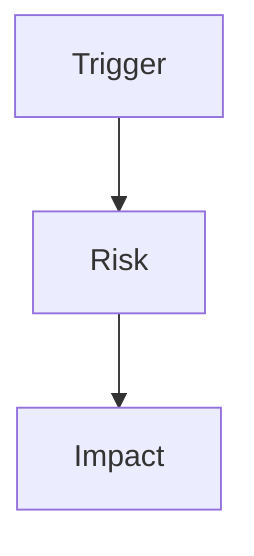

# Review: {{topic}}

## Language / Style

{{default: Chinese explanations with English technical terms preserved; use full English only when requested}}

## Review Target

{{code, docs, session decision, external plan, diff, or behavior claim}}

## Decision

{{approved | needs changes | blocked | docs blocked | accepted | revise}}

## Findings

| Severity | Finding | Evidence | Recommended Action |
| :--- | :--- | :--- | :--- |
| {{severity}} | {{finding}} | {{evidence}} | {{action}} |

## Failure Or Risk Path

> Optional. Keep this diagram only if it makes the finding easier to understand.

## Formal Docs Rules Check

{{only when docs/** is involved}}

- Source clear: {{yes/no}}
- Audience clear: {{yes/no}}
- Source of truth clear: {{yes/no}}
- Session-only material excluded: {{yes/no}}

## Verification

- {{verification performed or needed}}

## Follow-up

- {{sync, shape, plan, build, external-agent, or none}}
