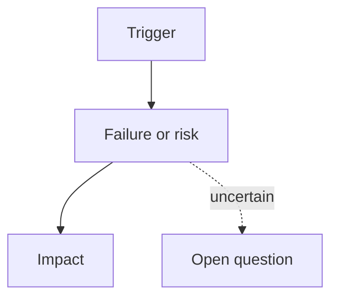

# Review

## Language / Style

{{default: Chinese explanations with English technical terms preserved; use full English only when requested}}

## Scope

{{what was reviewed}}

## Failure or Risk Path

> Optional. Add a Mermaid diagram only when it makes the finding easier to reproduce or understand.

## Findings

- Severity: {{blocker | warning | note}}
- Finding: {{issue or observation}}
- Evidence: {{path, command, reproduction, or source}}
- Recommendation: {{next action}}

## Verification Gaps

- {{gap or none}}

## Decision

{{pass, pass with risk, or blocked}}
