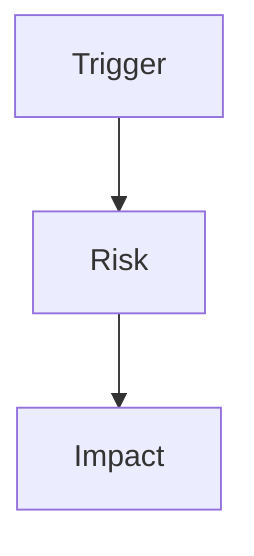

# Review: {{topic}}

## Save Metadata

- Artifact: review
- Status: {{draft | accepted}}
- Intent: {{audit | decision}}
- Depth: {{detailed}}
- Source: {{recent discussion | existing artifact | diff | file path}}
- Target: {{.session/...}}
- Last Updated: {{date}}

## Language / Style

{{default: Chinese explanations with English technical terms preserved; use full English only when requested}}

## Review Target

{{code, docs, session decision, external plan, diff, or behavior claim}}

## Review Question

{{what this review is trying to decide}}

## Source Context

- {{plan, diff, code path, formal doc, session artifact, or user claim}}

## Evidence Checked

- {{file, diff, command output, doc, artifact, or discussion evidence}}

## Decision-Relevant Facts

- {{fact that materially changes the verdict}}

## Assumptions vs Facts

- Fact: {{confirmed input}}
- Assumption: {{inference that still needs validation}}

## Discussion Trace

- Trigger: {{why this review exists}}
- Context Added: {{background that changed the verdict}}
- Decision Trail: {{initial concern -> evidence -> verdict}}
- Rejected Options: {{fixes or interpretations rejected}}
- Open Questions: {{remaining uncertainty}}

## Reasoning Trail

{{how evidence changed or confirmed the verdict}}

## Decision

{{approved | needs changes | blocked | docs blocked | accepted | revise}}

## Readiness

- Confidence: {{high | medium | low}}
- Readiness: {{0-10}}
- Blocking Gaps: {{must-fix before next write or implementation}}
- Non-blocking Gaps: {{can track without blocking}}
- Recommended Action: {{none | save | sync | shape | plan | build | external-agent}}
- Can Promote Source: {{yes/no}}
- Can Execute Plan: {{yes/no}}

## Findings

| Severity | Finding | Evidence | Recommended Action |
| :--- | :--- | :--- | :--- |
| {{severity}} | {{finding}} | {{evidence}} | {{action}} |

## What Is Still Reasonable

- {{part of the target that can remain unchanged}}

## Required Revisions

- {{required change before approval or next write}}

## Open Questions

- {{question that prevents approval, execution, or sync}}

## Failure Or Risk Path

> Optional. Keep this diagram only if it makes the finding easier to understand.

## Formal Docs Rules Check

{{only when docs/** is involved}}

- Source clear: {{yes/no}}
- Audience clear: {{yes/no}}
- Source of truth clear: {{yes/no}}
- Reader-facing success criteria clear: {{yes/no}}
- Existing docs tone and structure preserved: {{yes/no}}
- Session-only material excluded: {{yes/no}}

## Verification

- {{verification performed or needed}}

## Follow-up

- {{save, sync, shape, plan, build, external-agent, or none}}

## Recommended Next Task

{{shape | plan | build | sync | save | external-agent | none}}

## Next Use

{{save draft, save accepted, plan, build, sync, or none}}
