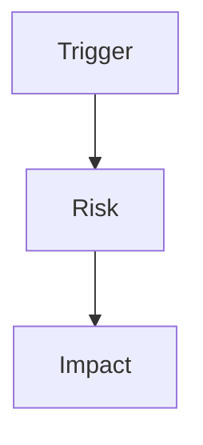

# Review

## Persist Metadata

- Artifact: review
- Topic: {{topic}}
- Artifact State: {{working | settled | superseded}}
- Thread: {{thread-name}}
- Intent: {{audit | decision}}
- Depth: {{detailed}}
- Source: {{recent discussion | existing artifact | diff | file path}}
- Target: {{.session/...}}
- Last Updated: {{date}}

## Language / Style

{{default: Chinese explanations with English technical terms preserved; use full English only when requested}}

## Review Target

{{code, docs, session decision, external plan, diff, or behavior claim}}

## Review Question

{{what this review is trying to decide}}

## Source Context

- {{plan, diff, code path, project doc, session artifact, or user claim}}

## Discussion Notes To Preserve

{{preserve discussion details that clarify the review question, user concern, evidence priority, accepted risk, or why the verdict changed. Do not redesign the target here, and do not preserve full transcript or conversational noise.}}

## Evidence Checked

- {{file, diff, command output, doc, artifact, or discussion evidence}}

## Decision-Relevant Facts

- {{fact that materially changes the verdict}}

## Assumptions vs Facts

- Fact: {{confirmed input}}
- Assumption: {{inference that still needs validation}}

## Discussion Trace

- Trigger: {{why this review exists}}
- Context Added: {{background that changed the verdict}}
- Decision Trail: {{initial concern -> evidence -> verdict}}
- Rejected Options: {{fixes or interpretations rejected}}
- Open Questions: {{remaining uncertainty}}

## Decision Trail

{{how evidence changed or confirmed the verdict}}

## Review Verdict

{{ready | needs changes | needs more evidence | blocked | docs blocked}}

## Readiness

- Confidence: {{high | medium | low}}
- Readiness: {{0-10}}
- Blocking Gaps: {{must-fix before next write or implementation}}
- Non-blocking Gaps: {{can track without blocking}}
- Recommended Action: {{none | persist | sync | shape | plan | build | external-agent}}
- Can Promote Source: {{yes/no}}
- Can Execute Plan: {{yes/no}}

## Findings

| Severity | Finding | Evidence | Recommended Action |
| :--- | :--- | :--- | :--- |
| {{severity}} | {{finding}} | {{evidence}} | {{action}} |

## What Is Still Reasonable

- {{part of the target that can remain unchanged}}

## Required Revisions

- {{required change before readiness or next write}}

## Open Questions

- {{question that prevents readiness, execution, or sync}}

## Failure Or Risk Path

> Optional. Keep this diagram only if it makes the finding easier to understand.

## Project Docs Rules Check

{{only when docs/** is involved}}

- Source clear: {{yes/no}}
- Scope clear: {{yes/no}}
- Docs type allowed: {{yes/no}}
- Source of truth clear: {{yes/no}}
- Alignment success criteria clear: {{yes/no}}
- Existing docs tone and structure preserved: {{yes/no}}
- Session-only material excluded: {{yes/no}}

## Docs Follow-up

- Impact: {{none | suggested | required}}
- Target: {{allowed docs/** path or none}}
- Reason: {{what code/docs alignment mistake could happen without docs update}}
- Recommended Sync: {{sync prompt or none}}

## Verification

- {{verification performed or needed}}

## Follow-up

- {{persist, sync, shape, plan, build, external-agent, or none}}

## Recommended Next Task

{{shape | plan | build | sync | persist | external-agent | none}}

## Next Use

{{persist, plan, build, sync, or none}}
