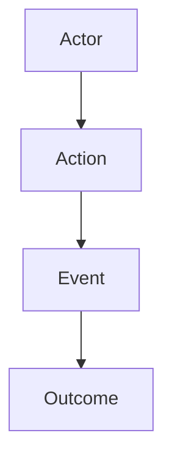

# Session

## Current Goal

{{what this discussion is trying to decide or clarify}}

## Background Added

- {{new background, source, and turn/context}}

## Constraints

- {{constraint, source, and impact}}

## Language Notes

| Term | Meaning | Source | Status |
| :--- | :--- | :--- | :--- |
| {{term}} | {{meaning}} | {{user/code/doc}} | {{stable | ambiguous | disputed}} |

## Story Flow

## Options Considered

| Option | Status | Why | Evidence |
| :--- | :--- | :--- | :--- |
| {{option}} | {{current | rejected | parked}} | {{reason}} | {{source}} |

## Current Recommendation

{{current recommendation and confidence}}

## Critiques / Weaknesses

- {{weakness or challenge}}

## Decisions So Far

- {{decision and reason}}

## Rejected Options

- {{option}}: {{why rejected}}

## Open Questions

- {{question}}

## Next Move

{{explore, shape, review, plan, or sync}}
