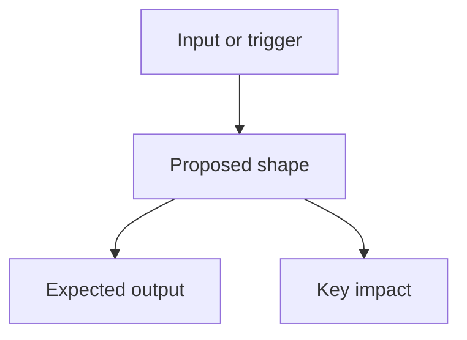

# Shape

## Language / Style

{{default: Chinese explanations with English technical terms preserved; use full English only when requested}}

## Objective

{{what this shape enables}}

## Current Context

{{relevant facts and constraints}}

## Visual Overview

> Keep this diagram only if it improves readability.

## Options

- Option A: {{simple option and tradeoff}}
- Option B: {{alternative option and tradeoff}}

## Decision

{{chosen direction and reason}}

## Implications

- Interfaces: {{none or changes}}
- Data: {{none or changes}}
- Operations: {{none or changes}}
- Risks: {{risks}}

## Plan Inputs

- {{what the plan task needs}}
