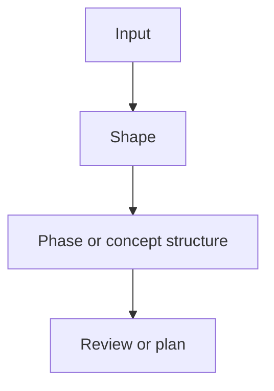

# Shape

## Persist Metadata

- Artifact: shape
- Artifact ID: {{shape_<topic>}}
- Topic: {{topic}}
- Status: {{working | stable | superseded}}
- Thread: {{thread-name}}
- Intent: {{exploration | decision | constraint}}
- Depth: {{detailed}}
- Source: {{recent discussion | existing artifact | file path}}
- Target: {{.session/...}}
- Last Updated: {{date}}

## Language / Style

{{default: Chinese explanations with English technical terms preserved; use full English only when requested}}

## Decision Link

- Thread shape: `.session/threads/<thread>/shape_<topic>.md`
- Thread decision: `.session/threads/<thread>/decision_<topic>.md`
- Goal file: `.session/goal/<file>.md`

## Decision Snapshot

- Planning Level: {{concept | high-level-plan | implementation-plan | none}}
- Current Recommendation: {{one-paragraph recommendation}}
- Core Boundary: {{main in/out boundary}}
- Narrowest Useful Wedge: {{smallest scope that can validate the goal}}
- Success Criteria: {{what would make this worth continuing}}
- Key Risk: {{main risk or unknown}}
- Next Use: {{persist | review | plan | sync | none}}

## Important Context From Discussion

{{preserve any discussion detail that would help future readers understand, revise, implement, or audit this shape. This may include user corrections, user preferences, examples, counterexamples, phase boundaries, constraints mentioned in chat, why the recommendation changed, accepted risks, or details a weaker model might otherwise miss. Do not preserve full transcript or conversational noise.}}

## Phase / Concept Structure

| Phase / Concept | Purpose | Scope | Constraints | Validation | Notes |
| :--- | :--- | :--- | :--- | :--- | :--- |
| {{phase or concept}} | {{purpose}} | {{included scope}} | {{constraint or boundary}} | {{how to validate}} | {{important context or none}} |

## Operating Constraints

- Compatibility: {{preserve | breaking}}
- Constraint Mode: {{respect | propose_override | prototype_exception}}
- In Scope: {{included work, behavior, or concept}}
- Out Of Scope: {{excluded work, behavior, or concept}}
- Do Not Assume: {{assumption or inference future work must not make}}
- Human Decision Needed: {{yes/no and why}}

> Use `Compatibility: breaking` or `Constraint Mode != respect` only when explicitly requested by the user or explicit source.

## Visual Overview

> Only keep this diagram if it improves readability.

## Problem Framing

- Problem: {{problem or opportunity}}
- Is: {{what problem this shape solves}}
- Is Not: {{what similar problem this shape does not solve}}
- Reframed Goal: {{clearer version of the user's goal}}
- Rejected Larger Scope: {{larger scope intentionally not included now}}

## Source Context

- {{discussion, goal, source file, project doc, or user correction that this shape depends on}}

## Decision-Relevant Facts

- {{confirmed fact that materially affects the shape}}

## Assumptions vs Facts

- Fact: {{confirmed input}}
- Assumption: {{inference that still needs validation}}

## Proposed Shape

{{solution shape, concept, architecture, or decision}}

## Conceptual Model

- {{core concept, boundary, relationship, lifecycle, or rule ownership note}}

## Options Considered

| Option | Fit | Cost | Risk | Status |
| :--- | :--- | :--- | :--- | :--- |
| {{option}} | {{fit}} | {{cost}} | {{risk}} | {{chosen / rejected / parked}} |

## Why This Option

{{why the proposed shape is the current recommendation}}

## Why Not Others

- {{option}}: {{reason rejected or parked}}

## Tradeoffs

- {{tradeoff}}

## Examples

- {{example scenario, workflow, API sketch, or concrete usage}}

## Validation Approach

- {{how to validate or falsify this shape}}

## Discussion Trace

- Trigger: {{why this artifact exists}}
- Context Added: {{background that changed the answer}}
- Decision Trail: {{initial direction -> revision -> current direction}}
- Rejected Options: {{compressed list}}
- Open Questions: {{remaining uncertainty}}

## Reasoning Trail

{{how the discussion moved from initial framing to the current shape}}

## Target Docs

- {{docs path or none}}

## Open Questions

- {{question}}

## Next Use

{{persist, review, plan, sync, or none}}
