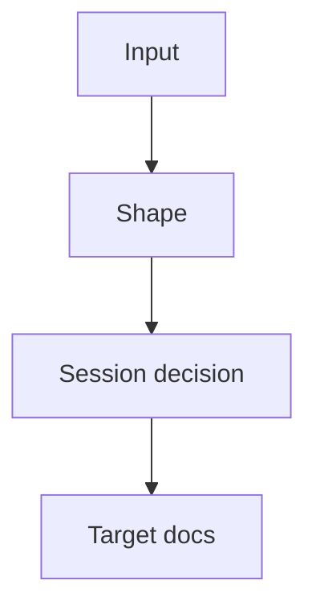

# Shape: {{topic}}

## Language / Style

{{default: Chinese explanations with English technical terms preserved; use full English only when requested}}

## Decision Link

{{.session/decisions/dec_{topic}.md or .session/goal/{file}.md}}

## Visual Overview

> Only keep this diagram if it improves readability.

## Problem

{{problem or opportunity}}

## Reframed Goal

{{clearer version of the user's goal}}

## Narrowest Useful Wedge

{{smallest scope that can validate the goal}}

## Success Criteria

- {{what would make this worth continuing}}

## Rejected Larger Scope

- {{larger scope intentionally not included now}}

## Proposed Shape

{{solution shape, concept, architecture, or decision}}

## Boundaries

- In: {{included}}
- Out: {{excluded}}

## Tradeoffs

- {{tradeoff}}

## Target Docs

- {{docs path or none}}

## Open Questions

- {{question}}
