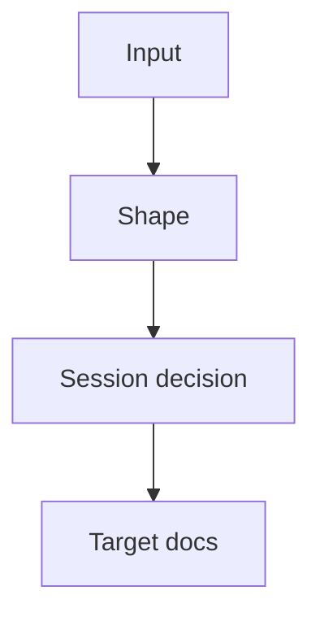

# Shape

## Persist Metadata

- Artifact: shape
- Topic: {{topic}}
- Status: {{draft | accepted}}
- Intent: {{exploration | decision | constraint}}
- Depth: {{detailed}}
- Source: {{recent discussion | existing artifact | file path}}
- Target: {{.session/...}}
- Last Updated: {{date}}

## Language / Style

{{default: Chinese explanations with English technical terms preserved; use full English only when requested}}

## Decision Link

- Draft shape: `.session/drafts/shape_<topic>.md`
- Accepted decision: `.session/accepted/decision_<topic>.md`
- Goal file: `.session/goal/<file>.md`

## Visual Overview

> Only keep this diagram if it improves readability.

## Problem

{{problem or opportunity}}

## Source Context

- {{discussion, goal, source file, project doc, or user correction that this shape depends on}}

## Decision-Relevant Facts

- {{confirmed fact that materially affects the shape}}

## Assumptions vs Facts

- Fact: {{confirmed input}}
- Assumption: {{inference that still needs validation}}

## Discussion Trace

- Trigger: {{why this artifact exists}}
- Context Added: {{background that changed the answer}}
- Decision Trail: {{initial direction -> revision -> current direction}}
- Rejected Options: {{compressed list}}
- Open Questions: {{remaining uncertainty}}

## Reasoning Trail

{{how the discussion moved from initial framing to the current shape}}

## Problem Framing

- Is: {{what problem this shape solves}}
- Is Not: {{what similar problem this shape does not solve}}

## Forces / Constraints

- {{constraint, pressure, tradeoff, or preference affecting the decision}}

## Compatibility / Constraint Check

- Compatibility: {{preserve | breaking}}
- Constraint Mode: {{respect | propose_override | prototype_exception}}
- Compatibility Pressure: {{low | medium | high}}
- Breaking Option Available: {{yes/no}}
- Constraint Tension: {{none | mild | strong}}
- Suggested Policy: {{preserve | consider breaking | consider override | prototype exception}}
- Human Decision Needed: {{yes/no}}

> Use `Compatibility: breaking` or `Constraint Mode != respect` only when explicitly requested by the user or accepted source.

## Reframed Goal

{{clearer version of the user's goal}}

## Narrowest Useful Wedge

{{smallest scope that can validate the goal}}

## Success Criteria

- {{what would make this worth continuing}}

## Rejected Larger Scope

- {{larger scope intentionally not included now}}

## Proposed Shape

{{solution shape, concept, architecture, or decision}}

## Conceptual Model

- {{core concept, boundary, relationship, lifecycle, or rule ownership note}}

## Options Considered

| Option | Fit | Cost | Risk | Status |
| :--- | :--- | :--- | :--- | :--- |
| {{option}} | {{fit}} | {{cost}} | {{risk}} | {{chosen / rejected / parked}} |

## Why This Option

{{why the proposed shape is the current recommendation}}

## Why Not Others

- {{option}}: {{reason rejected or parked}}

## Boundaries

- In: {{included}}
- Out: {{excluded}}

## Tradeoffs

- {{tradeoff}}

## Examples

- {{example scenario, workflow, API sketch, or concrete usage}}

## Validation Approach

- {{how to validate or falsify this shape}}

## Target Docs

- {{docs path or none}}

## Open Questions

- {{question}}

## Next Use

{{persist draft, review, plan, persist accepted, sync, or none}}
