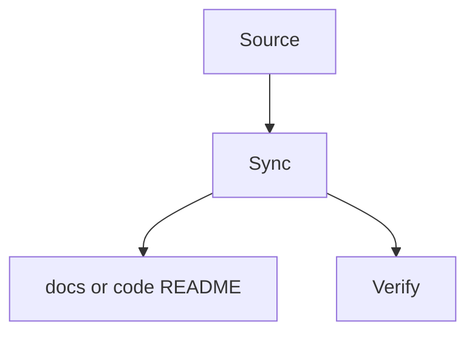

# Project Docs Sync

## Language / Style

{{default: Chinese explanations with English technical terms preserved; use full English only when requested}}

## Topic

{{topic}}

## Source

- {{session decision, code path, diff, test, existing docs, or README}}

## Target

- {{docs/** or src/**/README.md}}

## Source Of Truth

{{confirmed source of truth}}

## Future Use

{{how this doc or README will guide future human/agent work}}

## Future-Use Success Criteria

- {{what future human/agent work should understand or avoid after reading}}

## Sync Flow

> Optional. Keep this diagram only if it makes the sync path easier to audit.

## Project Docs Rules Check

- Source is clear: {{yes/no}}
- Future use is clear: {{yes/no}}
- Source of truth is clear: {{yes/no}}
- Future-use success criteria clear: {{yes/no}}
- Existing docs tone and structure preserved: {{yes/no}}
- Session-only residue removed: {{yes/no}}
- Temporary PoC, low-level mirror, or misleading details removed: {{yes/no}}

## Create Docs Gate

{{for new docs/** targets only: why this doc will reduce future human/agent execution mistakes, or docs blocked}}

## Updates

- {{project docs or README update}}

## Verification

- {{how consistency was checked}}

## Follow-up

- {{follow-up or none}}
