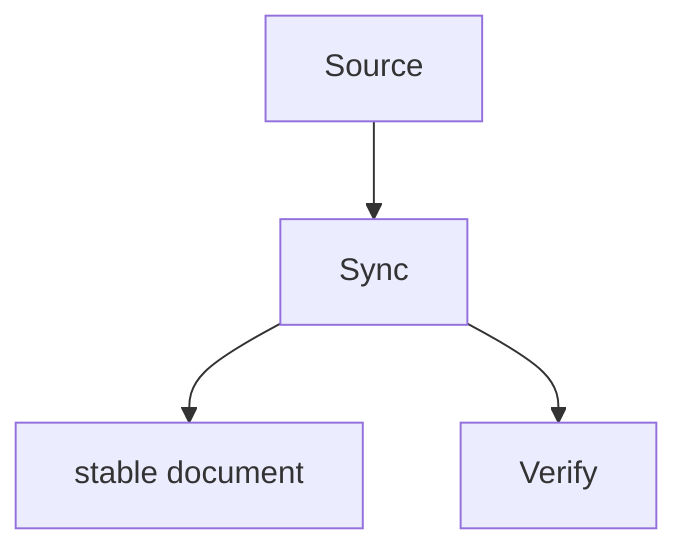

# Stable Document Sync

## Language / Style

{{default: Chinese explanations with English technical terms preserved; use full English only when requested}}

## Topic

{{topic}}

## Sync Domain

{{project-docs | session-archive}}

## Sync Object

{{architecture | feature | reference | code-readme | archive-summary | all | blocked}}

## Scope

{{explicit area, code path, feature, package, docs subtree, source thread, archive scope, or target-only sync}}

## Source

- {{session decision, source thread, code path, diff, test, existing docs, or README}}

## Target Directory

- {{explicit docs directory, src area, archive directory, existing convention, or none}}

## Target

- {{docs/** | src/**/README.md | .session/archive/<thread>/summary.md | suggested target | blocked}}

## Source Of Truth

{{confirmed source of truth}}

## Alignment Purpose

{{what code/docs alignment mistake this sync should prevent}}

## Alignment Success Criteria

- {{what must be true after sync for docs/code alignment to be correct}}

## Archive Criteria

{{only for Sync Domain: session-archive}}

- Source Thread: {{.session/threads/<thread>/**}}
- Thread Status: {{settled | superseded | abandoned | implemented | blocked}}
- Archive Purpose: {{why this archive exists}}
- Summary Scope: {{what source artifacts are summarized}}
- Next Retrieval Use: {{how future work should use the archive}}

## Alignment Set

| Sync Object | Target Directory | Target | Source | Source Of Truth | Alignment Reason | Action |
| :--- | :--- | :--- | :--- | :--- | :--- | :--- |
| {{architecture / feature / reference / code-readme / archive-summary}} | {{directory or none}} | {{target path}} | {{source path or diff}} | {{truth source}} | {{why this target must align}} | {{update / create / no change / blocked}} |

## Sync Flow

> Optional. Keep this diagram only if it makes the sync path easier to audit.

## Project Docs Rules Check

- Source is clear: {{yes/no}}
- Scope is clear: {{yes/no}}
- Sync object is clear: {{yes/no}}
- Target, target directory, or existing convention is safe: {{yes/no}}
- Source of truth is clear: {{yes/no}}
- Alignment success criteria clear: {{yes/no}}
- Existing docs tone and structure preserved: {{yes/no}}
- Session-only residue removed: {{yes/no}}
- Temporary PoC, low-level mirror, or misleading details removed: {{yes/no}}
- Workflow-internal docs leakage avoided: {{yes/no}}

## Archive Rules Check

{{only for Sync Domain: session-archive}}

- Source thread is clear: {{yes/no}}
- Thread status is clear: {{yes/no}}
- Archive purpose is clear: {{yes/no}}
- Summary scope is clear: {{yes/no}}
- Next retrieval use is clear: {{yes/no}}
- Active thread files untouched: {{yes/no}}
- Unresolved conflicts marked instead of resolved: {{yes/no}}

## Sync Object Gate

{{allowed sync object, confirmed alignment set for all, or docs blocked}}

## Create Docs Gate

{{for new docs/** targets only: object is clear, target/target directory/convention is safe, no docs taxonomy decision is being made by sync, and why this doc will reduce future code/docs alignment mistakes; otherwise docs blocked}}

## Updates

- {{project docs, README, or archive summary update}}

## Blocked Items

- {{blocked target, reason, and suggested next task or none}}

## Verification

- {{how consistency was checked}}

## Follow-up

- {{follow-up review needed, next sync batch, or none}}
