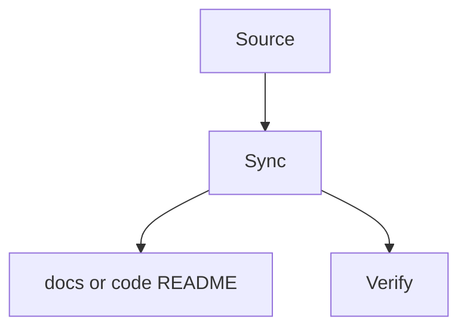

# Formal Docs Sync: {{topic}}

## Language / Style

{{default: Chinese explanations with English technical terms preserved; use full English only when requested}}

## Source

- {{session decision, code path, diff, test, existing docs, or README}}

## Target

- {{docs/** or src/**/README.md}}

## Source Of Truth

{{confirmed source of truth}}

## Audience

{{formal docs readers or code readers}}

## Reader-Facing Success Criteria

- {{what the target reader should understand or be able to do after reading}}

## Sync Flow

> Optional. Keep this diagram only if it makes the sync path easier to audit.

## Formal Docs Rules Check

- Source is clear: {{yes/no}}
- Audience is clear: {{yes/no}}
- Source of truth is clear: {{yes/no}}
- Reader-facing success criteria clear: {{yes/no}}
- Existing docs tone and structure preserved: {{yes/no}}
- Session-only residue removed: {{yes/no}}
- Sensitive or not-yet-announced details removed: {{yes/no}}

## Updates

- {{formal docs or README update}}

## Verification

- {{how consistency was checked}}

## Follow-up

- {{follow-up or none}}
