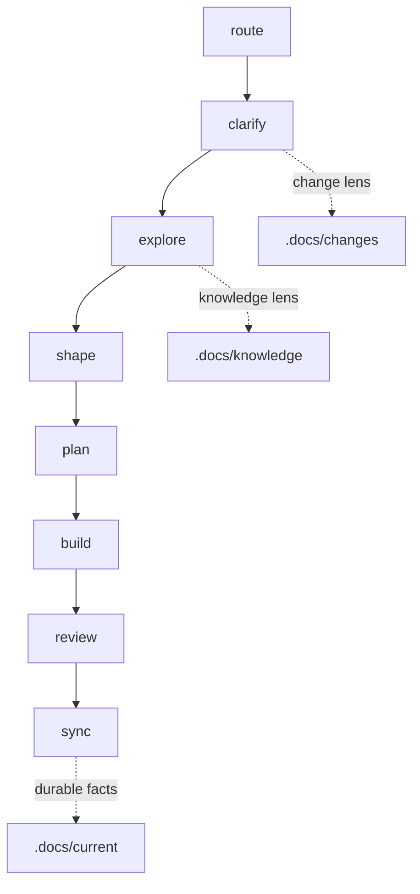

# Workflow Lite

> **Philosophy**: lightweight by default, heavier only when needed.
>
> Tasks define actions. Roles define perspective. Lenses add optional depth. Directories describe information state.

## Workflow



## Core Ideas

- `task`: a lightweight action prompt in `workflow_core/tasks/`.
- `role`: a small perspective file in `workflow_core/roles/`.
- `lens`: an optional escalation method in `workflow_core/lenses/`.
- `.docs/work`: default place for everyday workflow artifacts.
- `.docs/changes`: optional tracked workspace for larger changes.
- `.docs/current`: durable facts synced from code, changes, or knowledge.
- `.docs/knowledge`: raw material and reusable wiki-style explanations.
- `.docs/shared`: project-wide terms, rules, and boundaries.

## Tasks

| Task | Role | Default Output | Purpose |
| :--- | :--- | :--- | :--- |
| `route` | `analyst` | chat | Recommend the smallest useful next path. |
| `clarify` | `analyst` | `.docs/work/briefs/` | Clarify goals, scope, assumptions, and acceptance. |
| `explore` | `designer` | `.docs/work/notes/` | Understand code, material, feasibility, or current behavior. |
| `shape` | `designer` | `.docs/work/shapes/` | Shape a solution, rule, contract, structure, or decision. |
| `plan` | `designer` | `.docs/work/plans/` | Turn a chosen direction into executable steps. |
| `build` | `builder` | code and `src/**/MODULE.md` | Apply an approved plan safely. |
| `review` | `reviewer` | `.docs/work/reviews/` | Inspect behavior, risks, evidence, or refactor options. |
| `sync` | `steward` | updated docs | Update living docs, archive durable facts, or organize knowledge. |

## Lenses

Lenses are user-selected. Copilot may suggest a lens, but must not apply it unless the user explicitly names it or adds its file as context.

| Lens | Use When |
| :--- | :--- |
| `domain` | Terms, rules, ownership, or boundaries are unclear. |
| `test` | Behavior needs stronger verification. |
| `architecture` | Structure, interfaces, dependencies, or durable tradeoffs matter. |
| `change` | Work should be tracked under `.docs/changes/{change_id}`. |
| `knowledge` | Raw material should become reusable long-term knowledge. |
| `debug` | A defect or uncertain behavior needs diagnosis. |

Architecture constraints are not global startup rules. Use `shape --lens architecture` to form architecture decisions, `review --lens architecture` to inspect structural risks, and `sync --lens architecture` to record confirmed constraints in `.docs/shared/boundaries.md`.

## Task Schema

Every task front matter uses this schema:

```yaml
id: <task_id>
role: <analyst|designer|builder|reviewer|steward>
purpose: <one sentence>
inputs:
  - <input>
outputs:
  - <output>
user_selectable_lenses:
  - <lens>
done_check:
  - <completion check>
```

Do not add legacy stage, artifact, skill, gate, or auto-applied lens fields.

## Using With Copilot

Use Copilot as a manual context composer:

- Add one task file from `workflow_core/tasks/` as the main context.
- Add the matching template only when producing a file artifact.
- Add lens files only when the user explicitly selects them.
- If no lens is named, use `Lens: none`.
- Do not add all task, role, template, or lens files.

Suggested starting points:

- Add #workflow_core/copilot.md as the context menu.
- Use `.github/copilot-instructions.md` for short repo-wide behavior.
- Use `.github/prompts/workflow-lite.prompt.md` as a manually invoked VS Code prompt file.

Example:

```text
Task: plan
Lens: none
Context:
- #workflow_core/tasks/plan.md
- #workflow_core/templates/plan.md
- #.docs/work/briefs/brief_example.md
Request:
Create a lightweight implementation plan.
```

## Using With Codex

Codex can continue to read task files directly:

- Task files keep `{{CONTENT: /workflow_core/roles/...}}` and `{{CONTENT: /workflow_core/templates/...}}` for role/template injection.
- Lens files are not injected by default.
- Read a lens only when the user explicitly names it or the task input says `Lens: <name>`.
- Keep ordinary outputs in `.docs/work/**`.

## `.docs` Structure

```text
.docs/
  work/
    briefs/
    notes/
    shapes/
    plans/
    reviews/
    decisions/
  changes/
    {change_id}/
      brief.md
      plan.md
      evidence.md
      archive.md
  current/
    {topic}.md
  knowledge/
    raw/
    wiki/
      index.md
  shared/
    glossary.md
    rules.md
    boundaries.md
```

## Default Paths

- Small request: `clarify -> plan -> build`
- Need context first: `clarify -> explore -> plan -> build`
- Need solution shaping: `clarify -> explore -> shape -> plan -> build`
- Bug or risk: `review --lens debug -> plan -> build`
- Larger tracked work: enable `change` lens and use `.docs/changes/{change_id}/`
- Knowledge capture: enable `knowledge` lens and use `.docs/knowledge/`
- Durable fact update: use `sync` and write `.docs/current/{topic}.md`

## Rules

- Keep the default path light.
- Select lenses only when the user explicitly asks or adds them as context.
- Copilot may suggest lenses, but must not auto-apply them.
- Explain why a selected lens is being used.
- Do not create change, current, or knowledge artifacts for ordinary small tasks.
- Use Mermaid diagrams only when they reduce understanding cost; do not add diagrams as decoration.
- Keep `src/**/MODULE.md` next to code.
- Code remains the source of truth for runtime behavior.
- Workflow Root is the repository root containing `workflow_core/`.
