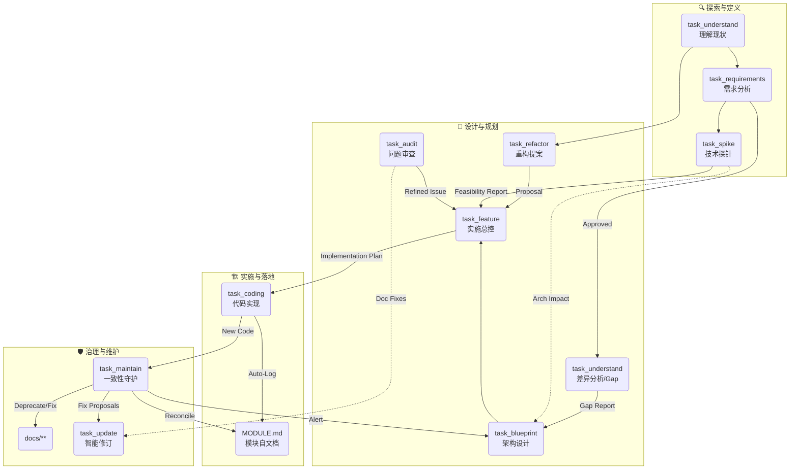

# AI 辅助开发工作流 (AI-Assisted Development Workflow)

> **Philosophy**: **Code is the Definition of Done (Code First)**.
> 文档是代码的快照与契约。我们通过一系列标准化的任务，确保文档与代码的**双向一致性**，并利用 Agent 实现模块的**自描述**与**自维护**。

## 🌐 上下文流转图 (Context Flow)

这是一个基于“领域驱动”和“代码为王”的闭环系统。



## 📂 任务清单 (Task Catalog)

任务定义位于 `core/tasks/`。所有文档均采用 **Domain-Centric** 命名法 (`docs/{Features}/{Domain}/{Intent}.md`)。

### 核心生产流 (Production)

| 任务文件 | 角色 (Role) | 目标 (Goal) | 输出路径 |
| :--- | :--- | :--- | :--- |
| **[task_understand](core/tasks/task_understand.md)** | 探险家 | **[双模式]** 生成地图 (Map Mode) 或 差异分析 (Gap Mode)。 | `docs/system_maps/` or `blueprints/` |
| **[task_requirements](core/tasks/task_requirements.md)** | 分析师 | 产出结构化 PRD。 | `docs/requirements/{Domain}/` |
| **[task_spike](core/tasks/task_spike.md)** | 起草人 | 技术可行性验证。 | `docs/spikes/{Topic}/` |
| **[task_blueprint](core/tasks/task_blueprint.md)** | 架构师 | 基于 Gap Analysis 设计架构方案。 | `docs/blueprints/{Scope}/` |
| **[task_feature](core/tasks/task_feature.md)** | TDD 专家 | **[总控]** 实施计划 (含熔断检查与模式选择)。 | `docs/features/{Domain}/` |
| **[task_coding](core/tasks/task_coding.md)** | 工程师 | **[执行]** 编码 + **自动维护 MODULE.md**。 | *src/{Module}/*, `MODULE.md` |

### 治理与维护流 (Governance)

| 任务文件 | 负责角色 | 描述 | 输出/行为 |
| :--- | :--- | :--- | :--- |
| **[task_refactor](core/tasks/task_refactor.md)** | 精修师 | 产出重构提案。 | `docs/refactors/{Target}/` |
| **[task_audit](core/tasks/task_audit.md)** | 找茬员 | 深度审计与 Arch Rule 检查。 | `docs/audits/{Focus}/` |
| **[task_update](core/tasks/task_update.md)** | 编辑 | **[智能]** 带影响分析与回滚机制的文档修订。 | *原位修改*, *Archive 备份* |
| **[task_maintain](core/tasks/task_maintain.md)** | 守护者 | **[校准]** Code-First 双向一致性修复与初始化。 | *Sync MODULE.md*, *Deprecate Docs* |

## 🚀 关键机制 (Key Mechanisms)

### 1. 模块自文档化 (Module Self-Documentation)

- **MODULE.md**: 每个业务模块根目录下的“简历”。
- **Auto-Update**: `Coding Task` 结束时，Agent 会自动：
  - 更新 Public API 签名。
  - 追加 **Distributed Changelog**（标注跨模块的 Trigger 关系）。

### 2. 领域驱动命名 (Domain-Centric Naming)

文档不再是一大堆 `yyyy_mm_dd` 的文件，而是结构化的知识库：

- `docs/features/user/login.md` (User 域的登录功能)
- `docs/blueprints/backtest/engine-optimization.md` (Backtest 域的优化蓝图)
- **备份策略**: 每次覆盖前，旧文件自动移入 `archive/` 子目录。

### 3. 一致性校准 (Code-First Reconciliation)

- **Maintain Task** 拥有最高裁决权：**代码是唯一的真理来源**。
- 如果文档说 API 是 A，代码里是 B，Maintainer 会更新文档为 B，或标记文档为 `[DEPRECATED]`。

### 4. 最佳实践 (Best Practices)

- **Impact Check**: 修改文档超过 10% 或涉及架构时，强制暂停确认。
- **Ghost Check**: 修改后主动猎杀逻辑矛盾的残余文本。

### 5. 软版本控制 (Soft Versioning Policy)

- **Local Time Machine**: 所有文档生成任务在覆盖文件前，都会自动将旧版本移动到 `archive/` 目录。
- **Naming**: `{dirname}/archive/{filename}.bak_{timestamp}.md`。
- **Value**: 即便没有 Git Commit，Agent 的每一次尝试也都可追溯、可回滚。构建了文件系统的“撤销栈”。

### 6. 模式化执行 (Mode-Based Execution)

Coding Task 根据风险等级强制分为三种模式，通过 Prompt 约束 Agent 行为：

- **Safety Mode (默认)**: 严禁修改配置和接口，仅允许写业务逻辑。
- **Pragmatic Mode**: 允许受控的配置变更（需注释）。
- **Refactor Mode**: 仅允许代码清理和重构，严禁变更业务逻辑。

### 7. 逆向工程能力 (Reverse Engineering)

Maintain 和 Update 任务具备“阅读代码理解意图”的能力。

- 它们不依赖过时的文档，而是直接从 AST（抽象语法树）或源码结构反推当前的设计状态。
- 这是 **Code-First** 哲学的核心技术支撑。

### 8. 命名规范 (Naming Convention)

为了避免不同类型文档在 IDE 中同名混淆，所有生成的文档必须强制使用以下前缀：

- **PRD**: `req_{intent}.md` (e.g., `req_login.md`)
- **Blueprints**: `bp_{scope}.md` (e.g., `bp_auth.md`)
- **Features**: `feat_{intent}.md` (e.g., `feat_login.md`)
- **Refactors**: `ref_{target}.md` (e.g., `ref_order.md`)
- **Audits**: `aud_{focus}.md` (e.g., `aud_security.md`)
- **Spikes**: `sp_{topic}.md` (e.g., `sp_redis.md`)

> **注意**: 严禁生成不带前缀的裸文件名（如 `login.md`）。

### 9. Mermaid 语法红线 (Mermaid Syntax Guard)

为了防止渲染错误，编写 Mermaid 时必须遵守：

1. **强制引号**: 所有节点文本必须使用双引号包裹。
    - ❌ 错误: `A[User (Admin)]`
    - ✅ 正确: `A["User (Admin)"]`
2. **ID 规范**: 节点 ID 只能使用英文字母和下划线，严禁空格。
    - ❌ 错误: `User Login --> System`
    - ✅ 正确: `user_login["User Login"] --> System`

### 10. 智能工作流增强 (Workflow Enhancements)

- **Gap Analysis (差异分析)**:
  - 集成在 `task_understand` 中。
  - **Gap Mode**: 输入 Code + Requirements，输出差距报告 (`gap_analysis.md`)，作为 Blueprint 的输入。

- **Pattern Extraction (模式提取)**:
  - 在 `task_understand` 中执行。
  - 自动提取目录结构和隐含风格，确保后续设计的一致性。

- **Feature Pre-Flight (飞行前检查)**:
  - `task_feature` 在设计前强制执行：意图分类 (Intent)、重构熔断 (Circuit Breaker) 和模式选择 (Mode Selection)。
  - **Fail Fast**: 代码太烂或不适合新功能时，立即熔断并建议重构。

## 🎬 场景指南 (Scenario Guide)

不知道该用哪个 Task？即使有说明书也容易迷路？请参考以下常见剧本：

### 🎭 剧本 A: "我有一个新点子" (New Feature)

1. **执行 `task_requirements`**: 输入你的想法，产出 `docs/requirements/user/signup.md`。
2. **执行 `task_understand`**: (Gap Mode) 输入 PRD，分析现状与目标的差距，产出 `docs/blueprints/user/gap_analysis_signup.md`。
3. **执行 `task_blueprint`**: 输入 Gap 报告，设计填补差距的架构方案，产出 `docs/blueprints/user/auth-system.md`。
4. **执行 `task_feature`**: 输入架构设计的一块（如 API），产出 `docs/features/user/auth-api.md`。
5. **执行 `task_coding`**: 输入 Feature 文档，让 AI 写代码并自动维护文档。
6. **执行 `task_understand`**: (Map Mode) 最后更新 `system_maps` 以反映新领土。

### 🎭 剧本 B: "这代码跑不通/有Bug" (Bug Fix)

1. **执行 `task_audit`**: 输入错误日志，分析根因，产出 `docs/audits/maintenance/crash-report.md`。
2. **执行 `task_feature`**: (若是复杂逻辑错误) 基于审计报告制定修复方案。
3. **执行 `task_coding`**: (Logic Mode) 修复代码。
4. **执行 `task_maintain`**: 确保修复没有破坏其他契约。

### 🎭 剧本 C: "这代码写的太烂了" (Refactoring)

1. **执行 `task_understand`**: 生成当前模块的地图。
2. **执行 `task_refactor`**: 提出重构提案 `docs/refactors/order/legacy-cleanup.md`。
3. **执行 `task_feature`**: 将重构提案转化为实施步骤。
4. **执行 `task_coding`**: (Refactor Mode) 安全重构。

### 🎭 剧本 D: "刚接手一个旧项目" (Project Onboarding)

1. **执行 `task_maintain`**: (使用 Bootstrap 指令) "请初始化所有文档"，生成 `MODULE.md`。
2. **执行 `task_understand`**: "生成全局系统地图"。
3. **执行 `task_audit`**: "扫描现有架构风险"。

## 📁 目录结构 (Structure)

```text
.workflow/
├── README.md               # 本文件
├── core/                   # 核心定义
│   ├── roles/              # 角色 (Persona) 定义
│   ├── tasks/              # 任务 (Prompt) 定义
│   └── templates/          # 输出模版 (Templates)
└── docs/                   # [自动管理] 领域文档库
    ├── audits/
    ├── blueprints/
    ├── features/
    ├── refactors/
    ├── requirements/
    ├── spikes/
    └── system_maps/
src/
└── {module}/
    ├── MODULE.md           # [自动维护] 模块状态与变更日志
    └── ...
```
