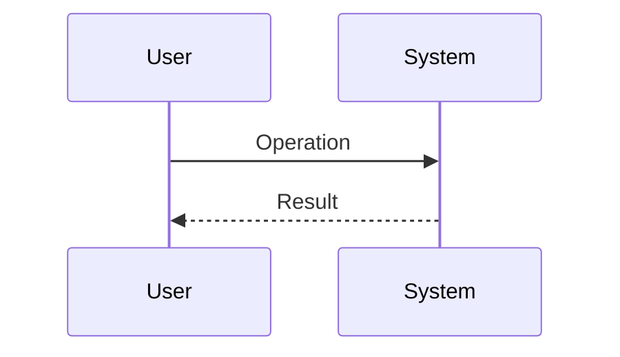
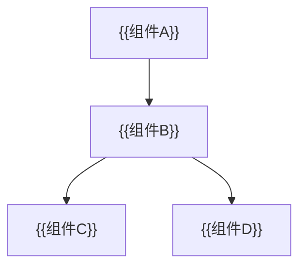
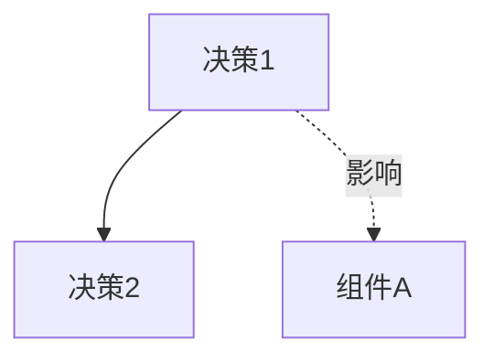

# 技术蓝图 (Technical Blueprint)

## 设计目标 (Design Objective)

{{简要描述架构设计的核心目标和约束}}

### 需求修正 (Requirement Refinement)
>
> *[Optional] 在此处记录架构设计对原始需求的修正。*
>
> - **Override**: 原需求... 修正为...

## 方案摘要 (Solution Abstract)

> **核心策略**: {{一句话描述核心技术手段}}
> **关键决策**:
>
> - {{决策1}}
> - {{决策2}}

## 技术选型 (Technology Stack)

| 类别 | 选择 | 理由 |
| :--- | :--- | :--- |
| 语言/运行时 | {{例如: Python 3.11}} | {{选择理由}} |
| 框架 | {{例如: FastAPI}} | {{选择理由}} |
| 数据库 | {{例如: PostgreSQL}} | {{选择理由}} |
| 缓存 | {{例如: Redis}} | {{选择理由}} |
| 部署 | {{例如: Docker + K8s}} | {{选择理由}} |

## 目录结构 (Project Structure)

```text
{{项目名}}/
├── src/
│   ├── {{模块1}}/
│   │   ├── __init__.py
│   │   ├── {{文件}}.py
│   │   └── ...
│   ├── {{模块2}}/
│   └── ...
├── tests/
├── docs/
├── scripts/
├── {{配置文件}}
└── README.md

```

### 核心业务流程 (Core Workflow)



## 模块划分 (Module Design)

### {{模块名称 1}}

- **职责**: {{该模块负责什么}}
- **依赖**: {{依赖哪些其他模块}}
- **对外接口**: {{暴露哪些 API 或方法}}

### {{模块名称 2}}

- **职责**: {{该模块负责什么}}
- **依赖**: {{依赖哪些其他模块}}
- **对外接口**: {{暴露哪些 API 或方法}}

## 架构图 (Architecture Diagram)



## 关键设计模式 (Key Design Patterns)

| 模式名称 | 应用场景 | 理由/好处 |
| :--- | :--- | :--- |
| {{例如: Factory Method}} | {{例如: 创建不同类型的 OrderHandler}} | {{例如: 解耦创建逻辑，易于扩展新订单类型}} |
| {{例如: Singleton}} | {{例如: DatabaseConnectionPool}} | {{例如: 全局唯一，节省资源}} |

### 核心抽象 (Core Abstractions)

| 抽象/基类名 | 职责 (Role) | 继承者 (Implementations) | 关键约束 (Must Implement) |
| :--- | :--- | :--- | :--- |
| `BaseExchange` | 定义交易所交互标准 | `Binance`, `Okx` | `fetch_ticker`, `place_order` |
| `Event` | 消息基类 | `TickEvent` | `serialize` |

### 运维与观测 (Operations & Observability)

- [ ] **Config Layering**: 已定义明确的优先级 (CLI > Env > File)。
- [ ] **Secrets Management**: 已定义敏感信息 (Secrets) 的注入方式。
- [ ] **Logging Strategy**: 已定义日志输出目标 (Stdout/File) 和格式 (Text/JSON)。

### 建议的架构规范 (Proposed Architecture Rules)

*（用户可将此章节剪切至根目录 `ARCH_RULES.md` 以作为全局约束）*

1. **依赖原则**: {{例如: Domain层严禁依赖Infrastructure层}}
2. **模块边界**: {{例如: 订单模块只能通过 Public Service 被调用}}
3. **技术限制**: {{例如: 严禁在循环中进行 SQL 查询}}

## 关键设计决策 (Key Design Decisions)

### 决策 1: {{决策标题}}

- **问题**: {{面临的问题}}
- **方案**: {{选择的方案}}
- **备选**: {{考虑过的其他方案}}
- **理由**: {{为什么选择这个方案}}
- **风险**: {{潜在风险}}

### 决策 2: {{决策标题}}

- **方案**: {{选择的方案}}
- **理由**: {{为什么选择这个方案}}
- **风险**: {{潜在风险}}

### 决策关系图 (Decisions Map)



## 实施拆解 (Implementation Breakdown)

**重要：** 请将架构蓝图拆解为具体的下游任务列表。

- [ ] **Feature Task 1**: {{例如: 基础框架搭建}}
- [ ] **Contract Task 1**: {{例如: API 接口定义}}
- [ ] **Feature Task 2**: {{例如: 核心业务流程实现}}
