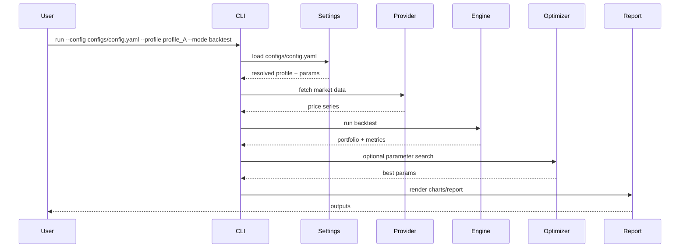
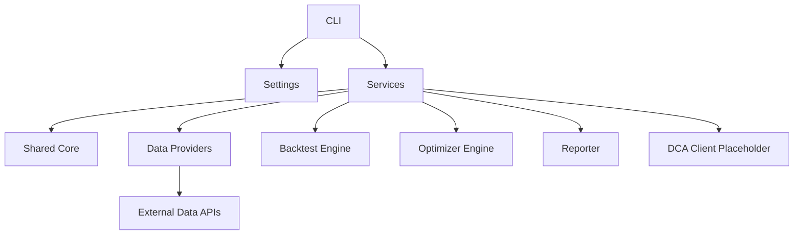
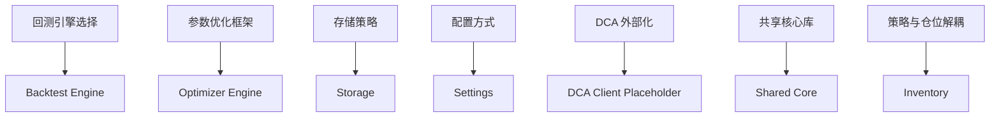

# 技术蓝图 (Technical Blueprint)

## 设计目标 (Design Objective)

对现有项目进行破坏式重构，聚焦“回测 + 参数优化 + 可视化”，通过单一 YAML 配置（含 profiles/meta）与可替换 data provider 支持多组合对比；定投与真实投资记录由其他应用接入，本蓝图暂不展开；引入共享核心库供定时服务复用策略与指标；优先使用成熟第三方库以减少重复实现。

## 技术选型 (Technology Stack)

| 类别 | 选择 | 理由 |
| :--- | :--- | :--- |
| 语言/运行时 | Python 3.11+ | 数据分析生态成熟，支持类型与性能优化，适合回测/优化场景 |
| 框架/库 | Typer + Pydantic + PyYAML | CLI 入口清晰，配置可校验，YAML 分层配置便于模块化管理 |
| 回测引擎 | vectorbt | 信号驱动回测与指标/可视化一体化，降低自研成本 |
| 参数优化 | Optuna | 采样策略丰富、可扩展，适合策略参数搜索 |
| 可视化/报告 | Plotly + quantstats | 交互式图表与成熟绩效统计能力 |
| 数据处理 | pandas + numpy | 标准化数据处理能力，社区成熟 |
| 缓存 | diskcache | 本地磁盘缓存降低数据重复拉取 |
| 共享核心库 | 本地可复用包（shared_core） | 复用数据模型与指标接口，服务间一致性 |

**数据库/存储选型（重大决策）**

- 方案 A: 本地文件（CSV/Parquet/JSON）
  - 优点：零部署、成本低
  - 缺点：查询与一致性弱
- 方案 B: SQLite
  - 优点：单文件部署、事务支持
  - 缺点：并发能力有限
- 方案 C: DuckDB
  - 优点：分析型查询强、适合列式数据
  - 缺点：生态相对轻量

**推荐**: v1 使用本地文件（CSV 为日线数据主格式），若数据规模增大优先升级到 DuckDB。

## 目录结构 (Project Structure)

```text
TradingAssistance/
├── shared_core/
│   ├── CONVENTIONS.md
│   ├── models/
│   ├── indicators/
│   ├── strategies/
│   ├── inventory/
│   ├── core_utils/
│   └── schemas/
├── backtest_app/
│   ├── CONVENTIONS.md
│   ├── app/
│   │   ├── cli/
│   │   ├── services/
│   │   └── settings/
│   ├── domain/               # optional adapter layer
│   │   ├── indicators/
│   │   └── models/
│   ├── engines/
│   │   ├── backtest/
│   │   └── optimizer/
│   ├── data_providers/
│   │   ├── adapters/
│   │   └── registry/
│   ├── reporter/
│   │   ├── charts/
│   │   └── exports/
│   ├── integration/
│   │   └── dca_client/
│   └── app_utils/
├── configs/
│   └── config.yaml
├── data/
│   └── daily_csv/
├── outputs/
├── tests/
│   ├── backtest_app/
│   └── test_lib/             # shared_core tests
└── scripts/

```

### 核心业务流程 (Core Workflow)



## 模块划分 (Module Design)

### app/cli

- __职责__: 统一 CLI 入口，通过 args 选择运行模式与配置文件（`--config`）并可指定 profile
- __依赖__: app/settings, app/services
- __对外接口__: CLI Commands

### run.py

- __职责__: 作为薄包装入口，转发到 `app/cli`，并预留未来其他应用的启动入口
- __依赖__: app/cli
- __对外接口__: 运行入口（兼容多应用启动）

### app/settings

- __职责__: 单一 YAML 配置加载与校验（profiles/meta/strategies/optimizations 作为配置块）
- __依赖__: backtest_app/app_utils, Pydantic
- __对外接口__: SettingsLoader / ProfileResolver

### app/services

- __职责__: 业务编排层，组织回测、优化、报告流程
- __依赖__: shared_core, engines, data_providers, reporter（domain 作为冗余适配层可选）
- __对外接口__: Service Facade

### shared_core/strategies

- __职责__: 策略定义与信号生成接口（跨应用复用）
- __依赖__: shared_core/models, shared_core/indicators
- __对外接口__: Strategy 抽象

### shared_core/inventory

- __职责__: 仓位分配/管理规则（与策略信号解耦，跨应用复用）
- __依赖__: shared_core/models
- __对外接口__: PositionAllocator 抽象

### domain/indicators

- __职责__: 冗余适配层，仅复用 shared_core 指标接口
- __依赖__: shared_core/indicators
- __对外接口__: 复用 shared_core 指标接口

### domain/models

- __职责__: optional adapter，针对 shared_core/models 的薄封装或占位
- __依赖__: shared_core/models
- __对外接口__: 复用 shared_core 模型接口

### engines/backtest

- __职责__: 回测执行（以 portfolio 为基本单位），连接策略信号与仓位分配
- __依赖__: shared_core, vectorbt
- __对外接口__: BacktestEngine

### engines/optimizer

- __职责__: 参数优化流程与搜索空间解析（Optuna），读取 YAML 优化配置并将结果存入 `outputs/`
- __依赖__: shared_core/strategies, shared_core/schemas
- __对外接口__: OptimizerEngine

### data_providers

- __职责__: 数据源适配与切换
- __依赖__: backtest_app/app_utils（内部工具）
- __对外接口__: MarketDataProvider + Provider Registry

### reporter

- __职责__: 绩效指标与可视化输出
- __依赖__: shared_core/models, shared_core/strategies, Plotly, quantstats
- __对外接口__: ReportBuilder

### integration/dca_client

- __职责__: Placeholder only，预留对接外部 DCA/真实投资记录应用的客户端边界
- __依赖__: backtest_app/app_utils（内部工具）
- __对外接口__: DCAServiceClient

### shared_core

- __职责__: 提供稳定的数据模型、指标/策略/仓位接口与跨服务 schema
- __依赖__: pandas, numpy
- __对外接口__: CoreModels / Indicators / Strategies / Inventory / Schemas / Utils

### shared_core/core_utils

- __职责__: 跨应用通用工具（YAML 解析/合并、基础序列化、通用路径解析）
- __依赖__: PyYAML
- __对外接口__: SharedUtils

### backtest_app/app_utils

- __职责__: 应用内工具与适配封装（运行时路径、缓存、I/O 辅助、外部 utils 注册与 YAML 解析封装）
- __依赖__: Python 标准库, shared_core/core_utils
- __对外接口__: AppUtils

__说明与警告__：
- 仅允许无状态、低依赖、纯函数型工具进入 shared_core/core_utils
- 禁止引入 app 级业务逻辑、I/O 绑定、运行时环境假设
- backtest_app 内部模块优先依赖 backtest_app/app_utils，非必要不得直接依赖 shared_core/core_utils
- 如需引用外部 utils，必须先在 backtest_app/app_utils 中注册/封装后再使用
- YAML 解析必须通过 backtest_app/app_utils 间接引用 shared_core/core_utils
- 工具变更需保持向后兼容或明确版本升级策略，避免影响其他应用
- 具体使用规范与引用禁忌见 `shared_core/CONVENTIONS.md` 与 `backtest_app/CONVENTIONS.md`

## 架构图 (Architecture Diagram)



## 关键设计模式 (Key Design Patterns)

| 模式名称 | 应用场景 | 理由/好处 |
| :--- | :--- | :--- |
| Strategy | 策略与仓位规则 | 便于扩展不同信号与仓位算法 |
| Adapter | data provider 适配层 | 隔离第三方数据源差异，支持可替换 |
| Factory Method | Provider Registry | 通过配置选择不同数据源实现 |
| Template Method | Backtest Engine | 固化回测流程、替换执行细节 |
| Facade | app/services | 对 CLI 暴露稳定的业务接口 |
| Shared Kernel | shared_core | 复用核心模型，保证跨服务一致性 |
| Front Controller | run.py | 统一入口转发与应用选择 |

## 核心抽象 (Core Abstractions)

- __Strategy__: 生成交易信号，提供参数与校验逻辑（来自 shared_core）
- __PositionAllocator__: 基于策略信号与组合状态进行仓位分配（与策略解耦，来自 shared_core）
- __Indicator/IndicatorSet__: 统一指标计算输入输出（来自 shared_core）
- __MarketDataProvider__: 拉取并校验行情数据
- __BacktestEngine__: 执行回测并产出结果
- __OptimizerEngine__: 执行参数搜索并产出最佳参数
- __OptimizationSpec__: 优化搜索空间定义（shared_core/schemas）
- __ReportBuilder__: 生成图表与报告
- __SettingsLoader/ProfileResolver__: 加载并解析 config.yaml 中的 profiles/meta/strategies/optimizations 配置块
- __DCAServiceClient__: 定义外部 DCA 服务请求/响应边界
- __CoreModels/Schemas__: 跨服务共享的模型与数据契约

## 运维与观测 (Ops Strategy)

- 配置分层：`configs/config.yaml` 为统一配置入口，支持在配置中选择 simulator 数据源（本地 CSV）
- 机密管理：API key 与敏感信息通过根目录 `.env` 注入，且由 `.gitignore` 排除
- 日志策略：默认 stdout 文本日志，支持切换为 JSON 格式并落盘到 `logs/`

## 测试策略 (Testing Strategy)

- Level 1（Light）：对策略、指标、配置解析进行单元/集成测试，使用本地样本数据
- Level 2（Simulation）：通过 config.yaml 选择 simulator data provider（本地 CSV），保证回测可复现并避免外部依赖

## 关键设计决策 (Key Design Decisions)

### 决策 1: 回测引擎选择

- __问题__: 自研回测还是采用成熟第三方引擎
- __方案__: 使用 vectorbt 作为核心回测引擎，并设计可替换的引擎抽象
- __备选__: backtrader / zipline / backtesting.py
- __理由__: 减少重复实现并提升可视化能力
- __风险__: 依赖较重，版本升级需评估，抽象设计不当会影响后续切换

### 决策 2: 参数优化框架

- __问题__: 采用何种参数搜索框架
- __方案__: 使用 Optuna，优化配置写入 YAML 配置文件，优化结果存入 `outputs/`
- __备选__: scikit-optimize / nevergrad
- __理由__: 搜索算法丰富，易扩展
- __风险__: 结果可复现性需要控制随机种子

### 决策 3: 存储策略

- __问题__: 是否引入数据库
- __方案__: 使用本地文件存储，日线数据 CSV 为主
- __备选__: SQLite / DuckDB
- __理由__: 降低部署复杂度
- __风险__: 数据规模增大后性能受限

### 决策 4: 配置方式

- __问题__: 组合与超参数如何统一管理
- __方案__: 单一 config.yaml（profiles/meta/strategies/optimizations 作为配置块）
- __备选__: 多配置文件 / CLI 参数驱动
- __理由__: 配置集中、便于管理与复现
- __风险__: 单文件体积变大，需要良好结构化

### 决策 5: DCA 与真实投资记录

- __问题__: 是否内置定投与真实记录
- __方案__: 由其他应用接入系统，本蓝图暂不考虑实现
- __备选__: 内置模块
- __理由__: 避免项目膨胀，便于独立迭代
- __风险__: 需要明确数据契约

### 决策 6: 共享核心库

- __问题__: 数据类型与指标/策略/仓位是否需要跨服务复用
- __方案__: 抽出 shared_core 作为可复用包
- __备选__: 复制代码到各服务
- __理由__: 避免漂移，保证信号与指标一致性
- __风险__: 版本治理与依赖分层需约束

### 决策 7: 策略与仓位解耦

- __问题__: 是否将策略信号与仓位管理分离
- __方案__: Strategy 仅生成信号，PositionAllocator 仅负责仓位分配
- __备选__: 策略内置仓位逻辑
- __理由__: 便于复用与对比、降低耦合
- __风险__: 接口设计需要清晰，避免上下文缺失

### 决策关系图 (Decisions Map)



## 实施拆解 (Implementation Breakdown)

__重要：__ 请将架构蓝图拆解为具体的下游任务列表。

- [ ] __Feature Task 1__: 破坏式重构目录为 backtest_app 布局与分层
- [ ] __Contract Task 1__: 定义核心抽象（Strategy/PositionAllocator/Provider/Engine/Optimizer/Report/Settings）
- [ ] __Feature Task 2__: data provider 适配与切换（含缓存）
- [ ] __Feature Task 3__: 基于 vectorbt 构建回测引擎与指标输出
- [ ] __Feature Task 4__: 参数优化引擎（Optuna）与配置驱动搜索（结果写入 `outputs/`）
- [ ] __Feature Task 5__: config.yaml 加载与 profiles/meta/strategies/optimizations 解析
- [ ] __Feature Task 6__: 可视化与报告输出
- [ ] __Feature Task 7__: CLI 入口与多模式启动（同目录多模块）
- [ ] __Feature Task 8__: DCA 对接边界占位（可选，暂不实现）
- [ ] __Feature Task 9__: shared_core 抽取（模型/指标/策略/仓位/schema/core_utils）与依赖治理，创建 `shared_core/CONVENTIONS.md` 与 `backtest_app/CONVENTIONS.md` 说明使用规范与引用禁忌，shared_core/core_utils 文件头需写明约束
- [ ] __Contract Task 2__: 明确 Strategy 与 PositionAllocator 的解耦契约与数据接口
