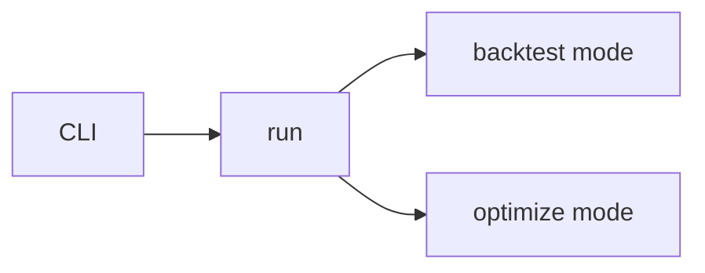

# 实现计划 (Implementation Plan)

## 验收标准列表 (Acceptance Criteria List)

- [ ] AC1: `--mode backtest` 仅执行回测流程，不触发优化逻辑。
- [ ] AC2: `--mode optimize` 仅执行优化流程，不运行回测。
- [ ] AC3: 优化结果写入 `outputs/`，路径由 optimizer 直接负责。
- [ ] AC4: CLI 的模式切换可由单元测试验证。

## 概述 (Summary)

> **目标**: 让 CLI 的不同 mode 分别触发回测与优化，确保 backtest 专注回测、optimization 专注策略优化。
> **范围**:
>
> - [x] 核心: `--mode backtest|optimize` 路由到对应服务入口
> - [x] 边界: optimizer 输出仍写入 `outputs/`
> - [ ] 排除: DCA/真实投资接入

## 需求 (Requirements)

### 核心接口定义 (Public Interface Design)

- **Class/Module**: `backtest_app/app/cli`
- **Method Signature**:

  ```python
  def main(argv: list[str] | None = None) -> int:
      ...
  ```

- **Reason**: CLI 是入口，负责将 mode 映射到 backtest/optimization。

- **Class/Module**: `backtest_app/app/services/runner`
- **Method Signature**:

  ```python
  def run(config_path: str, mode: str, profile: str) -> None: ...
  def run_backtest(config: AppConfig, profile: str, mode: str = "backtest") -> Path: ...
  def run_optimization(config: AppConfig, profile: str) -> Path: ...
  ```

- **Reason**: 保持 backtest 与 optimization 分离入口，避免交叉依赖。

### 意图分类 (Intent Classification)

- **类型**: Type A (Value Delivery)
- **理由**: 通过 CLI mode 明确分流回测与优化，交付新的运行行为。

### 配置与环境 (Configuration & Environment)

- [ ] **Config File**: 无新增字段，复用 `config.yaml` 的 `optimizations` 配置块。
- [ ] **Env Vars**: 无
- [ ] **CLI Args**: 无新增，仅使用现有 `--mode`。

### 数据变更 (Data Schema Changes)

- 无

### 依赖影响 (Dependency Impact)

- 无新增依赖；optuna/vectorbt 保持按需导入。

### 执行模式 (Mode Selection)

- **Coding Task Mode**: Safety Mode
- **理由**: 不修改配置与公共接口，仅新增内部入口函数与路由。

### 验收标准 (Acceptance Criteria)

- [ ] AC1: `--mode backtest` 仅执行回测流程，不触发优化逻辑。
- [ ] AC2: `--mode optimize` 仅执行优化流程，不运行回测。
- [ ] AC3: 优化结果写入 `outputs/`，路径由 optimizer 直接负责。
- [ ] AC4: CLI 的模式切换可由单元测试验证。

### 备选方案 (Alternatives)

- **方案 A (Minimalist Strategy)**: 只在 CLI 内 if/else 调用不同函数。
  - [ ] ✅ 采纳 (理由: 变更最小，易落地)
- **方案 B (Robust Strategy)**: 引入独立 `ModeRouter` 类管理路由。
  - [ ] ❌ 驳回 (理由: 当前规模不需要额外抽象)

### 重构熔断检查 (Refactor Circuit Breaker)

- **判定**: 未触发
- **理由**: 修改范围小于新增功能本体，且主要为入口路由与新增函数。

## 约束与复用检查 (Constraints & Reuse)

- [ ] **配置检查**: 否
- [ ] **接口检查**: 否（仅新增内部入口函数）
- [ ] **复用分析**:
  - 需实现功能: mode 路由
  - 现有候选: `run()` in runner
  - 决策: 复用并扩展

## 影响分析 (Impact Analysis)

### 受影响范围 (Scope)

- **模块**: `backtest_app/app/cli`, `backtest_app/app/services/runner`, `backtest_app/engines/optimizer`
- **API**: CLI 行为变更（mode 路由更明确）
- **数据**: outputs 写入路径保持不变

### 风险 (Risks)

- mode 拼写错误导致 ValueError，需要清晰提示。

## 逻辑变更 (Logic Changes)

### 流程/状态对比 (Flow/State)




## 详细变更计划 (Detailed Changes)

### 1. 新增/修改文件: `backtest_app/app/services/runner.py`

- **变更类型**: [修改]
- **变更描述**:
  - 在 `run()` 中根据 mode 分流。
  - 新增 `run_optimization()`，读取 `config.optimizations` 并调用 OptimizerEngine。

### 2. 新增/修改文件: `backtest_app/app/cli/__init__.py`

- **变更类型**: [修改]
- **变更描述**:
  - 保持 `--mode` 选择，校验可接受的 `backtest`/`optimize`。

### 3. 新增/修改文件: `tests/test_backtest_app/test_runner_backtest.py`

- **变更类型**: [修改]
- **变更描述**:
  - 增加 optimize mode 的轻量测试（可跳过 optuna）。

## 实施步骤 (Execution Steps)

1. [ ] 扩展 runner 增加 `run_optimization()`。
2. [ ] 更新 CLI mode 选项并路由。
3. [ ] 更新测试覆盖 mode 分流。

## 验证计划 (Verification Plan)

- **自动化测试**: runner/cli 分流测试。
- **手动验证**: `python run.py --mode backtest` 与 `--mode optimize`。
