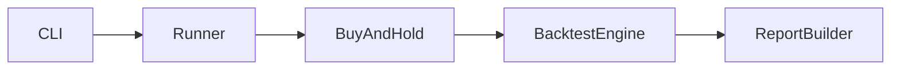
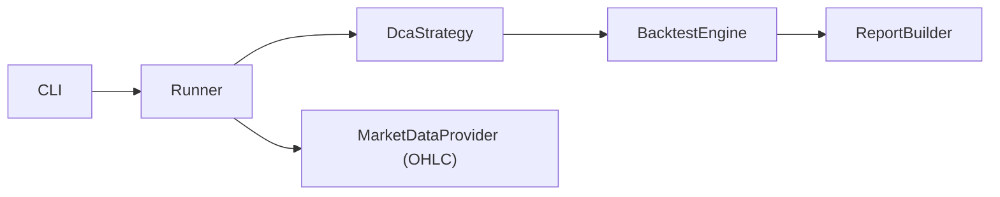

# 实现计划 (Implementation Plan)

## 概述 (Summary)

> **目标**: 将 `.sandbox/dca_trade/dca.py` 的 DCA 权重分配逻辑接入 `backtest_app`，支持在回测中按配置选择 DCA 策略并输出结果。
> **范围**:
>
> - [x] 核心: DCA 权重计算 + 回测执行链路集成
> - [x] 边界: OHLC 数据支持与回测配置扩展
> - [ ] 排除: 实盘交易/对账接入、优化器联动与高级可视化
>
> **建议执行模式**: Pragmatic
> **任务类型**: Value Delivery (Type A)

## 需求 (Requirements)

### 核心接口定义 (Public Interface Design)

- **Class/Module**: `shared_core/models/dca.py`
- **Method Signature**:

  ```python
  class DcaParams(BaseModel):
      atr_weight: float = 0.3
      atr_window: int = 63
      rv_weight: float = 0.7
      rv_window: int = 90
      momentum_window: int = 63
      cash_weight: float = 0.05
      trend_beta: float = 0.4
      trend_lambda: float = 0.4
      smoothing_alpha: float = 1.0
      rebalance_frequency: str = "M"
  ```

- **Reason**: 统一 DCA 配置模型，满足“所有 schemas 由 `shared_core/models` 统一定义”的架构规则。

- **Class/Module**: `shared_core/models/market_data.py`
- **Method Signature**:

  ```python
  class MarketDataRequest(BaseModel):
      tickers: list[str]
      start: date | None = None
      end: date | None = None
      frequency: Literal["1d"] = "1d"
      fields: list[str] = ["open", "high", "low", "close"]
  ```

- **Reason**: DCA 需要 OHLC 字段，必须通过统一的请求模型显式声明。

- **Class/Module**: `shared_core/strategies/dca.py`
- **Method Signature**:

  ```python
  class DcaStrategy(Strategy):
      def __init__(self, params: DcaParams) -> None: ...
      def prepare(self, data: MarketDataFrame) -> None: ...
      def generate_signals(self, data: MarketDataFrame) -> tuple[SignalFrame, SignalFrame]: ...
      def target_weights(self, data: MarketDataFrame) -> MarketDataFrame: ...
  ```

- **Reason**: 保持 Strategy 基类接口不变，同时提供 DCA 的权重序列输出给回测引擎。

### 配置与环境 (Configuration & Environment)

- [ ] **Config File**: 在 `configs/config.yaml` 增加 `strategies.dca` 配置块与 `rebalance_frequency`。
- [ ] **Env Vars**: 无。
- [ ] **CLI Args**: 无新增参数；继续通过 `--profile` 与 `strategies.active` 选择策略。

### 数据变更 (Data Schema Changes)

- **SQL DDL**:

  ```sql
  -- N/A
  ```

- **JSON/Pydantic**:

  ```python
  class DcaParams(BaseModel):
      atr_weight: float
      atr_window: int
      rv_weight: float
      rv_window: int
      momentum_window: int
      cash_weight: float
      trend_beta: float
      trend_lambda: float
      smoothing_alpha: float
      rebalance_frequency: str
  ```

### 依赖影响 (Dependency Impact)

- 仍使用现有 `pandas/numpy/vectorbt`；不新增第三方依赖。
- `MarketDataRequest` 需迁移到 `shared_core/models` 并保持旧路径兼容（如 `shared_core/schemas` 仅做 re-export）。

### 验收标准 (Acceptance Criteria)

- [ ] AC1: 在 `configs/config.yaml` 设置 `strategies.active: dca` 时，可完成 DCA 回测并在 `outputs/` 输出结果文件。
- [ ] AC2: DCA 回测使用 OHLC 数据计算混合波动率与动量，且支持 `rebalance_frequency` 生效。
- [ ] AC3: 现有 `buy_and_hold` 回测行为与输出保持不变。
- [ ] AC4: 全部新增/修改的 schema 定义位于 `shared_core/models`，app 只通过引用使用。

### 备选方案 (Alternatives)

- **方案 A (Minimalist)**: 仅在回测起始点计算一次 DCA 权重，复用现有 `BacktestEngine` 的 `from_signals` 逻辑，不支持再平衡。 - [ ] ❌ 驳回 (理由: 与 DCA 周期性再平衡目标不符)
- **方案 B (Robust)**: 支持 OHLC + 定期再平衡权重序列，回测引擎扩展为接受目标权重序列。 - [ ] ✅ 采纳 (理由: 与 DCA 逻辑一致，可扩展到其他权重策略)

## 约束与复用检查 (Constraints & Reuse)

- [ ] **配置检查**: 是，需扩展 `configs/config.yaml`，理由：DCA 参数与再平衡频率。
- [ ] **接口检查**: 是，`MarketDataRequest` 结构扩展并迁移到 `shared_core/models`。
- [ ] **复用分析**:
  - 需实现功能: 波动率/动量计算与权重融合
  - 现有候选: `.sandbox/dca_trade/dca.py`
  - 决策: 复用核心算法，迁移为可测试的 shared_core 实现

## 影响分析 (Impact Analysis)

### 受影响范围 (Scope)

- **模块**: `shared_core/models`, `shared_core/strategies`, `shared_core/indicators`, `backtest_app/engines`, `backtest_app/app/settings`, `backtest_app/app/services`
- **API**: `MarketDataRequest` 结构扩展，新增 DCA Strategy 接口
- **数据**: 输出增加权重/再平衡信息字段（JSON 结构扩展）

### 风险 (Risks)

- OHLC 数据来源不足或字段缺失导致回测失败。
- 再平衡权重序列与 vectorbt 接口不兼容需要调整引擎实现。
- 迁移 schema 至 `shared_core/models` 可能影响现有 import 路径。

## 逻辑变更 (Logic Changes)

### 流程/状态对比 (Flow/State)





## 详细变更计划 (Detailed Changes)

### 1. 新增/修改文件: `shared_core/models/market_data.py`

- **变更类型**: 新增
- **变更描述**:
  - 定义 `MarketDataRequest`（含 `fields`）
  - `shared_core/schemas/market_data.py` 改为 re-export，保持旧引用兼容

### 2. 新增/修改文件: `shared_core/models/dca.py`

- **变更类型**: 新增
- **变更描述**:
  - 定义 `DcaParams` 配置模型

### 3. 新增/修改文件: `shared_core/indicators/dca_metrics.py`

- **变更类型**: 新增
- **变更描述**:
  - 抽取 `compute_atr`, `compute_realized_vol`, `compute_blended_vol`, `compute_momentum_stats`
  - 保持纯函数与单元测试友好

### 4. 新增/修改文件: `shared_core/strategies/dca.py`

- **变更类型**: 新增
- **变更描述**:
  - 迁移 `.sandbox/dca_trade/dca.py` 权重计算逻辑
  - 提供 `target_weights()` 以生成再平衡权重序列
  - `generate_signals()` 生成再平衡点的 entry/exit 或委托引擎权重模式

### 5. 新增/修改文件: `backtest_app/data_providers/base.py`

- **变更类型**: 修改
- **变更描述**:
  - `fetch()` 支持按 `MarketDataRequest.fields` 返回 OHLC 列

### 6. 新增/修改文件: `backtest_app/data_providers/adapters/simulator.py`

- **变更类型**: 修改
- **变更描述**:
  - 支持输出 OHLC 字段（可用简单合成逻辑）

### 7. 新增/修改文件: `backtest_app/app/settings/loader.py`

- **变更类型**: 修改
- **变更描述**:
  - 增加 DCA 配置字段并绑定到 `DcaParams`

### 8. 新增/修改文件: `backtest_app/app/services/runner.py`

- **变更类型**: 修改
- **变更描述**:
  - 根据 `strategies.active` 分派 `BuyAndHold` vs `DcaStrategy`
  - DCA 需要 OHLC 时请求 provider 输出相应字段
  - 输出结果中追加 `weights` 或 `rebalance_log` 以便分析

### 9. 新增/修改文件: `backtest_app/engines/backtest/engine.py`

- **变更类型**: 修改
- **变更描述**:
  - 增加“目标权重序列”执行路径（如 `Portfolio.from_orders` / `from_weights`）

### 10. 新增/修改文件: `configs/config.yaml`

- **变更类型**: 修改
- **变更描述**:
  - 新增 `strategies.dca` 配置块（与 `DcaParams` 对齐）

### 11. 新增/修改文件: `tests/test_backtest_app/test_dca_strategy.py`

- **变更类型**: 新增
- **变更描述**:
  - DCA 权重计算单测（稳定性/归一化/边界）
  - DCA 回测集成测试（模拟 OHLC 数据）

## 实施步骤 (Execution Steps)

1. [ ] 在 `shared_core/models` 新增 `market_data.py` 与 `dca.py`，并更新 `shared_core/schemas` 为兼容 re-export。
2. [ ] 在 `shared_core/indicators` 新增 DCA 指标计算模块，并补充单元测试。
3. [ ] 新增 `shared_core/strategies/dca.py`，迁移算法与权重计算逻辑。
4. [ ] 扩展 `MarketDataProvider` 与 `SimulatorProvider` 支持 OHLC 字段。
5. [ ] 扩展 `backtest_app/app/settings/loader.py` 与 `configs/config.yaml` 以解析 DCA 配置。
6. [ ] 修改 `backtest_app/app/services/runner.py` 增加 DCA 分支与输出。
7. [ ] 修改 `BacktestEngine` 以支持目标权重序列回测路径。
8. [ ] 增加测试用例并补充文档/示例配置。

## 验证计划 (Verification Plan)

- **自动化测试**:
  - DCA 权重计算：固定 OHLC 数据下权重归一化与稳定性。
  - 回测集成：DCA 配置下能够生成输出文件，并包含权重字段。
- **手动验证**:
  - 运行 `python run.py --config configs/config.yaml --mode backtest --profile profile_A`，确认输出包含 DCA 权重/再平衡信息。
