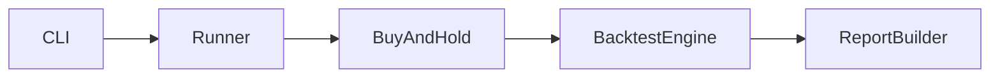
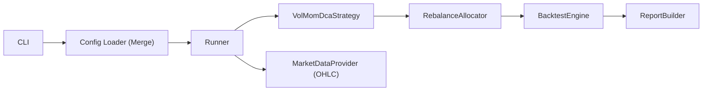

# 实现计划 (Implementation Plan)

## 概述 (Summary)

> **目标**: 将 `.sandbox/dca_trade/dca.py` 的 DCA 权重分配逻辑以 `vol_mom_dca` 策略名接入 `backtest_app`，通过库存/仓位管理执行再平衡，并支持在回测中按分层配置选择该策略输出结果。
> **范围**:
>
> - [x] 核心: vol_mom_dca 权重计算 + 仓位再平衡 + 回测执行链路集成
> - [x] 边界: OHLC 数据支持与分层配置加载
> - [ ] 排除: 实盘交易/对账接入、优化器联动与高级可视化
>
> **建议执行模式**: Pragmatic
> **任务类型**: Value Delivery (Type A)

## 需求 (Requirements)

### 核心接口定义 (Public Interface Design)

- **Class/Module**: `shared_core/models/vol_mom_dca.py`
- **Method Signature**:

  ```python
  class VolMomDcaParams(BaseModel):
      atr_weight: float = 0.3
      atr_window: int = 63
      rv_weight: float = 0.7
      rv_window: int = 90
      momentum_window: int = 63
      cash_weight: float = 0.05
      trend_beta: float = 0.4
      trend_lambda: float = 0.4
      smoothing_alpha: float = 1.0
      rebalance_frequency: str = "M"
  ```

- **Reason**: 统一 vol+momentum DCA 配置模型，满足“所有 schemas 由 `shared_core/models` 统一定义”的架构规则。

- **Class/Module**: `shared_core/models/market_data.py`
- **Method Signature**:

  ```python
  class MarketDataRequest(BaseModel):
      tickers: list[str]
      start: date | None = None
      end: date | None = None
      frequency: Literal["1d"] = "1d"
      fields: list[str] = ["open", "high", "low", "close"]
  ```

- **Reason**: vol_mom_dca 需要 OHLC 字段，必须通过统一的请求模型显式声明。

- **Class/Module**: `shared_core/strategies/vol_mom_dca.py`
- **Method Signature**:

  ```python
  class VolMomDcaStrategy(Strategy):
      def __init__(self, params: VolMomDcaParams) -> None: ...
      def prepare(self, data: MarketDataFrame) -> None: ...
      def generate_signals(self, data: MarketDataFrame) -> tuple[SignalFrame, SignalFrame]: ...
      def target_weights(self, data: MarketDataFrame) -> MarketDataFrame: ...
  ```

- **Reason**: Strategy 只负责生成目标权重序列与信号，不直接执行再平衡。

- **Class/Module**: `shared_core/inventory/rebalance.py`
- **Method Signature**:

  ```python
  class RebalanceAllocator(PositionAllocator):
      def allocate(self, prices: MarketDataFrame, target_weights: MarketDataFrame) -> MarketDataFrame:
          """Return per-timestamp target weights or positions."""
  ```

- **Reason**: 再平衡由库存/仓位层处理，符合“Strategy/Inventory 解耦”的架构规则。

### 配置与环境 (Configuration & Environment)

- [ ] **Config File**: 采用分层配置，`configs/base.yaml` 为主入口，策略配置放在 `configs/strategies/vol_mom_dca.yaml`，通过 `includes` 深度合并。
- [ ] **Env Vars**: 无。
- [ ] **CLI Args**: 无新增参数；继续通过 `--config` 指定入口文件。

### 数据变更 (Data Schema Changes)

- **SQL DDL**:

  ```sql
  -- N/A
  ```

- **JSON/Pydantic**:

  ```python
  class VolMomDcaParams(BaseModel):
      atr_weight: float
      atr_window: int
      rv_weight: float
      rv_window: int
      momentum_window: int
      cash_weight: float
      trend_beta: float
      trend_lambda: float
      smoothing_alpha: float
      rebalance_frequency: str
  ```

### 依赖影响 (Dependency Impact)

- 仍使用现有 `pandas/numpy/vectorbt`；不新增第三方依赖。
- `MarketDataRequest` 需迁移到 `shared_core/models` 并保持旧路径兼容（如 `shared_core/schemas` 仅做 re-export）。
- `backtest_app/app_utils/yaml.py` 需支持多文件合并读取。

### 验收标准 (Acceptance Criteria)

- [ ] AC1: 在 `configs/base.yaml` 中设置 `strategies.active: vol_mom_dca`，并通过 `includes` 引入策略配置时，可完成回测并在 `outputs/` 输出结果文件。
- [ ] AC2: vol_mom_dca 回测使用 OHLC 数据计算混合波动率与动量，且支持 `rebalance_frequency` 生效。
- [ ] AC3: 再平衡执行由 `PositionAllocator` 负责，`Strategy` 不直接操作仓位。
- [ ] AC4: 现有 `buy_and_hold` 回测行为与输出保持不变。
- [ ] AC5: 全部新增/修改的 schema 定义位于 `shared_core/models`，app 只通过引用使用。

### 备选方案 (Alternatives)

- **方案 A (Minimalist)**: 仅在回测起始点计算一次 vol_mom_dca 权重，复用现有 `BacktestEngine` 的 `from_signals` 逻辑，不支持再平衡。 - [ ] ❌ 驳回 (理由: 与周期性再平衡目标不符)
- **方案 B (Robust)**: 支持 OHLC + 定期再平衡权重序列，回测引擎走“目标权重 + 再平衡 allocator”路径。 - [ ] ✅ 采纳 (理由: 与算法逻辑一致，架构职责清晰)

## 约束与复用检查 (Constraints & Reuse)

- [ ] **配置检查**: 是，采用分层配置并扩展 loader 合并逻辑。
- [ ] **接口检查**: 是，`MarketDataRequest` 结构扩展并迁移到 `shared_core/models`。
- [ ] **复用分析**:
  - 需实现功能: 波动率/动量计算与权重融合
  - 现有候选: `.sandbox/dca_trade/dca.py`
  - 决策: 复用核心算法，迁移为可测试的 shared_core 实现

## 影响分析 (Impact Analysis)

### 受影响范围 (Scope)

- **模块**: `shared_core/models`, `shared_core/strategies`, `shared_core/indicators`, `shared_core/inventory`, `backtest_app/engines`, `backtest_app/app/settings`, `backtest_app/app_utils`
- **API**: `MarketDataRequest` 结构扩展，新增 vol_mom_dca Strategy 与 RebalanceAllocator 接口
- **数据**: 输出增加权重/再平衡信息字段（JSON 结构扩展）

### 风险 (Risks)

- OHLC 数据来源不足或字段缺失导致回测失败。
- 再平衡权重序列与 vectorbt 接口不兼容需要调整引擎实现。
- 迁移 schema 至 `shared_core/models` 可能影响现有 import 路径。
- 分层配置合并规则不清晰导致覆盖顺序错误。

## 逻辑变更 (Logic Changes)

### 流程/状态对比 (Flow/State)





## 详细变更计划 (Detailed Changes)

### 1. 新增/修改文件: `shared_core/models/market_data.py`

- **变更类型**: 新增
- **变更描述**:
  - 定义 `MarketDataRequest`（含 `fields`）
  - `shared_core/schemas/market_data.py` 改为 re-export，保持旧引用兼容

### 2. 新增/修改文件: `shared_core/models/vol_mom_dca.py`

- **变更类型**: 新增
- **变更描述**:
  - 定义 `VolMomDcaParams` 配置模型

### 3. 新增/修改文件: `shared_core/indicators/vol_mom_dca_metrics.py`

- **变更类型**: 新增
- **变更描述**:
  - 抽取 `compute_atr`, `compute_realized_vol`, `compute_blended_vol`, `compute_momentum_stats`
  - 保持纯函数与单元测试友好

### 4. 新增/修改文件: `shared_core/strategies/vol_mom_dca.py`

- **变更类型**: 新增
- **变更描述**:
  - 迁移 `.sandbox/dca_trade/dca.py` 权重计算逻辑
  - 提供 `target_weights()` 以生成再平衡权重序列
  - `generate_signals()` 仅输出再平衡点信号，不直接下单

### 5. 新增/修改文件: `shared_core/inventory/rebalance.py`

- **变更类型**: 新增
- **变更描述**:
  - 实现 `RebalanceAllocator`，将目标权重转换为引擎可执行的权重序列
  - 支持对齐 `rebalance_frequency`

### 6. 新增/修改文件: `backtest_app/app_utils/yaml.py`

- **变更类型**: 修改
- **变更描述**:
  - 支持 `includes` 字段读取多文件并深度合并（base -> overrides）
  - 确保合并行为可预测并有单测覆盖

### 7. 新增/修改文件: `backtest_app/data_providers/base.py`

- **变更类型**: 修改
- **变更描述**:
  - `fetch()` 支持按 `MarketDataRequest.fields` 返回 OHLC 列

### 8. 新增/修改文件: `backtest_app/data_providers/adapters/simulator.py`

- **变更类型**: 修改
- **变更描述**:
  - 支持输出 OHLC 字段（可用简单合成逻辑）

### 9. 新增/修改文件: `backtest_app/app/settings/loader.py`

- **变更类型**: 修改
- **变更描述**:
  - 读取分层配置结果，增加 vol_mom_dca 配置字段并绑定到 `VolMomDcaParams`

### 10. 新增/修改文件: `backtest_app/app/services/runner.py`

- **变更类型**: 修改
- **变更描述**:
  - 根据 `strategies.active` 分派 `BuyAndHold` vs `VolMomDcaStrategy`
  - vol_mom_dca 需要 OHLC 时请求 provider 输出相应字段
  - 使用 `RebalanceAllocator` 生成权重序列，交给回测引擎执行
  - 输出结果中追加 `weights` 或 `rebalance_log` 以便分析

### 11. 新增/修改文件: `backtest_app/engines/backtest/engine.py`

- **变更类型**: 修改
- **变更描述**:
  - 增加“目标权重序列”执行路径（如 `Portfolio.from_orders` / `from_weights`）

### 12. 新增/修改文件: `configs/base.yaml`

- **变更类型**: 新增
- **变更描述**:
  - 主入口配置文件，包含 profiles/meta/backtest/data_provider/strategies.active
  - 增加 `includes` 指向策略配置文件

### 13. 新增/修改文件: `configs/strategies/vol_mom_dca.yaml`

- **变更类型**: 新增
- **变更描述**:
  - vol_mom_dca 策略参数（与 `VolMomDcaParams` 对齐）

### 14. 新增/修改文件: `tests/test_backtest_app/test_vol_mom_dca_strategy.py`

- **变更类型**: 新增
- **变更描述**:
  - vol_mom_dca 权重计算单测（稳定性/归一化/边界）
  - vol_mom_dca 回测集成测试（模拟 OHLC 数据）
  - allocator 再平衡路径测试

### 15. 新增/修改文件: `tests/test_backtest_app/test_config_loader_includes.py`

- **变更类型**: 新增
- **变更描述**:
  - 分层配置合并与覆盖顺序测试

## 实施步骤 (Execution Steps)

1. [ ] 在 `shared_core/models` 新增 `market_data.py` 与 `vol_mom_dca.py`，并更新 `shared_core/schemas` 为兼容 re-export。
2. [ ] 在 `shared_core/indicators` 新增 vol_mom_dca 指标计算模块，并补充单元测试。
3. [ ] 新增 `shared_core/strategies/vol_mom_dca.py`，迁移算法与权重计算逻辑。
4. [ ] 新增 `shared_core/inventory/rebalance.py`，实现再平衡 allocator。
5. [ ] 扩展 `backtest_app/app_utils/yaml.py` 以支持 `includes` 深度合并。
6. [ ] 扩展 `MarketDataProvider` 与 `SimulatorProvider` 支持 OHLC 字段。
7. [ ] 更新 `backtest_app/app/settings/loader.py` 适配分层配置。
8. [ ] 新增 `configs/base.yaml` 与 `configs/strategies/vol_mom_dca.yaml`，并调整示例运行说明。
9. [ ] 修改 `backtest_app/app/services/runner.py` 增加 vol_mom_dca 分支、allocator 调用与输出。
10. [ ] 修改 `BacktestEngine` 以支持目标权重序列回测路径。
11. [ ] 增加测试用例并补充文档/示例配置。

## 验证计划 (Verification Plan)

- **自动化测试**:
  - vol_mom_dca 权重计算：固定 OHLC 数据下权重归一化与稳定性。
  - 回测集成：vol_mom_dca 配置下能够生成输出文件，并包含权重字段。
  - allocator 再平衡：目标权重序列输入后结果一致。
  - 分层配置合并：base + strategy 覆盖顺序正确。
- **手动验证**:
  - 运行 `python run.py --config configs/base.yaml --mode backtest --profile profile_A`，确认输出包含 vol_mom_dca 权重/再平衡信息。
