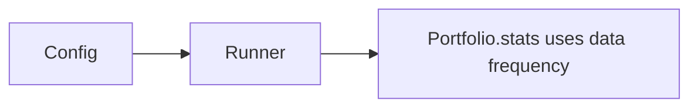
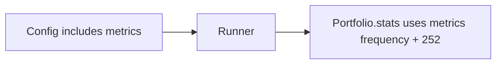

# 实现计划 (Implementation Plan)

## 验收标准 (Acceptance Criteria)

- [ ] AC1: 指标统计使用独立的 `metrics.frequency`，不再继承数据频率；相关警告可通过该配置消除。
- [ ] AC2: 年化因子默认使用 252 交易日，并可通过配置覆盖。
- [ ] AC3: 新增 shared_core 的 metrics/backtest schema，并在 app 配置中引用。
- [ ] AC4: `profiles` 与 `backtest` 配置拆分为独立文件；`configs/base.yaml` 仅做 includes 拼装。
- [ ] AC5: 现有策略与数据提供方可在新配置结构下正常运行。

## 概述 (Summary)

> **目标**: 将回测指标频率与数据频率解耦，并引入指标年化配置，同时完成配置分层拆分与入口拼装。
> **范围**:
>
> - [x] 核心: 新增 metrics schema 与配置，指标频率独立，默认年化 252
> - [x] 边界: 拆分 `profiles`/`backtest` 配置，入口仅 include
> - [ ] 排除: 不新增复杂指标体系与外部数据源 (留待后续)
>
> **建议执行模式**: Pragmatic
> **任务类型**: Value Delivery (Type A)

## 需求 (Requirements)

### 核心接口定义 (Public Interface Design)

- **Class/Module**: `shared_core/models/backtest.py`
- **Method Signature**:

  ```python
  class BacktestMetricsSettings(BaseModel):
      frequency: MarketFrequency | None = None
      annualization_factor: int = 252

  class BacktestSettings(BaseModel):
      start: date | None = None
      end: date | None = None
      init_cash: float = 100000.0
      frequency: MarketFrequency = MarketFrequency.ONE_DAY
      metrics: BacktestMetricsSettings = Field(default_factory=BacktestMetricsSettings)
  ```

- **Reason**: 将指标配置显式化，避免从数据频率隐式继承；提供默认年化因子。

- **Class/Module**: `backtest_app/app/services/runner.py`
- **Method Signature**:

  ```python
  def _extract_metrics(
      portfolio: Any,
      metrics: BacktestMetricsSettings | None,
  ) -> Dict[str, Any]:
      """Return stats with explicit metrics frequency and annualization."""
  ```

- **Reason**: 指标统计使用独立的频率与年化配置。

### 配置与环境 (Configuration & Environment)

- [ ] **Config File**: 新增 `configs/profiles/default.yaml` 与 `configs/backtest/default.yaml`，并将 `configs/base.yaml` 改为仅包含 includes。
- [ ] **Env Vars**: 无
- [ ] **CLI Args**: 无

### 数据变更 (Data Schema Changes)

- **JSON/Pydantic**:

  ```python
  class BacktestMetricsSettings(BaseModel):
      frequency: MarketFrequency | None = None
      annualization_factor: int = 252
  ```

### 依赖影响 (Dependency Impact)

- vectorbt 依赖不变，仅调整 stats 调用参数。

### 验收标准 (Acceptance Criteria)

- 见文档顶部 AC 列表。

### 备选方案 (Alternatives)

- **方案 A (Minimalist Strategy)**: 仅在 `_extract_metrics` 中使用 `config.backtest.frequency` 以消除 warning，不新增 schema/配置拆分。 - [ ] ❌ 驳回 (理由: 不满足“指标频率独立”和配置拆分要求)
- **方案 B**: 新增 metrics schema + 独立配置 + 配置拆分与入口拼装。 - [ ] ✅ 采纳 (理由: 满足全部需求且可持续扩展)

## 约束与复用检查 (Constraints & Reuse)

- [ ] **配置检查**: 是，涉及 `configs/` 结构拆分与新增字段。
- [ ] **接口检查**: 否 (Public API 不变)，仅新增配置与内部模型。
- [ ] **复用分析**:
  - 需实现功能: 指标频率/年化配置
  - 现有候选: `shared_core/models/frequency.py`
  - 决策: 复用 MarketFrequency + 新增 metrics schema

## 影响分析 (Impact Analysis)

### 受影响范围 (Scope)

- **模块**: `shared_core/models`、`backtest_app/app/settings`、`backtest_app/app/services`、`configs/`
- **API**: 无直接 Breaking Changes，但配置结构变化会影响旧配置文件
- **数据**: 新增配置 schema (BacktestMetricsSettings)

### 风险 (Risks)

- 配置拆分导致旧 config 失效，需要迁移策略或示例更新。
- vectorbt stats 对 `freq/year_freq` 参数支持需验证。

## 逻辑变更 (Logic Changes)

### 流程/状态对比 (Flow/State)





## 详细变更计划 (Detailed Changes)

### 1. 新增/修改文件: `shared_core/models/backtest.py`

- **变更类型**: 新增
- **变更描述**:
  - 定义 `BacktestMetricsSettings` 与 `BacktestSettings`。
  - 默认 `annualization_factor=252`，`metrics.frequency` 可为空。

### 2. 新增/修改文件: `shared_core/models/__init__.py`

- **变更类型**: 修改
- **变更描述**:
  - 导出 `BacktestSettings`/`BacktestMetricsSettings`。

### 3. 新增/修改文件: `backtest_app/app/settings/loader.py`

- **变更类型**: 修改
- **变更描述**:
  - `BacktestSettings` 改为引用 `shared_core/models/backtest.py`。
  - 确保 `metrics` 配置可被读取与校验。

### 4. 新增/修改文件: `backtest_app/app/services/runner.py`

- **变更类型**: 修改
- **变更描述**:
  - `_extract_metrics` 接收 `metrics` 配置。
  - 调用 `portfolio.stats` 时显式传入 `freq` 与年化因子 (基于 252)。
  - 报告中可记录 `metrics_frequency` 与 `annualization_factor` 以便审计。

### 5. 新增/修改文件: `configs/base.yaml`

- **变更类型**: 修改
- **变更描述**:
  - 仅保留 `includes` 列表，入口文件不再包含具体配置块。

### 6. 新增/修改文件: `configs/profiles/default.yaml`

- **变更类型**: 新增
- **变更描述**:
  - 迁移 `profiles` 与 `meta` 相关配置。

### 7. 新增/修改文件: `configs/backtest/default.yaml`

- **变更类型**: 新增
- **变更描述**:
  - 迁移 `backtest` 配置并添加 `metrics` 子块。
  - 示例:
    - `metrics.frequency: 1d`
    - `metrics.annualization_factor: 252`

### 8. 新增/修改文件: `configs/strategies/active.yaml`

- **变更类型**: 新增
- **变更描述**:
  - 将 `strategies.active` 迁移到独立文件，配合入口拼装。

### 9. 新增/修改文件: `configs/data_providers/simulator.yaml`

- **变更类型**: 新增
- **变更描述**:
  - 将 `data_provider` 配置迁移到独立文件。

### 10. 新增/修改文件: `configs/optimizations/optuna.yaml`

- **变更类型**: 新增
- **变更描述**:
  - 将 `optimizations` 配置迁移到独立文件。

### 11. 新增/修改文件: `tests/test_backtest_app/test_runner_backtest.py`

- **变更类型**: 修改
- **变更描述**:
  - 新增测试用例，确认 metrics 配置被读取并传入 stats。

## 实施步骤 (Execution Steps)

1. [ ] 新增 `shared_core/models/backtest.py`，定义 metrics/backtest schema。
2. [ ] 更新 `shared_core/models/__init__.py` 导出新模型。
3. [ ] 修改 `backtest_app/app/settings/loader.py` 使用新模型。
4. [ ] 修改 `backtest_app/app/services/runner.py`，stats 使用 metrics 频率与 252 年化。
5. [ ] 拆分配置文件并更新 `configs/base.yaml` 为仅 includes。
6. [ ] 更新/新增测试，覆盖 metrics 配置读取与统计逻辑。

## 验证计划 (Verification Plan)

- **自动化测试**: 更新 `tests/test_backtest_app/test_runner_backtest.py`，验证 stats 使用 metrics 配置。
- **手动验证**: 运行回测并检查输出中的 metrics 字段是否使用 252 年化。
