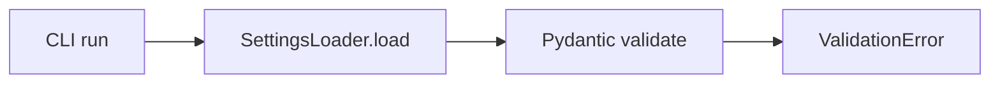
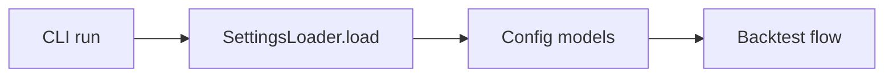

# 实现计划 (Implementation Plan)

## 验收标准列表 (Acceptance Criteria List)

- [ ] AC1: 使用默认 `configs/config.yaml` 可通过 `SettingsLoader().load()` 校验，不再触发 Pydantic ValidationError。
- [ ] AC2: `python run.py --mode backtest --profile profile_A` 可成功进入回测流程（不因配置校验崩溃）。
- [ ] AC3: 缺失 `strategies.active` 或 `optimizations.params` 时，报错信息清晰可定位。
- [ ] AC4: 单元测试覆盖默认配置形态并可重复验证。

## 概述 (Summary)

> **目标**: 修复配置契约与 Pydantic 模型不一致导致的 CLI 启动崩溃。
> **范围**:
>
> - [x] 核心: 对齐 `AppConfig` 与 `configs/config.yaml` 的字段结构
> - [x] 边界: 调整 runner 对策略/优化配置的读取方式
> - [ ] 排除: 不引入新策略/优化逻辑，仅修复配置校验
>
> **建议执行模式**: Safety
> **任务类型**: Value Delivery (Type A)

## 需求 (Requirements)

### 核心接口定义 (Public Interface Design)

- **Class/Module**: `backtest_app/app/settings/loader.py`
- **Method Signature**:

  ```python
  from pydantic import BaseModel, ConfigDict, Field
  from typing import Any, Dict

  class StrategiesSettings(BaseModel):
      active: str = "buy_and_hold"
      model_config = ConfigDict(extra="allow")

  class OptimizationsSettings(BaseModel):
      engine: str = "optuna"
      study_name: str | None = None
      params: Dict[str, list] = Field(default_factory=dict)
      model_config = ConfigDict(extra="allow")

  class AppConfig(BaseModel):
      strategies: StrategiesSettings = Field(default_factory=StrategiesSettings)
      optimizations: OptimizationsSettings = Field(default_factory=OptimizationsSettings)
  ```

- **Reason**: 允许 `active/engine/study_name` 作为顶层字符串字段，同时保留对附加策略配置的扩展空间。

### 配置与环境 (Configuration & Environment)

- [ ] **Config File**: 保持现有 `configs/config.yaml` 结构不变。
- [ ] **Env Vars**: 无
- [ ] **CLI Args**: 无

### 数据变更 (Data Schema Changes)

- **SQL DDL**: 无

- **JSON/Pydantic**:

  ```python
  class StrategiesSettings(BaseModel):
      active: str
      model_config = ConfigDict(extra="allow")

  class OptimizationsSettings(BaseModel):
      engine: str
      study_name: str | None
      params: Dict[str, list]
      model_config = ConfigDict(extra="allow")
  ```

### 依赖影响 (Dependency Impact)

- 无新增依赖。

### 验收标准 (Acceptance Criteria)

- [ ] AC1: 默认配置可通过 `SettingsLoader` 校验。
- [ ] AC2: CLI backtest 可启动执行。
- [ ] AC3: 缺失关键字段时报错信息明确。
- [ ] AC4: 单测覆盖默认配置形态。

### 备选方案 (Alternatives)

- **方案 A (Minimalist Strategy)**: 将 `strategies`/`optimizations` 类型改为 `dict[str, Any]`，不引入新模型。
  - [ ] ❌ 驳回 (理由: 类型约束过弱，后续配置错误难以定位)
- **方案 B (Robust Strategy)**: 引入 `StrategiesSettings`/`OptimizationsSettings` 并允许 extra 字段。
  - [ ] ✅ 采纳 (理由: 兼容现有配置且提供明确的字段类型)

## 约束与复用检查 (Constraints & Reuse)

- [ ] **配置检查**: 否（保持 `configs/config.yaml` 不变）。
- [ ] **接口检查**: 是（`AppConfig` 字段类型变化，需同步 runner 读取方式）。
- [ ] **复用分析**:
  - 需实现功能: 配置校验兼容
  - 现有候选: `SettingsLoader` + Pydantic
  - 决策: 复用并扩展

## 影响分析 (Impact Analysis)

### 受影响范围 (Scope)

- **模块**: `backtest_app/app/settings/loader.py`, `backtest_app/app/services/runner.py`, `tests/test_backtest_app/test_settings.py`
- **API**: 内部配置模型变更（非外部 API）
- **数据**: 无

### 风险 (Risks)

- 允许 extra 字段可能掩盖拼写错误，建议后续补充显式校验。
- runner 读取逻辑需更新以避免 `.get()` 失效。

## 逻辑变更 (Logic Changes)

### 流程/状态对比 (Flow/State)





## 详细变更计划 (Detailed Changes)

### 1. 新增/修改文件: `backtest_app/app/settings/loader.py`

- **变更类型**: [修改]
- **变更描述**:
  - 新增 `StrategiesSettings` 与 `OptimizationsSettings` 模型。
  - `AppConfig.strategies/optimizations` 使用新模型替代 dict。
  - 保持 `profiles/meta/backtest/data_provider` 现有结构。

### 2. 新增/修改文件: `backtest_app/app/services/runner.py`

- **变更类型**: [修改]
- **变更描述**:
  - 读取 `config.strategies.active` 替代 `config.strategies.get(...)`。
  - 预留 `config.optimizations.*` 的读取入口（即使暂不启用）。

### 3. 新增/修改文件: `tests/test_backtest_app/test_settings.py`

- **变更类型**: [修改]
- **变更描述**:
  - 添加针对默认配置形态的加载测试（参考审计用例）。

## 实施步骤 (Execution Steps)

1. [ ] 在 `backtest_app/app/settings/loader.py` 中新增配置模型并更新 `AppConfig`。
2. [ ] 更新 `backtest_app/app/services/runner.py` 的策略读取逻辑。
3. [ ] 增加默认配置加载的单元测试。
4. [ ] 运行测试 `pytest -q tests/test_backtest_app/test_settings.py`。

## 验证计划 (Verification Plan)

- **自动化测试**: 新增默认配置加载测试；现有 settings/backtest 测试通过。
- **手动验证**: `python run.py --mode backtest --profile profile_A`。
