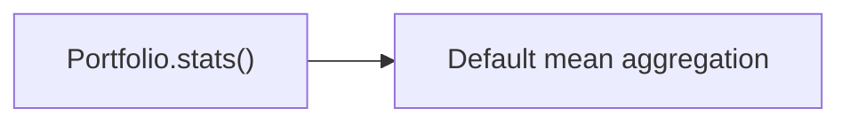

# 实现计划 (Implementation Plan)

## 验收标准 (Acceptance Criteria)

- [ ] AC1: 回测指标统计支持配置化聚合口径，默认 `total` (组合总价值)。
- [ ] AC2: 多资产回测下 `portfolio.stats()` 不再触发“mean 聚合”警告。
- [ ] AC3: 报告输出中包含 `metrics_config.aggregation`，且与配置一致。
- [ ] AC4: 配置结构不回退，仍采用分层配置方式。

## 概述 (Summary)

> **目标**: 为回测统计引入可配置聚合口径，默认使用组合总价值，避免隐式 mean 聚合。
> **范围**:
>
> - [x] 核心: 新增 metrics 聚合配置与 schema
> - [x] 边界: stats 调用改为显式聚合口径
> - [ ] 排除: 不调整策略逻辑与数据采集
>
> **建议执行模式**: Pragmatic
> **任务类型**: Debt Payback (Type B)

## 需求 (Requirements)

### 核心接口定义 (Public Interface Design)

- **Class/Module**: `shared_core/models/backtest.py`
- **Method Signature**:

  ```python
  class MetricsAggregation(str, Enum):
      TOTAL = "total"
      MEAN = "mean"
      MEDIAN = "median"

  class BacktestMetricsSettings(BaseModel):
      frequency: MarketFrequency | None = None
      annualization_factor: int = 252
      aggregation: MetricsAggregation = MetricsAggregation.TOTAL
  ```

- **Reason**: 通过明确的枚举，确保聚合口径可控且默认“total”。

- **Class/Module**: `backtest_app/app/services/runner.py`
- **Method Signature**:

  ```python
  def _extract_metrics(
      portfolio: Any,
      metrics: BacktestMetricsSettings | None,
  ) -> Dict[str, Any]:
      """Return stats with explicit aggregation behavior."""
  ```

- **Reason**: 统一入口，显式传入聚合口径，避免 vectorbt 默认 mean。

### 配置与环境 (Configuration & Environment)

- [ ] **Config File**: 在 `backtest.metrics` 增加 `aggregation` 字段，默认 `total`。
- [ ] **Env Vars**: 无
- [ ] **CLI Args**: 无

### 数据变更 (Data Schema Changes)

- **JSON/Pydantic**:

  ```python
  class BacktestMetricsSettings(BaseModel):
      frequency: MarketFrequency | None = None
      annualization_factor: int = 252
      aggregation: MetricsAggregation = MetricsAggregation.TOTAL
  ```

### 依赖影响 (Dependency Impact)

- vectorbt stats 调用参数需验证（是否支持 `agg_func` / `group_by` 等）。

### 验收标准 (Acceptance Criteria)

- 见文档顶部 AC 列表。

### 备选方案 (Alternatives)

- **方案 A (Minimalist Strategy)**: 固定为 total 聚合，不暴露配置项。 - [ ] ❌ 驳回 (理由: 不能满足“可配置”需求)
- **方案 B**: 增加聚合配置，并在 stats 调用处显式设置聚合方式。 - [ ] ✅ 采纳 (理由: 满足需求且扩展性好)

## 约束与复用检查 (Constraints & Reuse)

- [ ] **配置检查**: 是，需新增 `metrics.aggregation`。
- [ ] **接口检查**: 否 (新增 schema 字段，不改变现有调用方式)。
- [ ] **复用分析**:
  - 需实现功能: 聚合口径选择
  - 现有候选: `backtest_app/app/services/runner.py` 中 stats kwargs 构造
  - 决策: 原地扩展

## 影响分析 (Impact Analysis)

### 受影响范围 (Scope)

- **模块**: `shared_core/models`、`backtest_app/app/services`、`configs/backtest`
- **API**: 无 Breaking Changes
- **数据**: 配置 schema 新增字段

### 风险 (Risks)

- 若 vectorbt stats 不支持指定聚合参数，需改为手动聚合后再统计。

## 逻辑变更 (Logic Changes)

### 流程/状态对比 (Flow/State)




## 详细变更计划 (Detailed Changes)

### 1. 新增/修改文件: `shared_core/models/backtest.py`

- **变更类型**: 修改
- **变更描述**:
  - 新增 `MetricsAggregation` 枚举。
  - `BacktestMetricsSettings` 增加 `aggregation` 字段，默认 `total`。

### 2. 新增/修改文件: `backtest_app/app/services/runner.py`

- **变更类型**: 修改
- **变更描述**:
  - 扩展 `_build_stats_kwargs`：支持将 `aggregation` 映射到 vectorbt 的聚合参数 (例如 `agg_func`)。
  - 若 vectorbt 不支持该参数，使用 `portfolio.value()` 聚合成单列后再计算 stats。
  - 输出 `metrics_config` 中包含 `aggregation`。

### 3. 新增/修改文件: `configs/backtest/default.yaml`

- **变更类型**: 修改
- **变更描述**:
  - `backtest.metrics.aggregation: total` 作为默认值。

### 4. 新增/修改文件: `tests/test_backtest_app/test_runner_backtest.py`

- **变更类型**: 修改
- **变更描述**:
  - 断言 `metrics_config.aggregation == "total"`。

### 5. 新增/修改文件: `tests/test_backtest_app/test_metrics_aggregation.py`

- **变更类型**: 新增
- **变更描述**:
  - 覆盖 `_build_stats_kwargs` 或聚合策略选择逻辑（可用 mock/stub）。

## 实施步骤 (Execution Steps)

1. [ ] 在 `shared_core/models/backtest.py` 增加 `MetricsAggregation` 与 `aggregation` 字段。
2. [ ] 更新 `backtest_app/app/services/runner.py`，显式设置聚合口径并记录到报告。
3. [ ] 更新 `configs/backtest/default.yaml` 添加 `aggregation: total`。
4. [ ] 更新测试并新增聚合逻辑测试。
5. [ ] 运行测试 `pytest tests/test_backtest_app/test_metrics_aggregation.py tests/test_backtest_app/test_runner_backtest.py -q`。

## 验证计划 (Verification Plan)

- **自动化测试**: 覆盖聚合逻辑与报告输出的断言。
- **手动验证**: 运行多资产回测，确认 warning 消失且输出 metrics 使用 total 口径。
