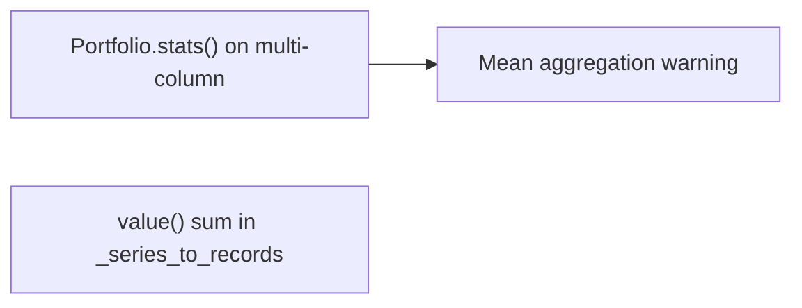
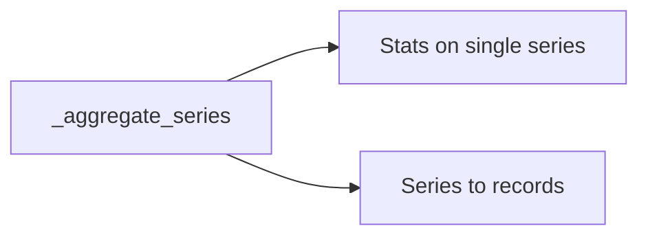

# 实现计划 (Implementation Plan)

## 验收标准 (Acceptance Criteria)

- [ ] AC1: 指标统计与净值曲线使用同一聚合口径（默认 `total`）。
- [ ] AC2: 多资产回测下 `portfolio.stats()` 不再触发 mean 聚合警告与 `start_value` 异常。
- [ ] AC3: `metrics_config.aggregation` 反映实际聚合口径，报告与统计一致。
- [ ] AC4: 不新增第二套聚合配置，避免配置重复。

## 概述 (Summary)

> **目标**: 统一指标统计与净值曲线的聚合口径，默认 total，保证统计口径一致。
> **范围**:
>
> - [x] 核心: 在 stats 计算前显式聚合成单列
> - [x] 边界: 与 `_series_to_records` 使用同一聚合逻辑
> - [ ] 排除: 不新增额外配置项
>
> **建议执行模式**: Pragmatic
> **任务类型**: Debt Payback (Type B)

## 需求 (Requirements)

### 核心接口定义 (Public Interface Design)

- **Class/Module**: `backtest_app/app/services/runner.py`
- **Method Signature**:

  ```python
  def _aggregate_series(
      data: Any,
      aggregation: MetricsAggregation,
  ) -> Any:
      """Aggregate multi-column data into a single series for metrics/reporting."""
  ```

- **Reason**: 复用相同聚合逻辑，避免 stats/report 口径不一致。

### 配置与环境 (Configuration & Environment)

- [ ] **Config File**: 无新增字段，复用 `backtest.metrics.aggregation`。
- [ ] **Env Vars**: 无
- [ ] **CLI Args**: 无

### 数据变更 (Data Schema Changes)

- 无

### 依赖影响 (Dependency Impact)

- 无新增依赖。

### 验收标准 (Acceptance Criteria)

- 见文档顶部 AC 列表。

### 备选方案 (Alternatives)

- **方案 A (Minimalist Strategy)**: 仅在 stats 前临时聚合，不复用逻辑。 - [ ] ❌ 驳回 (理由: 报告与指标口径可能漂移)
- **方案 B**: 抽出统一聚合函数，stats 与报告共用。 - [ ] ✅ 采纳 (理由: 口径一致、可维护)

## 约束与复用检查 (Constraints & Reuse)

- [ ] **配置检查**: 否
- [ ] **接口检查**: 否 (内部 helper)
- [ ] **复用分析**:
  - 需实现功能: 单列聚合
  - 现有候选: `_series_to_records` 中的 sum 聚合
  - 决策: 提取为 `_aggregate_series` 并复用

## 影响分析 (Impact Analysis)

### 受影响范围 (Scope)

- **模块**: `backtest_app/app/services`
- **API**: 无 Breaking Changes
- **数据**: 指标统计口径修正为可配置

### 风险 (Risks)

- 若 vectorbt 在单列 stats 上仍需特殊参数，可能需要额外适配。

## 逻辑变更 (Logic Changes)

### 流程/状态对比 (Flow/State)





## 详细变更计划 (Detailed Changes)

### 1. 新增/修改文件: `backtest_app/app/services/runner.py`

- **变更类型**: 修改
- **变更描述**:
  - 新增 `_aggregate_series`，按 `metrics.aggregation` 聚合多列数据。
  - `_extract_metrics` 改为对 `portfolio.value()` 先聚合，再计算 stats（避免 multi-column warning）。
  - `_series_to_records` 改为复用 `_aggregate_series`，保证报告与指标一致。

### 2. 新增/修改文件: `tests/test_backtest_app/test_metrics_aggregation.py`

- **变更类型**: 修改
- **变更描述**:
  - 补充对 `_aggregate_series` 的测试覆盖（total/mean/median）。

## 实施步骤 (Execution Steps)

1. [ ] 在 `backtest_app/app/services/runner.py` 新增 `_aggregate_series` 并复用。
2. [ ] 修改 `_extract_metrics` 使用聚合后的单列 series 进行 stats。
3. [ ] 调整 `_series_to_records` 使用同一聚合逻辑。
4. [ ] 更新测试覆盖聚合逻辑。
5. [ ] 运行测试 `pytest tests/test_backtest_app/test_metrics_aggregation.py tests/test_backtest_app/test_runner_backtest.py -q`。

## 验证计划 (Verification Plan)

- **自动化测试**: 聚合逻辑 + 现有回测输出测试。
- **手动验证**: 多标的回测，确认无 mean 聚合警告且 metrics 正常。
