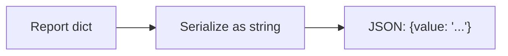
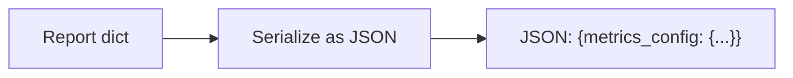

# 实现计划 (Implementation Plan)

## 验收标准 (Acceptance Criteria)

- [ ] AC1: 报告输出的 JSON 为结构化对象，`metrics_config` 等字段可直接读取。
- [ ] AC2: `ReportBuilder` 可正确序列化原生 `dict`（必要时包括 list）而不是降级为字符串。
- [ ] AC3: 新增回归测试覆盖 report 序列化行为，当前失败用例在修复后通过。
- [ ] AC4: 配置结构无需回退，修复不依赖 config 模式变更。

## 概述 (Summary)

> **目标**: 修复报告序列化逻辑，避免 dict 被写成字符串导致字段丢失。
> **范围**:
>
> - [x] 核心: `ReportBuilder._serialize` 正确处理 dict 输出
> - [x] 边界: 增加回归测试，保证 `metrics_config` 输出一致
> - [ ] 排除: 不修改配置结构与策略逻辑 (留待后续)
>
> **建议执行模式**: Pragmatic
> **任务类型**: Debt Payback (Type B)

## 需求 (Requirements)

### 核心接口定义 (Public Interface Design)

- **Class/Module**: `backtest_app/reporter/builder.py`
- **Method Signature**:

  ```python
  def _serialize(self, data: Any) -> str:
      """Serialize report payload into JSON string."""
  ```

- **Reason**: 保持现有接口不变，仅修复序列化分支。

### 配置与环境 (Configuration & Environment)

- [ ] **Config File**: 无
- [ ] **Env Vars**: 无
- [ ] **CLI Args**: 无

### 数据变更 (Data Schema Changes)

- 无

### 依赖影响 (Dependency Impact)

- 无新增依赖，仅调整序列化逻辑。

### 验收标准 (Acceptance Criteria)

- 见文档顶部 AC 列表。

### 备选方案 (Alternatives)

- **方案 A (Minimalist Strategy)**: 仅在 `ReportBuilder._serialize` 中新增 `dict` 分支。 - [ ] ❌ 驳回 (理由: 缺少回归测试，风险不可控)
- **方案 B**: 修复序列化逻辑 + 增加回归测试，锁定输出契约。 - [ ] ✅ 采纳 (理由: 成本低且可稳定防回归)

## 约束与复用检查 (Constraints & Reuse)

- [ ] **配置检查**: 否
- [ ] **接口检查**: 否 (不变更公共接口)
- [ ] **复用分析**:
  - 需实现功能: dict 序列化
  - 现有候选: `backtest_app/reporter/builder.py`
  - 决策: 原地修复

## 影响分析 (Impact Analysis)

### 受影响范围 (Scope)

- **模块**: `backtest_app/reporter`、`tests/test_backtest_app`
- **API**: 无 Breaking Changes
- **数据**: 输出 JSON 结构更完整（修复缺陷）

### 风险 (Risks)

- 若其他调用方依赖旧的字符串化行为，可能产生轻微兼容问题（预期不合理依赖）。

## 逻辑变更 (Logic Changes)

### 流程/状态对比 (Flow/State)





## 详细变更计划 (Detailed Changes)

### 1. 新增/修改文件: `backtest_app/reporter/builder.py`

- **变更类型**: 修改
- **变更描述**:
  - 在 `_serialize` 中优先识别 `dict` (可选：`list`) 并直接 `json.dumps`。
  - 保留现有 `dict()`/`to_dict()` 兼容路径。

### 2. 新增/修改文件: `tests/test_backtest_app/test_runner_backtest.py`

- **变更类型**: 修改
- **变更描述**:
  - 保留现有断言，确保 `metrics_config` 在 JSON 中可直接读取。

### 3. 新增/修改文件: `tests/test_backtest_app/test_report_builder.py`

- **变更类型**: 新增
- **变更描述**:
  - 添加 `ReportBuilder` 直接序列化 dict 的回归测试。

## 实施步骤 (Execution Steps)

1. [ ] 修改 `backtest_app/reporter/builder.py`，新增 dict 序列化分支。
2. [ ] 新增测试 `tests/test_backtest_app/test_report_builder.py`。
3. [ ] 运行测试 `pytest tests/test_backtest_app/test_report_builder.py tests/test_backtest_app/test_runner_backtest.py -q`。

## 验证计划 (Verification Plan)

- **自动化测试**: `test_report_builder_serializes_dict` + 现有 `test_run_backtest_writes_output`。
- **手动验证**: 运行一次回测，检查输出 JSON 中包含 `metrics_config` 字段。
