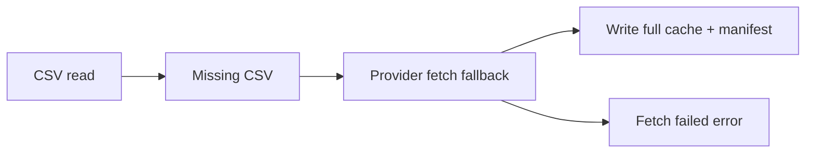

# 实现计划 (Implementation Plan)

## 验收标准列表 (Acceptance Criteria List)

- [ ] AC1: 所有 provider 在 CSV 缺失时先尝试 provider fetch，若失败则报错。
- [ ] AC2: 缓存路径按 provider + frequency 分目录（`data/{provider}/{frequency}/`），避免频率/数据源冲突。
- [ ] AC3: simulator 缺失 CSV 时使用其内部“模拟请求拉取”逻辑生成数据并写入全量缓存。
- [ ] AC4: 缓存采用全量存储策略，并在 manifest 中记录覆盖区间（start/end）。
- [ ] AC5: 缺失数据报错信息包含完整路径与 provider 名称。

## 概述 (Summary)

> **目标**: 建立统一的“全量缓存按频率隔离 + provider fetch 兜底”的数据路径，并为 simulator 提供内部模拟拉取，保证不干扰真实 provider 数据。
> **范围**:
>
> - [x] 核心: CSV 缺失时的 fallback fetch 机制 + 全量缓存
> - [x] 边界: 缓存目录按 provider/frequency 隔离
> - [ ] 排除: 不实现真实外部 API 调用细节（由各 provider 自行实现）
>
> **建议执行模式**: Safety
> **任务类型**: Value Delivery (Type A)

## 需求 (Requirements)

### 核心接口定义 (Public Interface Design)

- **Class/Module**: `backtest_app/data_providers/base.py`
- **Method Signature**:

  ```python
  class MarketDataProvider(ABC):
      def fetch(self, request: MarketDataRequest) -> dict[str, "pd.DataFrame"]:
          """Fetch market data by ticker."""
  ```

- **Reason**: 不改动公共接口，仅调整内部实现策略。

### 配置与环境 (Configuration & Environment)

- [ ] **Config File**: `configs/config.yaml`
  - `data_provider.csv_dir` 作为根目录；实际读写路径为 `csv_dir/{provider}/{frequency}/`。
- [ ] **Env Vars**: 无
- [ ] **CLI Args**: 无

### 数据变更 (Data Schema Changes)

- **JSON/Pydantic**:

  ```python
  class CacheManifest(BaseModel):
      ticker: str
      frequency: str
      coverage_start: date | None
      coverage_end: date | None
      price_field: str
      updated_at: str
  ```

### 依赖影响 (Dependency Impact)

- 无新增依赖。

### 验收标准 (Acceptance Criteria)

- [ ] AC1: CSV 缺失时所有 provider 先尝试 fetch，失败后报错。
- [ ] AC2: provider/frequency 目录隔离生效，不同 provider/频率不读写同一路径。
- [ ] AC3: simulator 缺失 CSV 时使用内部模拟逻辑并写入缓存。
- [ ] AC4: manifest 记录 coverage_start/coverage_end，读取时按时间区间切片。
- [ ] AC5: 报错包含完整 CSV 路径与 provider 名称。

### 备选方案 (Alternatives)

- **方案 A (Minimalist Strategy)**: 仅在 simulator 内部处理缺失 CSV，不引入统一 fallback。
  - [ ] ❌ 驳回 (理由: 与“所有 provider 统一行为”目标冲突)
- **方案 B (Robust Strategy)**: 引入统一缓存策略与 provider 兜底 fetch，按 provider/frequency 分目录隔离。
  - [ ] ✅ 采纳 (理由: 统一行为、可扩展且隔离数据源/频率)

## 约束与复用检查 (Constraints & Reuse)

- [ ] **配置检查**: 是（csv_dir 逻辑变为 provider/frequency 子目录）
- [ ] **接口检查**: 否（不修改 public API）
- [ ] **复用分析**:
  - 需实现功能: 缓存路径拼接 / fallback fetch / manifest
  - 现有候选: `SimulatorProvider.fetch`
  - 决策: 复用并扩展

## 影响分析 (Impact Analysis)

### 受影响范围 (Scope)

- **模块**: `backtest_app/data_providers/adapters/simulator.py`, `backtest_app/data_providers/registry/provider_registry.py`, `backtest_app/app/services/runner.py`, `tests/test_backtest_app/test_simulator_provider.py`
- **API**: 无 Breaking Change
- **数据**: 缓存目录结构调整（provider/frequency 分目录）

### 风险 (Risks)

- 旧缓存路径迁移问题；需要明确目录结构切换说明。
- coverage 记录不准确导致切片缺口或重复数据。

## 逻辑变更 (Logic Changes)

### 流程/状态对比 (Flow/State)




## 详细变更计划 (Detailed Changes)

### 1. 新增/修改文件: `backtest_app/data_providers/registry/provider_registry.py`

- **变更类型**: [修改]
- **变更描述**:
  - 解析 `csv_dir` 时拼接 provider + frequency 形成专用路径。
  - provider 实例化时传入该路径（保持接口不变）。

### 2. 新增/修改文件: `backtest_app/data_providers/adapters/simulator.py`

- **变更类型**: [修改]
- **变更描述**:
  - CSV 缺失时执行模拟 fetch 并写入全量缓存。
  - 生成/更新 manifest（记录 coverage_start/coverage_end/price_field）。
  - 若模拟 fetch 失败，抛出包含完整路径的错误信息。

### 3. 新增/修改文件: `backtest_app/app/services/runner.py`

- **变更类型**: [修改]
- **变更描述**:
  - 无逻辑变更，仅依赖 provider 的 fallback 行为。

### 4. 新增/修改文件: `tests/test_backtest_app/test_simulator_provider.py`

- **变更类型**: [修改]
- **变更描述**:
  - 增加测试：缺失 CSV 时，simulator 生成数据并写入 provider/frequency 目录。
  - 增加测试：manifest 覆盖区间记录正确。
  - 增加测试：fetch 失败时错误信息包含完整路径与 provider 名。

## 实施步骤 (Execution Steps)

1. [ ] 更新 `provider_registry.py` 将 `csv_dir` 解析为 provider/frequency 目录。
2. [ ] 更新 `simulator.py`：缺失 CSV 时执行模拟 fetch 并写入缓存 + manifest。
3. [ ] 更新 `test_simulator_provider.py` 覆盖缓存与 manifest 行为。
4. [ ] 运行测试 `pytest -q tests/test_backtest_app/test_simulator_provider.py`。

## 验证计划 (Verification Plan)

- **自动化测试**: simulator 缺失 CSV 的 fallback 与 manifest 记录测试。
- **手动验证**: `python run.py --mode backtest --profile profile_A`，确认缺失 CSV 时可生成数据或给出明确错误。
