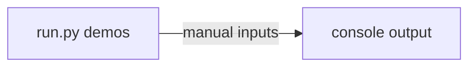
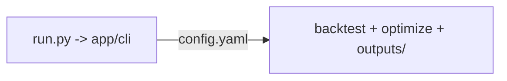

> [!WARNING] DEPRECATED: Implementation has diverged. See code for source of truth.

# 实现计划 (Implementation Plan)

## 需求 (Requirements)

### 核心接口定义 (Public Interface Design)

- **Class/Module**: `backtest_app/app/settings`
- **Method Signature**:

  ```python
  class SettingsLoader:
      def load(self, path: str) -> "AppConfig":
          """Load and validate config.yaml"""

  class ProfileResolver:
      def resolve(self, config: "AppConfig", profile: str) -> "ResolvedProfile":
          """Resolve profiles/meta to a portfolio definition"""
  ```

- **Reason**: 单一 config.yaml 是配置中心，需统一解析 profiles/meta/strategies/optimizations。

- **Class/Module**: `shared_core/strategies`
- **Method Signature**:

  ```python
  class Strategy:
      def prepare(self, data: "MarketDataFrame") -> None:
          """Prepare indicator state"""

      def generate_signals(self, data: "MarketDataFrame") -> "SignalFrame":
          """Generate trade signals"""
  ```

- **Reason**: 策略跨应用复用，信号输出与仓位分配解耦。

- **Class/Module**: `shared_core/inventory`
- **Method Signature**:

  ```python
  class PositionAllocator:
      def allocate(self, signals: "SignalFrame", state: "PortfolioState") -> "PositionPlan":
          """Allocate positions based on signals and state"""
  ```

- **Reason**: 仓位分配独立于策略信号，支持不同规则复用。

- **Class/Module**: `backtest_app/engines/optimizer`
- **Method Signature**:

  ```python
  class OptimizerEngine:
      def run(self, config: "OptimizationConfig") -> "OptimizationResult":
          """Run optimization and return best params"""
  ```

- **Reason**: 优化由引擎执行，结果直接写入 `outputs/`。

### 配置与环境 (Configuration & Environment)

- [ ] **Config File**: 新增/规范 `configs/config.yaml`，包含 `profiles/meta/strategies/optimizations` 配置块
- [ ] **Env Vars**: `.env` 中配置数据源 API key（如 `YF_API_KEY` / `ALPHA_VANTAGE_KEY`）
- [ ] **CLI Args**: `run.py` 支持指定配置文件并选择运行模式与 profile（例如 `--config configs/config.yaml --mode backtest --profile profile_A`）

### 数据变更 (Data Schema Changes)

- **SQL DDL**:

  ```sql
  -- No SQL schema changes; local files only.
  ```

- **JSON/Pydantic**:

  ```python
  class OptimizationResult(BaseModel):
      study_name: str
      best_params: dict
      best_score: float
      created_at: str
  ```

### 依赖影响 (Dependency Impact)

- 引入或集中使用：Optuna、vectorbt、Plotly、quantstats、PyYAML。
- 外部数据源通过 data_providers 适配层隔离，必要时使用 simulator provider（本地 CSV）。

### 验收标准 (Acceptance Criteria)

- [ ] AC1: 单一 `config.yaml` 可解析 profiles/meta/strategies/optimizations 并完成组合级回测
- [ ] AC2: 优化结果由 Optimizer 直接写入 `outputs/`，且不覆盖原始配置
- [ ] AC3: `Strategy` 与 `PositionAllocator` 解耦且位于 shared_core
- [ ] AC4: `shared_core/core_utils` 与 `backtest_app/app_utils` 的使用禁忌与文件头约束已生效
- [ ] AC5: DCA 仅保留 placeholder 客户端边界，无业务实现

### 备选方案 (Alternatives)

- **方案 A**: 单一 config.yaml + shared_core 抽取（当前方案） - [ ] ✅ 采纳 (理由: 初始项目迭代快，配置集中)
- **方案 B**: 多配置文件 + app 内部逻辑最小化 - [ ] ❌ 驳回 (理由: 配置分散，初期管理成本高)
- **方案 C (Minimalist Strategy)**: 不新增目录，仅在现有结构中 if/else 扩展 - [ ] ❌ 驳回 (理由: 与破坏式重构目标冲突)

## 约束与复用检查 (Constraints & Reuse)

- [ ] **配置检查**: 本次变更是否修改了 `config/` 下的文件？ (是 - 引入 `configs/config.yaml`)
- [ ] **接口检查**: 本次变更是否修改了 Public API？ (是 - 破坏式重构)
- [ ] **复用分析**:
  - 需实现功能: YAML 解析 / 路径解析
  - 现有候选: `shared_core/core_utils`
  - 决策: 复用（通过 `backtest_app/app_utils` 封装）

## 影响分析 (Impact Analysis)

### 受影响范围 (Scope)

- **模块**: backtest_app, shared_core, data_providers, reporter, optimizer
- **API**: 全量破坏式重构，旧入口不兼容
- **数据**: 不涉及数据库，新增 `outputs/` 文件产物

### 风险 (Risks)

- config.yaml 过大导致维护复杂度上升
- shared_core 与 app_utils 边界破坏导致耦合膨胀

## 逻辑变更 (Logic Changes)

### 流程/状态对比 (Flow/State)





## 详细变更计划 (Detailed Changes)

### 1. 新增/修改文件: `configs/config.yaml`

- **变更类型**: 新增
- **变更描述**:
  - 定义 `profiles/meta/strategies/optimizations` 配置块
  - 指定 `data_provider` 与 `simulator` 选项

### 2. 新增/修改文件: `shared_core/CONVENTIONS.md`

- **变更类型**: 新增
- **变更描述**:
  - 约束 shared_core/core_utils 的使用规范与禁忌

### 3. 新增/修改文件: `backtest_app/CONVENTIONS.md`

- **变更类型**: 新增
- **变更描述**:
  - 约束 app_utils 的封装与外部 utils 注册规则

### 4. 新增/修改文件: `shared_core/core_utils/`

- **变更类型**: 新增
- **变更描述**:
  - YAML 解析、合并、序列化等纯函数工具
  - 文件头包含约束说明

### 5. 新增/修改文件: `backtest_app/app_utils/`

- **变更类型**: 新增
- **变更描述**:
  - YAML 解析封装、路径/缓存工具
  - 对 shared_core/core_utils 进行注册封装

### 6. 新增/修改文件: `shared_core/strategies/` + `shared_core/inventory/`

- **变更类型**: 新增
- **变更描述**:
  - Strategy / PositionAllocator 抽象与注册机制

### 7. 新增/修改文件: `backtest_app/engines/optimizer/`

- **变更类型**: 新增
- **变更描述**:
  - Optuna 优化逻辑
  - 结果写入 `outputs/`

### 8. 新增/修改文件: `backtest_app/reporter/`

- **变更类型**: 新增
- **变更描述**:
  - 图表与报告生成
  - 输出文件写入 `outputs/`

## 实施步骤 (Execution Steps)

1. [ ] 创建 `shared_core/` 与 `backtest_app/` 目录结构
2. [ ] 新建 `shared_core/CONVENTIONS.md` 与 `backtest_app/CONVENTIONS.md`
3. [ ] 建立 `shared_core/core_utils` 与 `backtest_app/app_utils`，并加入文件头约束
4. [ ] 新建 `configs/config.yaml` 与配置解析逻辑（SettingsLoader/ProfileResolver）
5. [ ] 实现 Strategy/PositionAllocator 基类与注册机制
6. [ ] 实现 backtest 引擎（vectorbt）与 optimizer（Optuna）
7. [ ] 实现 reporter 输出到 `outputs/`
8. [ ] 添加 simulator data provider 与 .env 读取

## 验证计划 (Verification Plan)

- **自动化测试**: unit tests 覆盖 settings 解析、strategy/inventory 解耦、optimizer 输出写入 `outputs/`
- **手动验证**: 执行 `run.py --config configs/config.yaml --mode backtest --profile profile_A` 并确认输出文件生成
