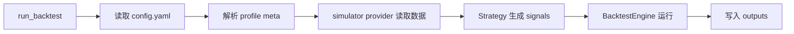

# 实现计划 (Implementation Plan)

## 验收标准列表 (Acceptance Criteria List)

- [ ] AC1: CLI 使用 `run --config configs/config.yaml --mode backtest --profile profile_A` 可执行完整回测流程（加载配置 -> 读取数据 -> 生成信号 -> 运行回测 -> 写入 `outputs/`）。
- [ ] AC2: 回测以 portfolio 为单位，支持 profile 与 meta 组合解析（meta 通过 include 合并 tickers）。
- [ ] AC3: data provider 可通过 `config.yaml` 切换；至少实现一个 `simulator` provider（本地 CSV 日线数据模拟源）。
- [ ] AC4: 生成基础输出（关键指标 + 收益曲线），写入 `outputs/`，不写入代码目录。
- [ ] AC5: 任何 YAML 解析仅通过 `backtest_app/app_utils`；`shared_core/core_utils` 不被 app 直接调用（符合 `ARCH_RULES.md`）。

## 需求 (Requirements)

### 核心接口定义 (Public Interface Design)

- **Class/Module**: `backtest_app.data_providers.base.MarketDataProvider`
- **Method Signature**:

  ```python
  from shared_core.schemas.market_data import MarketDataRequest

  class MarketDataProvider(ABC):
      def fetch(self, request: MarketDataRequest) -> dict[str, "pd.DataFrame"]:
          """Return price data by ticker."""
  ```

- **Class/Module**: `backtest_app.data_providers.adapters.simulator.SimulatorProvider`
- **Method Signature**:

  ```python
  class SimulatorProvider(MarketDataProvider):
      def __init__(self, csv_dir: Path, date_column: str, price_column: str) -> None: ...
      def fetch(self, request: MarketDataRequest) -> dict[str, "pd.DataFrame"]: ...
  ```

- **Class/Module**: `backtest_app.app.services.runner.run_backtest`
- **Function Signature**:

  ```python
  from backtest_app.app.settings.loader import AppConfig

  def run_backtest(config: AppConfig, profile: str, mode: str = "backtest") -> Path:
      """Run portfolio backtest and return output directory."""
  ```

- **Class/Module**: `shared_core.strategies.buy_and_hold.BuyAndHoldStrategy`
- **Method Signature**:

  ```python
  class BuyAndHoldStrategy(Strategy):
      def generate_signals(self, prices: "pd.DataFrame") -> tuple["pd.DataFrame", "pd.DataFrame"]:
          """Return entries/exits DataFrames."""
  ```

- **Class/Module**: `shared_core.inventory.equal_weight.EqualWeightAllocator`
- **Method Signature**:

  ```python
  class EqualWeightAllocator(PositionAllocator):
      def allocate(self, prices: "pd.DataFrame") -> "pd.DataFrame":
          """Return target weights per ticker."""
  ```

- **Reason**: 对齐 `ARCH_RULES.md`（策略/仓位解耦），并为后续替换策略与数据源留出扩展点。

### 配置与环境 (Configuration & Environment)

- [ ] **Config File**: `configs/config.yaml`
  - 新增 `data_provider` 字段细化（`name`, `csv_dir`, `date_column`, `price_column`），其中 `name=simulator`。
  - 新增 `backtest` 运行参数（`start`, `end`, `init_cash`, `frequency`）。
- [ ] **Env Vars**: 无新增（simulator provider 使用本地 CSV，不依赖外部 API Key）。
- [ ] **CLI Args**: 复用 `--config`/`--mode`/`--profile`，不新增参数。

### 数据变更 (Data Schema Changes)

- **JSON/Pydantic**:

  ```python
  from pydantic import BaseModel
  from datetime import date
  from typing import Literal

  class MarketDataRequest(BaseModel):
      tickers: list[str]
      start: date | None
      end: date | None
      frequency: Literal["1d"] = "1d"
      price_field: str = "close"
  ```

### 依赖影响 (Dependency Impact)

- 复用 `pandas` 与现有 `requirements.txt`，不新增依赖。

### 验收标准 (Acceptance Criteria)

- [ ] AC1: 见“验收标准列表”。
- [ ] AC2: 见“验收标准列表”。
- [ ] AC3: 见“验收标准列表”。
- [ ] AC4: 见“验收标准列表”。
- [ ] AC5: 见“验收标准列表”。

### 备选方案 (Alternatives)

- **方案 A (Minimalist Strategy)**: 不新增策略/仓位模块，直接在 `runner` 内 hardcode entries/exits 与权重。
  - [ ] ❌ 驳回 (理由: 违背扩展性与解耦要求，后续替换成本高)
- **方案 B (Robust Strategy)**: 增加 `MarketDataRequest` + `SimulatorProvider` + 基础策略/仓位实现，保持接口可替换。
  - [ ] ✅ 采纳 (理由: 满足 P0 并保留后续扩展空间，符合 ARCH_RULES)

## 约束与复用检查 (Constraints & Reuse)

- [ ] **配置检查**: 是。`configs/config.yaml` 增加 data_provider/backtest 配置。
- [ ] **接口检查**: 是。新增 `MarketDataRequest` 与 simulator provider 的接口。
- [ ] **复用分析**:
  - 需实现功能: YAML 解析
  - 现有候选: `backtest_app/app_utils/yaml.py`
  - 决策: 复用（严禁 app 直接调用 `shared_core/core_utils`）

## 影响分析 (Impact Analysis)

### 受影响范围 (Scope)

- **模块**: `backtest_app/app/services/runner.py`, `backtest_app/data_providers/*`, `shared_core/strategies`, `shared_core/inventory`, `configs/config.yaml`
- **API**: 新增接口，无破坏旧 API（当前 runner 为 placeholder）。
- **数据**: simulator 读取本地 CSV 与 `outputs/` 写入。

### 风险 (Risks)

- simulator 数据字段不一致导致解析失败（需明确 `date_column`/`price_column`）。
- 多 ticker 对齐缺失日期导致 NaN 传播（需要在 provider 中对齐/清洗策略）。

## 逻辑变更 (Logic Changes)

### 流程/状态对比 (Flow/State)




## 详细变更计划 (Detailed Changes)

### 1. 新增/修改文件: `shared_core/schemas/market_data.py`

- **变更类型**: [新增]
- **变更描述**:
  - 定义 `MarketDataRequest` Pydantic 模型，封装 tickers/日期区间/频率。

### 2. 新增/修改文件: `backtest_app/data_providers/adapters/simulator.py`

- **变更类型**: [新增]
- **变更描述**:
  - 实现 `SimulatorProvider`，按 ticker 读取 CSV 并对齐日期索引。
  - 仅返回 `price_column` 的 DataFrame，并保证索引为日期。

### 3. 新增/修改文件: `backtest_app/data_providers/registry/provider_registry.py`

- **变更类型**: [新增]
- **变更描述**:
  - 按 provider name 返回对应实例（`simulator` 为默认实现）。

### 4. 新增/修改文件: `shared_core/strategies/buy_and_hold.py`

- **变更类型**: [新增]
- **变更描述**:
  - 实现简单策略：首日 entry=True，永不 exit。

### 5. 新增/修改文件: `shared_core/inventory/equal_weight.py`

- **变更类型**: [新增]
- **变更描述**:
  - 实现 `EqualWeightAllocator`：每个 ticker 分配等权。

### 6. 新增/修改文件: `backtest_app/app/services/runner.py`

- **变更类型**: [修改]
- **变更描述**:
  - 用 `SettingsLoader` 加载配置，通过 `ProfileResolver` 解析 portfolio。
  - 使用 `data_providers` 拉取数据，调用 strategy -> signals，传入 `BacktestEngine`。
  - 通过 `backtest_app/reporter` 写入指标与曲线到 `outputs/`。

### 7. 新增/修改文件: `configs/config.yaml`

- **变更类型**: [修改]
- **变更描述**:
  - 补充 data_provider/backtest 字段（见“配置与环境”）。

### 8. 新增/修改文件: `tests/test_backtest_app/test_simulator_provider.py`

- **变更类型**: [新增]
- **变更描述**:
  - 使用 `tmp_path` 生成样例 CSV，验证 simulator provider 输出结构与对齐行为。

### 9. 新增/修改文件: `tests/test_backtest_app/test_runner_backtest.py`

- **变更类型**: [新增]
- **变更描述**:
  - 以临时配置 + 样例 CSV 验证 `run_backtest` 产出 `outputs/` 文件。

## 实施步骤 (Execution Steps)

1. [ ] 新增 `shared_core/schemas/market_data.py` 并导出 `MarketDataRequest`。
2. [ ] 新增 `backtest_app/data_providers/adapters/simulator.py` 与 provider registry。
3. [ ] 新增 `shared_core/strategies/buy_and_hold.py` 与 `shared_core/inventory/equal_weight.py`。
4. [ ] 修改 `backtest_app/app/services/runner.py` 串联回测流程。
5. [ ] 更新 `configs/config.yaml` 增加 data_provider/backtest 配置。
6. [ ] 增加 `tests/test_backtest_app/test_simulator_provider.py` 与 `test_runner_backtest.py`。
7. [ ] 运行 `pytest -q` 验证最小链路。

## 验证计划 (Verification Plan)

- **自动化测试**:
  - simulator provider 读取/对齐行为单测。
  - runner 端到端测试（使用临时 CSV 与临时输出目录）。
- **手动验证**:
  - `python run.py --config configs/config.yaml --mode backtest --profile profile_A`，检查 `outputs/` 产物。

## Mock & External Dependency Check

- **Yes (External Dependency)**: 本地 CSV I/O 与文件写入。
  - Mock/替代策略: 使用 `tmp_path` 创建 CSV；报告写入同样落在临时目录，避免污染真实 `outputs/`。

## Legacy Regression

- 旧模块已删除；当前改动不会破坏既有报表或旧导出流程。
