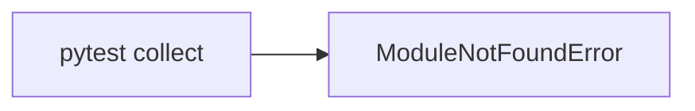
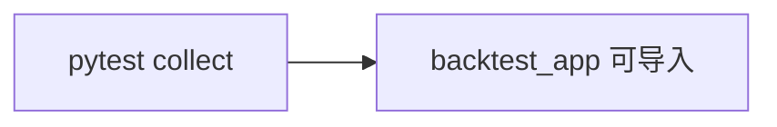

# 实现计划 (Implementation Plan)

## 验收标准列表 (Acceptance Criteria List)

- [ ] AC1: `pytest -q` 在 repo 根目录执行时能正常收集并导入 `backtest_app.*` 测试模块。
- [ ] AC2: 新增最小“导入可见性”测试，当前版本失败、修复后通过。
- [ ] AC3: 不新增/修改业务配置，不引入新的外部依赖。

## 需求 (Requirements)

### 核心接口定义 (Public Interface Design)

- **Class/Module**: 无新增公共接口
- **Reason**: 仅修复包可见性问题，不涉及业务逻辑或外部契约变更。

### 配置与环境 (Configuration & Environment)

- [ ] **Config File**: 无修改
- [ ] **Env Vars**: 无新增
- [ ] **CLI Args**: 无新增

### 数据变更 (Data Schema Changes)

- 无

### 依赖影响 (Dependency Impact)

- 无新增依赖

### 验收标准 (Acceptance Criteria)

- [ ] AC1: 见“验收标准列表”。
- [ ] AC2: 见“验收标准列表”。
- [ ] AC3: 见“验收标准列表”。

### 备选方案 (Alternatives)

- **方案 A (Minimalist Strategy)**: 添加 `tests/conftest.py` 手动插入 repo root 到 `sys.path`。
  - [ ] ❌ 驳回 (理由: 仅治标，隐藏包结构问题)
- **方案 B (Robust Strategy)**: 添加 `backtest_app/__init__.py` 作为显式包入口，并增加 import smoke test。
  - [ ] ✅ 采纳 (理由: 明确包结构，修复可见性根因)

## 约束与复用检查 (Constraints & Reuse)

- [ ] **配置检查**: 否
- [ ] **接口检查**: 否
- [ ] **复用分析**: 无需新增工具

## 影响分析 (Impact Analysis)

### 受影响范围 (Scope)

- **模块**: `backtest_app/__init__.py`, `tests/test_backtest_app/test_imports.py`
- **API**: 无
- **数据**: 无

### 风险 (Risks)

- 极低风险，仅影响导入路径与测试可见性。

## 逻辑变更 (Logic Changes)

### 流程/状态对比 (Flow/State)

## 详细变更计划 (Detailed Changes)

### 1. 新增/修改文件: `backtest_app/__init__.py`

- **变更类型**: [新增]
- **变更描述**:
  - 创建空入口或最小 docstring，显式声明包。

### 2. 新增/修改文件: `tests/test_backtest_app/test_imports.py`

- **变更类型**: [新增]
- **变更描述**:
  - 添加导入可见性测试，确保 `backtest_app.app` 与 `backtest_app.engines` 可被导入。

## 实施步骤 (Execution Steps)

1. [ ] 新增 `backtest_app/__init__.py`。
2. [ ] 新增 `tests/test_backtest_app/test_imports.py`。
3. [ ] 运行 `pytest -q` 验证收集阶段通过。

## 验证计划 (Verification Plan)

- **自动化测试**: `tests/test_backtest_app/test_imports.py` 导入检查。
- **手动验证**: `pytest -q` 在 repo 根目录执行。

## Mock & External Dependency Check

- **No (Internal Logic)**: 无外部依赖。

## Legacy Regression

- 不涉及业务逻辑与旧导出流程；不会影响既有行为。
