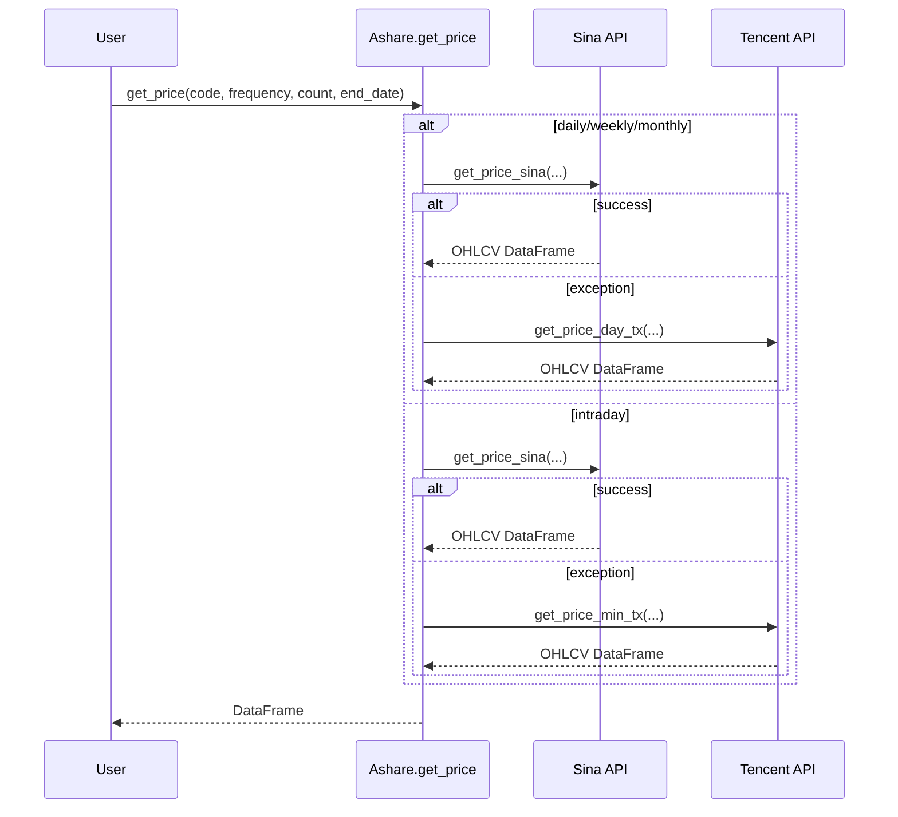
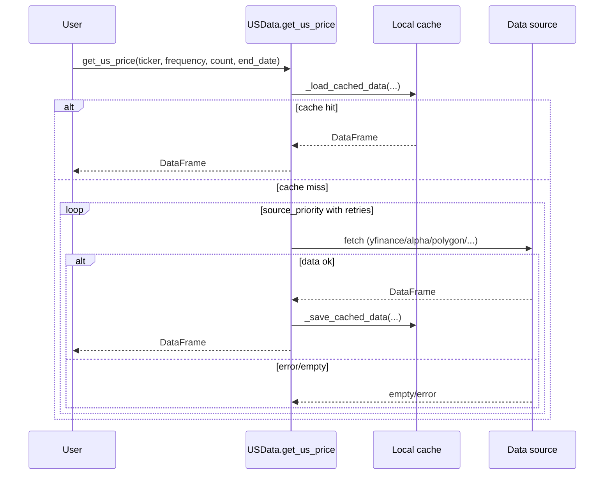
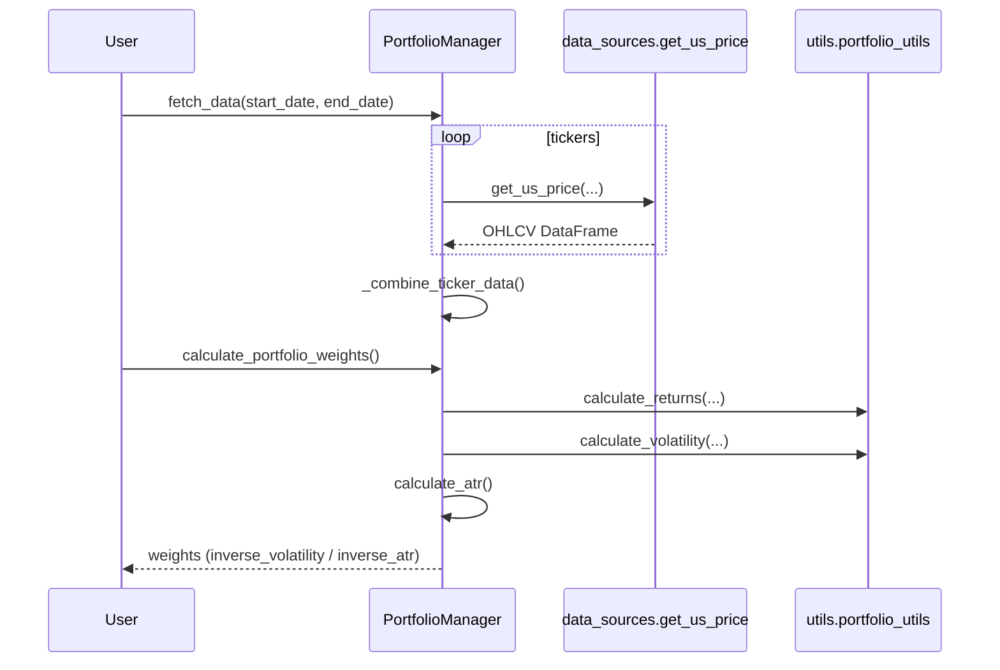
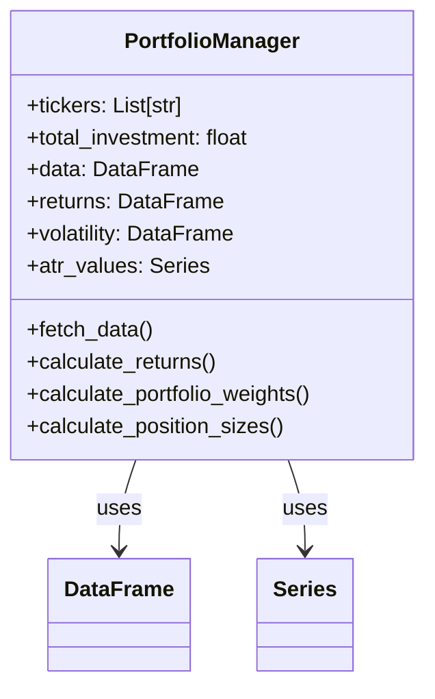

# 系统地图 (System Map)

## 执行摘要 (Executive Summary)

TradingAssistance is a Python-based quantitative trading toolkit that focuses on market data access (A-share + US), technical indicators, and risk-based portfolio allocation. The primary entry point is `run.py`, which dispatches demo/test flows. The codebase is modular, but some documentation referenced in README is not present in the repo, and a few modules are more demo-style than packaged APIs.

## 1. 架构概览 (Architecture Overview)

### 目录结构 (Directory Structure)

```text
TradingAssistance/
├── run.py
├── data_sources/
│   ├── Ashare.py
│   ├── USData.py
│   └── ETFConstituents.py
├── technical_analysis/
│   └── MyTT.py
├── portfolio_management/
│   └── risk_based_allocation/
│       └── inventory_management.py
├── utils/
│   └── portfolio_utils.py
├── unit_tests/
├── assets/
└── .workflow/
```

### 架构图 (System Architecture)

```mermaid
graph TD
    User[User / CLI] --> Runner[run.py]
    Runner --> DataSources[data_sources]
    Runner --> Technical[technical_analysis]
    Runner --> Portfolio[portfolio_management]
    DataSources --> Ashare[Ashare.py]
    DataSources --> USData[USData.py]
    DataSources --> ETF[ETFConstituents.py]
    USData --> ExternalUS[External APIs (yfinance/Alpha Vantage/Polygon/Stooq)]
    Ashare --> ExternalCN[External APIs (Sina/Tencent)]
    ETF --> ExternalETF[External APIs (Alpha Vantage/CSIndex/EastMoney)]
    DataSources --> Assets[assets/ data_cache & etf_holdings]
    Portfolio --> DataSources
    Portfolio --> Utils[utils/portfolio_utils.py]
```

**说明**:

- **Runner/Demos**: CLI entry and demo orchestration `run.py:16`
- **Data Sources**: CN/US market data + ETF constituents `data_sources/Ashare.py:49`, `data_sources/USData.py:762`, `data_sources/ETFConstituents.py:44`
- **Technical Analysis**: Indicator library (MyTT) `technical_analysis/MyTT.py:116`
- **Portfolio Management**: Risk-based allocation and sizing `portfolio_management/risk_based_allocation/inventory_management.py:30`
- **Utilities**: Shared portfolio metrics `utils/portfolio_utils.py:11`

## 2. 核心业务流 (Core Business Workflows)

### A股行情获取 (A-share Price Fetch)

**描述**: 通过 `data_sources.get_price` 进入 Ashare 兼容接口，按周期选择新浪为主源，失败时切换腾讯源，返回标准 OHLCV DataFrame。



**关键代码引用**:

- [ ] **入口与频率分流**: `data_sources/Ashare.py:49`
- [ ] **日/周/月主源 + 备用源**: `data_sources/Ashare.py:53`
- [ ] **分钟线主源 + 备用源**: `data_sources/Ashare.py:57`

### 美股行情获取 (US Price Fetch with Cache + Failover)

**描述**: `get_us_price` 优先读取本地缓存，未命中则按优先级轮询数据源并带重试，成功后写入缓存。



**关键代码引用**:

- [ ] **缓存读取与过期处理**: `data_sources/USData.py:97`
- [ ] **缓存命中直接返回**: `data_sources/USData.py:798`
- [ ] **多源优先级 + 失败重试**: `data_sources/USData.py:803`
- [ ] **成功后写入缓存**: `data_sources/USData.py:839`

### 风险驱动组合分配 (Risk-Based Allocation)

**描述**: `PortfolioManager` 拉取多资产行情，合并为多级列索引数据，计算收益/波动率/ATR，并据此生成逆波动率与逆 ATR 权重以及仓位建议。



**关键代码引用**:

- [ ] **批量拉取与合并数据**: `portfolio_management/risk_based_allocation/inventory_management.py:51`
- [ ] **多级列索引构建**: `portfolio_management/risk_based_allocation/inventory_management.py:113`
- [ ] **收益与波动率计算**: `portfolio_management/risk_based_allocation/inventory_management.py:145`
- [ ] **权重计算逻辑**: `portfolio_management/risk_based_allocation/inventory_management.py:230`
- [ ] **收益/波动率工具函数**: `utils/portfolio_utils.py:11`

## 3. 关键技术细节 (Key Technical Details)

### 数据模型 (Data Models)



### 核心算法/策略 (Core Logic)

- **逆波动率/逆ATR权重**:
  - 实现位置: `portfolio_management/risk_based_allocation/inventory_management.py:230`
  - 逻辑说明: 使用最新波动率或 ATR 取倒数并归一化为组合权重。
- **ATR 计算**:
  - 实现位置: `portfolio_management/risk_based_allocation/inventory_management.py:183`
  - 逻辑说明: 以 True Range 的滚动均值作为 ATR，用于风险驱动的仓位衡量。
- **布林带指标**:
  - 实现位置: `technical_analysis/MyTT.py:693`
  - 逻辑说明: MA ± P*STD 构造上下轨，用于衡量波动区间。

## 4. 待办/风险观测 (Observations)

- [ ] ❓ README 声明存在 `docs/` 目录，但仓库当前未包含该目录，需确认是否遗漏或迁移。
- [ ] ⚠️ `portfolio_management/risk_parity` 仅有占位 `__init__.py` 与 `test_dca.py` 脚本，未形成可复用模块接口。
- [ ] ⚠️ ETF 成分获取包含“占位/假设 URL”的实现，实际可用性可能受限。 `data_sources/ETFConstituents.py:170`
- [ ] ⚠️ `run.py` 通过 `exec` 直接运行测试脚本，demo 与测试耦合，可能导致演示流程不稳定。 `run.py:16`
