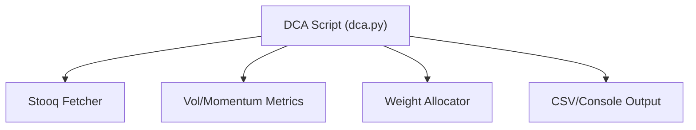
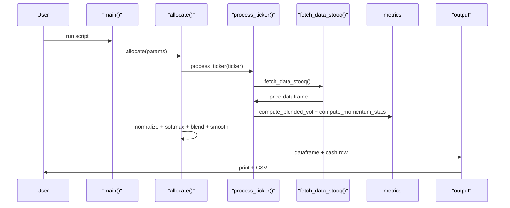
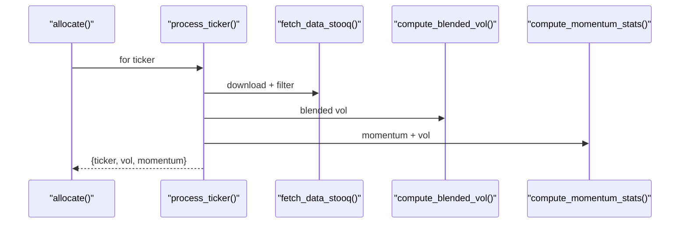
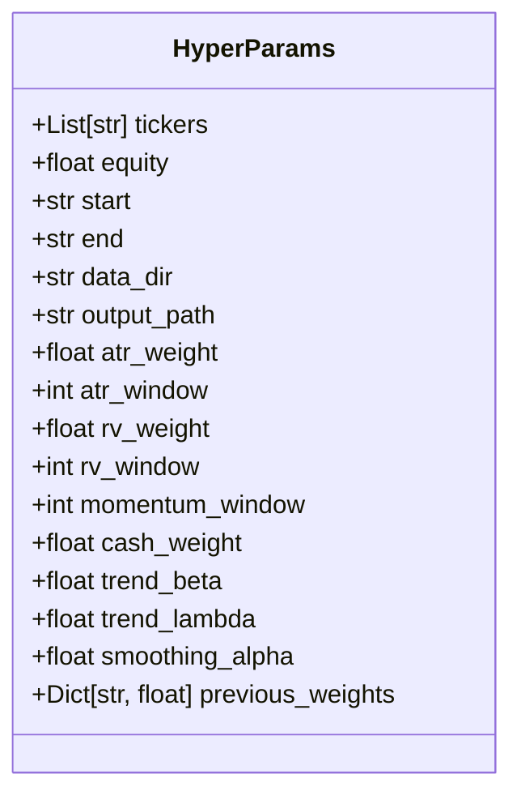

# 系统地图 (System Map)

## 执行摘要 (Executive Summary)

`.sandbox/dca_trade/dca.py` 是一个独立的 DCA 分配脚本：拉取 Stooq 日线数据，计算混合波动率与动量得分，生成组合权重与资金分配，并把结果打印与落盘为 CSV。当前为单文件脚本，无框架依赖与外部接口封装。

## 1. 架构概览 (Architecture Overview)

### 目录结构 (Directory Structure)

```text
.sandbox/dca_trade/
├── dca.py
├── calculate_target_value.py
├── cash_buffer.py
├── cta_position_sizing.py
├── target_value_cor_adj.py
├── topk_diversification.py
└── vol_position_sizing_online.py
```

### 架构图 (System Architecture)



**说明**:

- **DCA Script**: 入口与编排逻辑 ` .sandbox/dca_trade/dca.py:309 `
- **Stooq Fetcher**: 下载并过滤行情数据 ` .sandbox/dca_trade/dca.py:54 `
- **Vol/Momentum Metrics**: ATR/RV/动量计算 ` .sandbox/dca_trade/dca.py:82 `
- **Weight Allocator**: 权重混合与分配 ` .sandbox/dca_trade/dca.py:210 `
- **Output**: 控制台展示与 CSV 落盘 ` .sandbox/dca_trade/dca.py:332 `

## 2. 核心业务流 (Core Business Workflows)

### DCA 分配执行 (DCA Allocation Run)

**描述**: 从参数中读取标的与区间，拉取数据，计算混合波动率与动量评分，生成投资权重，并输出分配结果。



**关键代码引用**:

- [ ] **入口与编排**: `.sandbox/dca_trade/dca.py:309`
- [ ] **行情获取与缓存**: `.sandbox/dca_trade/dca.py:54`
- [ ] **波动率/动量计算**: `.sandbox/dca_trade/dca.py:82`
- [ ] **权重生成与平滑**: `.sandbox/dca_trade/dca.py:210`
- [ ] **输出与落盘**: `.sandbox/dca_trade/dca.py:368`

### 单标的计算 (Per-Ticker Processing)

**描述**: 对单个 ticker 拉取数据，计算混合波动率与动量统计，返回用于全局权重计算的记录。



**关键代码引用**:

- [ ] **单标的处理**: `.sandbox/dca_trade/dca.py:178`
- [ ] **混合波动率**: `.sandbox/dca_trade/dca.py:101`
- [ ] **动量统计**: `.sandbox/dca_trade/dca.py:115`

## 3. 关键技术细节 (Key Technical Details)

### 数据模型 (Data Models)



### 核心算法/策略 (Core Logic)

- **混合波动率 + 动量分配**:
  - 实现位置: `.sandbox/dca_trade/dca.py:101`
  - 逻辑说明: ATR% 与 RV 加权形成结构性波动率，动量/动量波动率经 softmax 得到趋势权重，再按 `trend_lambda` 混合并可选平滑。

## 4. 待办/风险观测 (Observations)

- [ ] ❓ 依赖 Stooq 在线数据，脚本运行需要网络且未提供缓存回放模式。
- [ ] ⚠️ `output_path` 目录不存在时直接 `os.makedirs`，未对权限/冲突做保护（`.sandbox/dca_trade/dca.py:368`）。
- [ ] ⚠️ 单标的失败会被跳过，全部失败直接抛错；无“部分结果”降级策略。
- [ ] ⚠️ 指标计算窗口较长（默认 63/90），短区间可能导致大量 NaN 或无有效结果。
